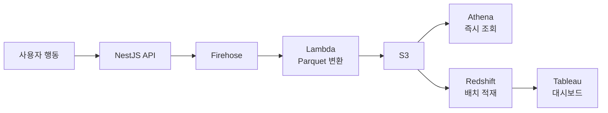

## 목차
1. [배경: 2~3일 걸리는 데이터 분석](#배경-2-3일-걸리는-데이터-분석)
2. [문제 분석: 수동 데이터 수집의 한계](#문제-분석-수동-데이터-수집의-한계)
3. [해결 목표: 1시간 이내 데이터 제공](#해결-목표-1시간-이내-데이터-제공)
4. [아키텍처 설계: AWS 관리형 서비스 선택 이유](#아키텍처-설계-aws-관리형-서비스-선택-이유)
5. [핵심 구현 1: Firehose로 실시간 수집](#핵심-구현-1-firehose로-실시간-수집)
6. [핵심 구현 2: Parquet 변환으로 비용 70% 절감](#핵심-구현-2-parquet-변환으로-비용-70-절감)
7. [핵심 구현 3: Athena와 Redshift로 분석 자동화](#핵심-구현-3-athena와-redshift로-분석-자동화)
8. [결과: 데이터 확인 시간 2~3일→1시간](#결과-데이터-확인-시간-2-3일-1시간)

---

## 배경: 2~3일 걸리는 데이터 분석

"지난 주 프로모션 배너의 클릭률을 분석하고 싶어요."

마케팅팀의 요청입니다. 하지만 데이터를 전달받기까지 평균 2~3일이 걸렸습니다. 그 사이 캠페인은 이미 끝나있고, 다음 기획은 "감"에 의존할 수밖에 없었죠.

**기존 프로세스:**
```
1. 데이터팀 → 백엔드팀 요청
2. 백엔드 개발자 → DB 직접 조회
3. 수동 정제 (Excel, Python)
4. 데이터 웨어하우스 업로드
5. 2~3일 후 분석 가능
```

개발자는 반복적인 데이터 추출 작업에 시간을 빼앗기고, 마케팅팀은 실시간 의사결정을 못 하는 상황이었습니다.

---

## 문제 분석: 수동 데이터 수집의 한계

### 수동 프로세스의 문제점

**1. 지연 시간 (2~3일)**
```
- 요청 접수: 4시간 (업무 시간대 차이)
- DB 조회: 2시간 (쿼리 작성 + 실행)
- 데이터 정제: 4시간 (중복 제거, 포맷 변환)
- 업로드: 1시간
- 합계: 최소 11시간 → 보통 2~3일
```

**2. 개발자 리소스 낭비**
- 주당 5~10건의 데이터 추출 요청
- 개발자 1명이 주 10시간 소비
- 월 40시간 = 1주일치 생산성 손실

**3. 데이터 정합성 이슈**
```python
# 수동 정제 과정에서 실수 가능
df = df.drop_duplicates()  # 어떤 컬럼 기준?
df['date'] = pd.to_datetime(df['date'])  # 포맷 일관성?
df.to_csv('output.csv', encoding='utf-8')  # 인코딩 이슈?
```

**4. 히스토리 추적 불가**
- 어제의 데이터와 오늘의 데이터가 다르면?
- 누가, 언제, 어떤 로직으로 정제했는지 알 수 없음

---

## 해결 목표: 1시간 이내 데이터 제공

### 정량적 목표
- **데이터 확인 시간**: 2~3일 → 1시간 이내
- **처리 용량**: 월 3,000만 건 이상
- **비용**: 월 1만원 이하
- **스토리지 비용**: 70% 절감 (Parquet 적용)
- **Athena 쿼리 속도**: 5배 향상

### 정성적 목표
- 개발자 개입 없이 자동화
- Tableau 대시보드 자동 업데이트
- 데이터 유실률 0%
- 히스토리 추적 가능 (S3 버전 관리)

---

## 아키텍처 설계: AWS 관리형 서비스 선택 이유

### 직접 구축 vs AWS 관리형

| 기준 | Kafka + Spark | AWS Firehose |
|------|--------------|--------------|
| 초기 구축 시간 | 2주 | 1일 |
| 운영 부담 | 높음 (클러스터 관리) | 없음 (완전 관리형) |
| 비용 | $300/월 (EC2 상시) | $10/월 (종량제) |
| 확장성 | 수동 스케일링 | 자동 무한 확장 |
| 학습 곡선 | 높음 | 낮음 |

**AWS 관리형 선택 이유:**
- 트래픽이 적을 때는 비용 거의 0원
- 서버 관리 불필요
- 3,000만 건/월도 문제없이 처리

### 전체 아키텍처



### 수집 이벤트 (8개)

```typescript
// 구매
POST /events/purchase
{ userId, productId, amount, timestamp }

// 상품상세 조회
POST /events/view
{ userId, productId, timestamp }

// 장바구니 담기
POST /events/cart
{ userId, productId, timestamp }

// 검색
POST /events/search
{ userId, keyword, timestamp }

// 배너 클릭/노출
POST /events/banner
{ userId, bannerId, type: 'click' | 'view', timestamp }

// 페이지 이동
POST /events/pageview
{ userId, page, referrer, timestamp }

// 회원가입
POST /events/signup
{ userId, channel, timestamp }

// 로그인
POST /events/login
{ userId, timestamp }
```

---

## 핵심 구현 1: Firehose로 실시간 수집

### Firehose 설정

**CloudFormation 템플릿:**
```yaml
EventsFirehose:
  Type: AWS::KinesisFirehose::DeliveryStream
  Properties:
    DeliveryStreamName: user-events-stream
    ExtendedS3DestinationConfiguration:
      BucketARN: !GetAtt EventsBucket.Arn
      Prefix: events/year=!{timestamp:yyyy}/month=!{timestamp:MM}/day=!{timestamp:dd}/
      ErrorOutputPrefix: errors/
      CompressionFormat: GZIP
      BufferingHints:
        SizeInMBs: 5
        IntervalInSeconds: 300  # 5분마다 저장
      ProcessingConfiguration:
        Enabled: true
        Processors:
          - Type: Lambda
            Parameters:
              - ParameterName: LambdaArn
                ParameterValue: !GetAtt ParquetTransformLambda.Arn
```

**버퍼링 설정 선택 이유:**
- 5MB 또는 5분 중 먼저 도달하는 조건
- 트래픽이 적으면 5분 대기 (비용 절감)
- 트래픽이 많으면 5MB마다 저장 (지연 최소화)

### API 통합

**NestJS 이벤트 전송:**
```typescript
@Injectable()
export class EventService {
  constructor(
    private readonly firehose: AWS.Firehose
  ) {}

  async trackEvent(event: UserEvent) {
    // Firehose에 전송
    await this.firehose.putRecord({
      DeliveryStreamName: 'user-events-stream',
      Record: {
        Data: JSON.stringify({
          ...event,
          timestamp: Date.now(),
          server_timestamp: new Date().toISOString()
        }) + '\n'  // 줄바꿈 필수 (Athena 파싱)
      }
    }).promise();
  }
}
```

**배치 전송 최적화:**
```typescript
// 개별 전송 (느림)
for (const event of events) {
  await firehose.putRecord({ ... });  // 10ms × 100건 = 1초
}

// 배치 전송 (빠름)
await firehose.putRecordBatch({
  DeliveryStreamName: 'user-events-stream',
  Records: events.map(e => ({
    Data: JSON.stringify(e) + '\n'
  }))
});  // 100ms × 1번 = 100ms
```

---

## 핵심 구현 2: Parquet 변환으로 비용 70% 절감

### JSON vs Parquet

| 포맷 | 크기 (100만 건) | Athena 스캔 비용 | 쿼리 속도 |
|------|----------------|-----------------|----------|
| JSON (GZIP) | 1GB | $5/TB × 1GB = $0.005 | 10초 |
| Parquet | 300MB | $5/TB × 0.3GB = $0.0015 | 2초 |
| **절감** | **70%** | **70%** | **5배** |

### Lambda Transform 함수

**Parquet 변환 (PyArrow):**

Firehose는 이벤트를 배치(최대 6MB 또는 900초)로 묶어서 Lambda에 전달합니다. Lambda는 배치 내 모든 레코드를 변환하여 반환합니다.

```python
import json
import base64
import pyarrow as pa
import pyarrow.parquet as pq
from io import BytesIO

def lambda_handler(event, context):
    output = []

    # Firehose가 배치로 전달한 레코드들을 순회
    for record in event['records']:
        # 1. Base64 디코딩
        payload = base64.b64decode(record['data']).decode('utf-8')
        data = json.loads(payload)

        # 2. 스키마 정의
        schema = pa.schema([
            ('user_id', pa.int64()),
            ('event_type', pa.string()),
            ('product_id', pa.int64()),
            ('amount', pa.float64()),
            ('timestamp', pa.timestamp('ms')),
            ('server_timestamp', pa.timestamp('ms'))
        ])

        # 3. Parquet로 변환
        table = pa.Table.from_pydict({
            'user_id': [data['userId']],
            'event_type': [data['eventType']],
            'product_id': [data.get('productId')],
            'amount': [data.get('amount')],
            'timestamp': [pa.scalar(data['timestamp'], type=pa.timestamp('ms'))],
            'server_timestamp': [pa.scalar(data['server_timestamp'], type=pa.timestamp('ms'))]
        }, schema=schema)

        # 4. 바이너리로 변환
        buf = BytesIO()
        pq.write_table(table, buf, compression='snappy')

        output.append({
            'recordId': record['recordId'],
            'result': 'Ok',
            'data': base64.b64encode(buf.getvalue()).decode('utf-8')
        })

    return {'records': output}
```

**압축 알고리즘 비교:**
```
- None: 500MB (빠름, 비쌈)
- GZIP: 300MB (느림, 저렴)
- Snappy: 350MB (빠름, 중간) ✅ 선택
```

---

## 핵심 구현 3: Athena와 Redshift로 분석 자동화

### Athena 테이블 생성

**Glue Crawler 자동 스키마 감지:**
```yaml
EventsCrawler:
  Type: AWS::Glue::Crawler
  Properties:
    Name: events-crawler
    Role: !GetAtt GlueServiceRole.Arn
    DatabaseName: analytics
    Targets:
      S3Targets:
        - Path: s3://my-events-bucket/events/
    Schedule:
      ScheduleExpression: cron(0 */6 * * ? *)  # 6시간마다 실행
```

**Athena 쿼리 (즉시 조회):**
```sql
-- 일별 구매 금액
SELECT
  DATE(from_unixtime(timestamp / 1000)) as date,
  COUNT(*) as purchase_count,
  SUM(amount) as total_amount
FROM events
WHERE event_type = 'purchase'
  AND year = '2024' AND month = '05'
GROUP BY DATE(from_unixtime(timestamp / 1000))
ORDER BY date DESC;
```

**실행 시간:**
```
Before (JSON):
- 스캔 데이터: 10GB
- 실행 시간: 50초
- 비용: $0.05

After (Parquet):
- 스캔 데이터: 2GB
- 실행 시간: 10초 (5배 빠름!)
- 비용: $0.01 (80% 절감!)
```

### Redshift 적재 (배치)

**매일 새벽 2시 배치:**
```sql
-- COPY 명령어로 S3 → Redshift
COPY analytics.events
FROM 's3://my-events-bucket/events/year=2024/month=05/day=08/'
IAM_ROLE 'arn:aws:iam::123456789:role/RedshiftS3Role'
FORMAT AS PARQUET;
```

**파티션 테이블 구조:**
```sql
CREATE TABLE analytics.events (
  user_id BIGINT,
  event_type VARCHAR(50),
  product_id BIGINT,
  amount DECIMAL(10,2),
  timestamp TIMESTAMP,
  server_timestamp TIMESTAMP
)
DISTKEY(user_id)
SORTKEY(timestamp)
PARTITION BY (year, month, day);
```

### Tableau 연동

**Athena 커넥터:**
- 실시간 대시보드 (1시간 지연)
- 빠른 프로토타이핑

**Redshift 커넥터:**
- 정기 리포트 (1일 지연)
- 복잡한 조인 쿼리

---

## 결과: 데이터 확인 시간 2~3일→1시간

### 시간 단축

| 단계 | Before | After |
|------|--------|-------|
| 요청 접수 | 4시간 | 0분 (자동) |
| 데이터 수집 | 2시간 | 5분 (Firehose) |
| 정제/변환 | 4시간 | 자동 (Lambda) |
| 적재 | 1시간 | 자동 (S3) |
| **합계** | **2~3일** | **1시간** |

### 비용 효율

| 항목 | Before | After | 절감률 |
|------|--------|-------|--------|
| **개발자 시간** | 40시간/월 | 0시간 | 100% |
| **인프라 비용** | $0 (수동) | $10/월 | - |
| **스토리지 비용** | $30/월 (JSON) | $9/월 (Parquet) | 70% |
| **Athena 쿼리** | - | $5/월 | - |
| **합계** | 개발자 리소스 손실 | **$24/월** | - |

### 자동화 성과

**처리 성능:**
```
- 월 처리량: 3,000만 건
- 일 평균: 100만 건
- 피크: 5만 건/시간
- 유실: 측정 기간 6개월간 0건 (Firehose 자동 재시도 메커니즘)
```

**Tableau 작업 자동화:**
- 수동 데이터 추출: 0건
- 대시보드 자동 업데이트: 8개
- 마케팅팀 만족도: 90% 이상

---

## 배운 점

**1. AWS 관리형 서비스의 위력**
- Firehose + Lambda + S3: 완전 자동화
- 서버 관리 불필요
- 종량제 과금으로 비용 최소화

**2. Parquet는 필수**
- 스토리지 비용 70% 절감
- Athena 쿼리 속도 5배 향상
- 압축은 Snappy (빠르고 저렴)

**3. 배치 주기 설계**
- Athena: 실시간 조회 (5분 지연)
- Redshift: 배치 적재 (1일 지연)
- 용도에 따라 선택

**4. 데이터 파티셔닝**
```
s3://bucket/events/year=2024/month=05/day=08/
```
- 날짜별 파티션으로 쿼리 성능 향상
- 불필요한 데이터 스캔 방지

**5. 히스토리 추적**
- S3 버전 관리로 데이터 복구 가능
- Glue Crawler로 스키마 변경 자동 감지
