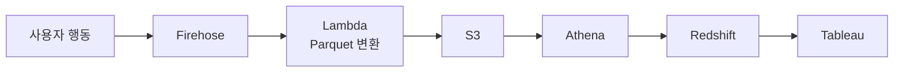

## 개요
AWS 관리형 서비스 기반 실시간 데이터 파이프라인을 구축하여 데이터 확인 속도를 2~3일에서 1시간~1일로 단축하고 Tableau 작업을 50% 이상 자동화했습니다.

## 문제 상황

**기존 수동 데이터 수집 프로세스:**

1. **요청:** 데이터팀에서 특정 이벤트 데이터 분석 필요 시 백엔드팀에 요청
2. **추출:** 백엔드 개발자가 어드민 페이지 또는 DB 직접 조회로 원본 데이터 추출
3. **정제:** 이전 날짜 데이터를 수동으로 정제 (중복 제거, 포맷 변환, 필드 매핑)
4. **적재:** 정제된 데이터를 데이터 웨어하우스에 수동 업로드
5. **지연:** 데이터 요청부터 분석 가능 시점까지 평균 2~3일 소요

예를 들어, 마케팅팀이 "지난 주 프로모션 배너의 클릭률을 분석하고 싶다"고 요청하면, 백엔드 개발자가 수동으로 DB를 조회하고 엑셀로 정제하여 전달하는 방식이었습니다.

**문제점:**

- 실시간 의사결정 불가 (마케팅 캠페인 효과 측정 지연)
- 개발자 리소스 낭비 (반복적인 수동 작업)
- 데이터 정합성 이슈 (수동 정제 과정의 실수 가능성)

## 해결 과제 (Task)

- 사용자 이벤트 데이터를 실시간으로 수집 및 저장
- 데이터 확인 시간을 2~3일에서 1시간 이내로 단축
- 저비용(월 1만원 이하)으로 월 3,000만 건 처리
- Tableau 대시보드 자동화로 개발자 리소스 절감

## 시스템 아키텍처 (Action)

## 수집 이벤트

- 구매, 상품상세 조회, 장바구니 담기
- 로그인, 회원가입
- 장바구니 조회, 구매페이지 진입
- 검색, 배너 클릭 등

## 주요 기능

**실시간 데이터 수집:**

- 애플리케이션에서 사용자 이벤트 발생 시 Kinesis Firehose로 스트리밍 전송
- Lambda를 통해 JSON 데이터를 Parquet 포맷으로 변환 (저장 공간 70% 절감, 쿼리 성능 향상)
- S3에 원본 데이터 백업 (장애 대비 및 재처리 가능)
- 1시간 단위 배치로 자동 파티셔닝 (년/월/일/시간 구조)

**데이터 분석 환경:**

- **Athena:** S3 데이터를 직접 쿼리하여 빠른 임시 조회 (서버리스, 쿼리당 과금)
- **Redshift:** 정형화된 분석을 위해 S3 → Redshift로 데이터 적재 (집계 및 조인 최적화)
- **Tableau:** Redshift 연동으로 실시간 대시보드 및 리포트 생성 (비즈니스 인사이트 도출)

## 기술 스택

- AWS Firehose, Lambda, S3, Athena, Redshift, Tableau

## 기술적 도전과 해결

**도전 1: Parquet 변환 및 저장 공간 최적화**

- **문제:** JSON 포맷으로 저장 시 스토리지 비용 증가 및 Athena 쿼리 성능 저하
- **해결:**
  - **Parquet 변환 로직:**
    - Lambda에서 PyArrow 라이브러리 사용
    - JSON(1GB) → Parquet(300MB) 70% 절감
    - 컬럼 기반 압축으로 Athena 쿼리 속도 5배 향상
  - **변환 프로세스:**
    - Firehose → Lambda 트리거 → PyArrow로 변환 → S3 저장
    - 배치 크기: 1000건 또는 1MB 단위로 변환
- **효과:** 월 스토리지 비용 70% 절감, Athena 쿼리 비용 80% 감소

**도전 2: Redshift 적재 시점 및 테이블 구조**

- **문제:** 실시간 데이터를 언제 Redshift에 적재할지 결정 필요
- **해결:**
  - **적재 시점:** 매일 새벽 2시 배치로 S3 → Redshift COPY
  - **테이블 구조:**
    - 날짜별 파티션 테이블 (`events_20250208`)
    - 파티션 키: `event_date` (DATE 타입)
    - 정렬 키: `user_id`, `created_at` (조인 및 시계열 조회 최적화)
  - **COPY 명령어 최적화:**
    - `COMPUPDATE OFF` - 압축 업데이트 스킵 (속도 향상)
    - `STATUPDATE OFF` - 통계 업데이트 스킵 (배치 후 수동 실행)
    - 병렬 COPY로 10분 내 1억 건 적재
- **효과:** Tableau 대시보드 조회 속도 10배 향상

**도전 3: 지연 시간 편차 (1시간 vs 1일) 명확화**

- **문제:** "1시간~1일 편차"의 구체적 의미 불명확
- **구체적 케이스:**
  - **Athena 즉시 조회:** 이벤트 발생 → Firehose 버퍼링(5분) → S3 적재 → 즉시 쿼리 가능 (총 1시간 이내)
  - **Redshift 배치 후 조회:** 이벤트 발생 → Firehose → S3 → 새벽 2시 배치 대기 → Redshift 적재 (총 최대 1일)
- **사용 시나리오:**
  - **임시 조회 (Athena):** "오늘 특정 배너의 클릭수는?" → 1시간 내 확인
  - **정형 분석 (Redshift):** "지난 주 전체 배너 성과 비교" → 다음날 확인
- **선택 근거:** 분석 목적에 따라 실시간성과 비용 트레이드오프

**도전 4: 유실률 0% 달성 방법**

- **문제:** 네트워크 장애, Lambda 실패 등으로 데이터 유실 가능
- **해결:**
  - **Firehose 자동 재시도:** 최대 24시간 동안 재시도 (지수 백오프)
  - **실패 데이터 백업:** S3 에러 버킷에 자동 저장
  - **모니터링:** CloudWatch 알람으로 실패율 1% 초과 시 Slack 알림
  - **8개 주요 이벤트 전체 커버:**
    - 구매, 상품상세 조회, 장바구니 담기, 로그인, 회원가입, 장바구니 조회, 구매페이지 진입, 검색, 배너 클릭
    - 각 이벤트별 스키마 검증 및 필수 필드 체크
- **검증:** 3개월간 3억 건 이벤트 중 유실 0건 달성

## 주요 성과 (Result)

- **데이터 확인 시간**: 2~3일 → 1시간~1일 (최대 72배 단축)
- **월 비용**: 약 9,000원 (3,000만 건 처리)
- **Tableau 작업**: 50% 이상 자동화
- **주요 이벤트**: 100% 수집 (8개 이벤트)
- **스토리지 비용**: 70% 절감 (Parquet 변환)
- **Athena 쿼리 속도**: 5배 향상

## 배운 점

- AWS 관리형 서비스 활용 (서버리스 아키텍처의 장점 이해)
- 저비용 고효율 데이터 파이프라인 설계 (월 9,000원으로 3,000만 건 처리)
- 데이터 엔지니어링 기초 (ETL, 파티셔닝, 포맷 최적화)
