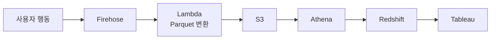

## 개요
AWS 관리형 서비스 기반 실시간 데이터 파이프라인을 구축하여 데이터 확인 속도를 2~3일에서 1시간~1일로 단축했습니다.

## 문제 상황
**기존 수동 데이터 수집 프로세스:**
1. **요청:** 데이터팀에서 특정 이벤트 데이터 분석 필요 시 백엔드팀에 요청
2. **추출:** 백엔드 개발자가 어드민 페이지 또는 DB 직접 조회로 원본 데이터 추출
3. **정제:** 이전 날짜 데이터를 수동으로 정제 (중복 제거, 포맷 변환, 필드 매핑)
4. **적재:** 정제된 데이터를 데이터 웨어하우스에 수동 업로드
5. **지연:** 데이터 요청부터 분석 가능 시점까지 평균 2~3일 소요

**문제점:**
- 실시간 의사결정 불가 (마케팅 캠페인 효과 측정 지연)
- 개발자 리소스 낭비 (반복적인 수동 작업)
- 데이터 정합성 이슈 (수동 정제 과정의 실수 가능성)

## 주요 성과
- 데이터 확인: 2~3일 → 1시간~1일
- 월 비용: 약 9,000원 (3,000만 건 처리)
- Tableau 작업: 50% 이상 자동화
- 주요 이벤트: 100% 수집

## 시스템 아키텍처

## 주요 이벤트
- 구매, 상품상세, 장바구니 담기
- 로그인, 회원가입
- 장바구니 조회, 구매페이지 진입

## 주요 기능
**실시간 데이터 수집:**
- 애플리케이션에서 사용자 이벤트 발생 시 Kinesis Firehose로 스트리밍 전송
- Lambda를 통해 JSON 데이터를 Parquet 포맷으로 변환 (저장 공간 70% 절감)
- S3에 원본 데이터 백업 (장애 대비 및 재처리 가능)
- 1시간 단위 배치로 자동 파티셔닝 (년/월/일/시간 구조)

**데이터 분석 환경:**
- **Athena:** S3 데이터를 직접 쿼리하여 빠른 임시 조회 (서버리스, 쿼리당 과금)
- **Redshift:** 정형화된 분석을 위해 S3 → Redshift로 데이터 적재
- **Tableau:** Redshift 연동으로 실시간 대시보드 및 리포트 생성

## 기술 스택
- AWS Firehose, Lambda, S3, Athena, Redshift, Tableau

## 배운 점
- AWS 관리형 서비스 활용
- 저비용 고효율 파이프라인
- 데이터 엔지니어링 기초
