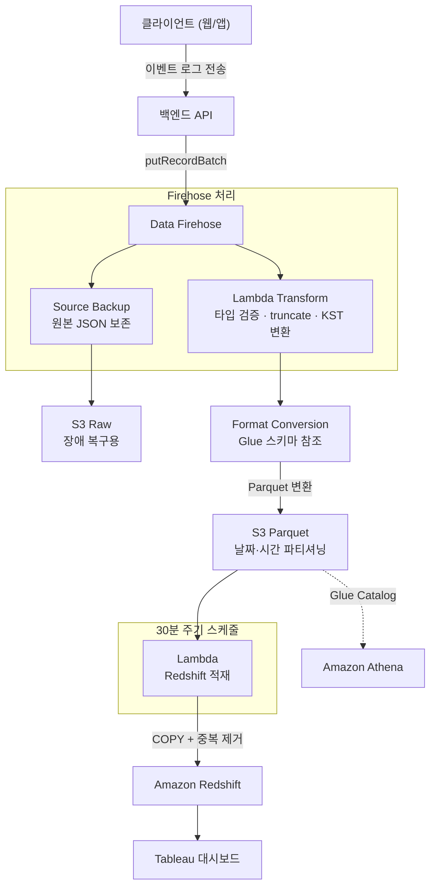
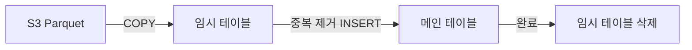
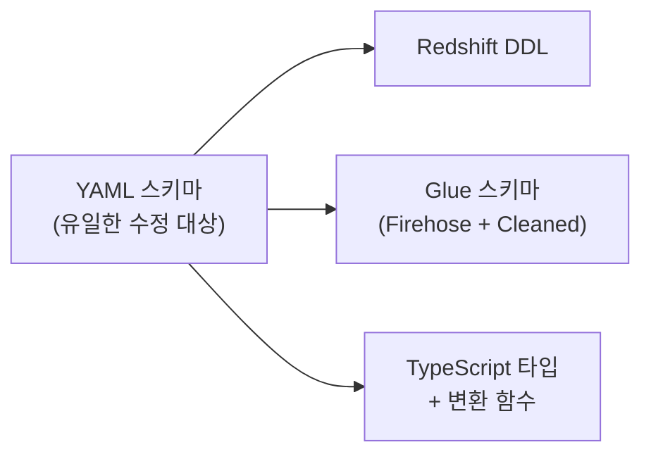
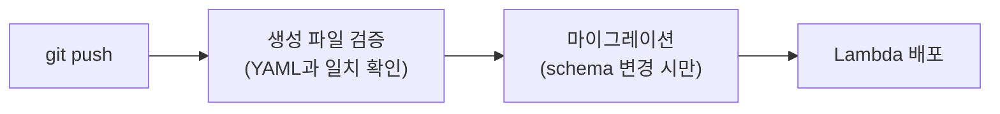

## 목차
1. [배경: 1~2일 걸리는 데이터 분석](#배경-12일-걸리는-데이터-분석)
2. [문제 분석: 수동 데이터 수집의 한계](#문제-분석-수동-데이터-수집의-한계)
3. [해결 목표](#해결-목표)
4. [아키텍처 설계](#아키텍처-설계)
5. [핵심 구현 1: Firehose + Lambda Transform](#핵심-구현-1-firehose--lambda-transform)
6. [핵심 구현 2: Parquet 변환과 파티셔닝](#핵심-구현-2-parquet-변환과-파티셔닝)
7. [핵심 구현 3: Redshift 적재와 중복 제거](#핵심-구현-3-redshift-적재와-중복-제거)
8. [핵심 구현 4: YAML 기반 스키마 자동화](#핵심-구현-4-yaml-기반-스키마-자동화)
9. [결과](#결과)
10. [배운 점](#배운-점)

---

## 배경: 1~2일 걸리는 데이터 분석

"지난 주 프로모션 배너의 클릭률을 분석하고 싶어요."

마케팅팀의 요청입니다. 하지만 데이터를 전달받기까지 평균 1~2일이 걸렸습니다. 그 사이 캠페인은 이미 끝나있고, 다음 기획은 과거 데이터 없이 진행될 수밖에 없었습니다.

**기존 프로세스:**
```
1. 데이터 담당자가 어드민에서 직접 다운로드 또는 개발팀에 데이터 요청
2. 개발팀이 DB 직접 조회 후 전달
3. 데이터 담당자가 전처리 (중복 제거, 포맷 변환)
4. 데이터 웨어하우스에 수동 적재
5. 1~2일 후 분석 가능
```

개발자는 반복적인 데이터 추출 작업에 시간을 빼앗기고, 데이터 담당자는 적시에 데이터를 확보하지 못하는 상황이었습니다.

---

## 문제 분석: 수동 데이터 수집의 한계

**1. 데이터 리드타임 (1~2일)**

요청 접수(수 시간) → DB 조회(쿼리 작성 + 실행) → 전처리(중복 제거, 포맷 변환) → 적재까지, 최소 반나절에서 보통 1~2일이 소요되었습니다.

**2. 개발자 리소스 낭비**

반복적인 데이터 추출 요청이 수시로 발생하여 매번 쿼리를 작성하고 결과를 전달하는 단순 작업에 개발 시간을 소비했습니다.

**3. 데이터 정합성 이슈**

수동 전처리 과정에서 중복 제거 기준이 매번 달라지거나, 포맷 변환·인코딩 실수가 발생할 수 있었습니다. 동일한 데이터를 요청해도 담당자에 따라 결과가 달라질 수 있는 구조였습니다.

**4. 히스토리 추적 불가**

어제의 데이터와 오늘의 데이터가 다르면 원인 파악이 어렵습니다. 누가, 언제, 어떤 로직으로 전처리했는지 기록이 남지 않았습니다.

---

## 해결 목표

- **데이터 리드타임**: 1~2일 → 당일 데이터 리드 가능
- 개발자 개입 없이 자동화
- Tableau 대시보드 자동 업데이트
- 데이터 유실률 0%

---

## 아키텍처 설계

### Kinesis Data Streams vs Data Firehose

실시간 스트리밍 서비스로 Kinesis Data Streams와 Data Firehose를 비교했습니다.

| 기준 | Kinesis Data Streams | Data Firehose |
|------|---------------------|---------------|
| 데이터 보존 | 최대 365일 보존, 재처리 가능 | 보존 없음 (전달 후 삭제) |
| 소비자 | 다수 소비자 가능 (팬아웃) | S3/Redshift 등 단일 목적지 |
| 비용 | 샤드 단위 과금 (상시 비용) | 처리량 기반 종량제 |
| 운영 | 샤드 수 관리 필요 | 완전 관리형 |
| 변환 | 별도 Lambda/KDA 구성 필요 | 내장 Lambda Transform + Format Conversion |

**Firehose 선택 이유:**
- 이벤트 로그는 S3/Redshift에 적재하는 **단일 목적**이므로 다수 소비자가 불필요
- 샤드 관리 없이 트래픽에 따라 자동 확장되어 **운영 부담이 없음**
- Lambda Transform과 Format Conversion이 내장되어 **별도 변환 인프라 불필요**
- 트래픽이 적을 때는 비용이 거의 0원인 종량제 과금

Kinesis Data Streams는 실시간 재처리나 여러 소비자에게 팬아웃이 필요한 경우에 적합하지만, 로그 수집 → 적재라는 단순한 흐름에는 Firehose가 비용과 운영 면에서 유리했습니다.

### 전체 아키텍처


```mermaid
flowchart TB
    Client["클라이언트 (웹/앱)"] -->|이벤트 로그 전송| API["백엔드 API"]
    API -->|putRecordBatch| Firehose["Data Firehose"]

    subgraph firehose_processing["Firehose 처리"]
        Firehose --> Backup["Source Backup\n원본 JSON 보존"]
        Firehose --> Transform["Lambda Transform\n타입 검증 · truncate · KST 변환"]
    end

    Backup --> S3Raw["S3 Raw\n장애 복구용"]
    Transform --> FormatConvert["Format Conversion\nGlue 스키마 참조"]
    FormatConvert -->|Parquet 변환| S3Parquet["S3 Parquet\n날짜·시간 파티셔닝"]

    subgraph scheduled["30분 주기 스케줄"]
        Handler["Lambda\nRedshift 적재"]
    end

    S3Parquet --> Handler
    Handler -->|"COPY + 중복 제거"| Redshift["Amazon Redshift"]

    S3Parquet -.->|Glue Catalog| Athena["Amazon Athena"]
    Redshift --> Tableau["Tableau 대시보드"]
```

데이터는 크게 세 단계를 거칩니다.

1. **실시간 수집**: 클라이언트 → 백엔드 API → Firehose → Lambda Transform → S3 Parquet
2. **주기적 적재**: S3 Parquet → Lambda → Redshift (30분 주기)
3. **분석**: Athena(즉시 조회) + Redshift → Tableau(대시보드)

---

## 핵심 구현 1: Firehose + Lambda Transform

### 두 경로 동시 처리

Firehose가 이벤트를 수신하면 두 경로로 동시에 처리합니다.

1. **Source Backup**: 원본 JSON을 그대로 S3에 보존 (장애 복구용)
2. **Lambda Transform → Format Conversion**: 데이터를 검증·변환한 뒤 Parquet로 저장

Source Backup은 Lambda Transform이나 Format Conversion에서 장애가 발생했을 때 원본 데이터를 복구할 수 있는 안전장치입니다.

### Lambda Transform이 필요한 이유

Format Conversion만으로는 타입 검증, 필드 길이 제한, 타임존 변환 같은 비즈니스 로직을 처리할 수 없습니다. Lambda Transform이 데이터를 정제하고, Format Conversion이 Parquet 변환을 담당하는 **역할 분리 구조**를 설계했습니다.

**Lambda Transform 처리 내용:**
- 필수 필드 검증 (검증 실패 시 Dropped 처리)
- 문자열 필드를 스키마에 정의된 VARCHAR 길이에 맞게 truncate
- 정수 필드의 범위 검증 (SMALLINT, INTEGER 등)
- JSON 객체를 문자열로 직렬화
- UTC → KST 타임스탬프 변환
- 파티션 키(날짜, 시간) 추출

**결과 코드**: 각 레코드에 대해 `Ok`(성공), `Dropped`(검증 실패), `ProcessingFailed`(예외) 중 하나를 반환합니다. Firehose는 ProcessingFailed 레코드를 별도 에러 경로에 자동 분리 저장합니다.

---

## 핵심 구현 2: Parquet 변환과 파티셔닝

### JSON vs Parquet

Parquet는 컬럼 기반 포맷입니다. 수십 개 컬럼 중 필요한 컬럼만 읽을 수 있어 스토리지 비용과 쿼리 속도 모두 개선됩니다.

| 포맷 | 저장 용량 | Athena 쿼리 |
|------|----------|------------|
| JSON (GZIP) | 기준 | 전체 레코드를 스캔해야 함 |
| Parquet (SNAPPY) | 대폭 절감 | 필요한 컬럼만 읽어 빠르고 저렴 |

### Small File Problem 방지

Parquet의 장점은 **대량의 레코드를 하나의 파일에 담았을 때** 나타납니다. Lambda에서 레코드를 개별 Parquet 파일로 변환하면 오히려 JSON보다 파일이 커지고, Athena에서 Small File Problem이 발생합니다.

이를 해결하기 위해 Firehose의 Format Conversion을 활용했습니다. Firehose가 버퍼링한 데이터를 Glue Data Catalog 스키마를 참조하여 **한 파일로 묶어** Parquet 변환합니다.

### 압축: SNAPPY 선택

```
- GZIP: 높은 압축률, 느린 속도
- Snappy: 적절한 압축률, 빠른 속도 ✅
```

SNAPPY는 압축률은 GZIP보다 낮지만, 압축/해제 속도가 빨라 실시간 파이프라인에 적합합니다.

### 날짜·시간 파티셔닝

S3에 날짜와 시간으로 2단계 파티셔닝하여 저장합니다. Athena 쿼리 시 특정 날짜·시간 범위만 스캔하므로 불필요한 데이터 스캔을 방지하고 비용을 절감합니다.

### 스키마 진화(Schema Evolution)

이벤트 타입이 추가되거나 필드가 변경되는 것은 데이터 파이프라인에서 가장 빈번한 변경 사항입니다.

**하위 호환성 원칙:**
- 새 필드는 **nullable로만 추가** (기존 레코드에 영향 없음)
- 필드 삭제/타입 변경은 금지 → 새 필드를 추가하고 기존 필드는 deprecated 처리

Parquet의 self-describing 특성 덕분에, 새 필드가 추가된 파일과 기존 파일이 공존해도 Athena가 정상적으로 쿼리합니다. 기존 파일에서 새 필드는 NULL로 반환됩니다.

---

## 핵심 구현 3: Redshift 적재와 중복 제거

### 적재 스케줄

30분 주기로 Lambda가 S3의 Parquet 데이터를 Redshift에 적재합니다.

Tableau가 정시(:00)와 반(:30)에 Redshift에서 데이터를 수집하므로, **5분 전에 적재를 시작**하여 Tableau 수집 시점에 최신 데이터가 준비되도록 했습니다.

### 적재 흐름


```mermaid
flowchart LR
    A["S3 Parquet"] -->|COPY| B["임시 테이블"]
    B -->|"중복 제거 INSERT"| C["메인 테이블"]
    C -->|완료| D["임시 테이블 삭제"]
```

1. 직전 시간과 현재 시간의 S3 경로 존재 여부를 확인합니다.
2. 임시 테이블을 생성하고 Parquet COPY로 데이터를 적재합니다.
3. 복합 dedup 키 기준으로 중복을 제거하며 메인 테이블에 INSERT합니다.
4. 임시 테이블을 삭제합니다.

직전 시간(hour-1)과 현재 시간(hour-0)을 모두 COPY하는 이유는, Firehose 버퍼링 타이밍에 따라 직전 시간 파티션에 늦게 도착하는 데이터가 있을 수 있기 때문입니다.

### NULL-safe 중복 제거

Firehose의 at-least-once 특성상 중복 데이터가 발생할 수 있습니다. 이때 일반 `=` 연산자로 dedup 키를 비교하면 문제가 생깁니다.

```sql
-- = 연산자: NULL 비교 실패
NULL = NULL  → FALSE  -- 중복인데도 삽입됨

-- IS NOT DISTINCT FROM: NULL도 같은 값으로 취급
NULL IS NOT DISTINCT FROM NULL  → TRUE  -- 중복 정상 차단
```

`IS NOT DISTINCT FROM`을 사용하여 복합 dedup 키에 NULL이 포함되어도 중복 레코드를 정확하게 걸러냅니다.

---

## 핵심 구현 4: YAML 기반 스키마 자동화

### 문제: 스키마 불일치

수십 개 컬럼의 스키마를 Redshift DDL, Glue 스키마, TypeScript 타입, Lambda 변환 함수에 각각 수동으로 관리하면 어디선가 불일치가 발생합니다. 실제로 Parquet 컬럼 타입과 Redshift 테이블 타입이 맞지 않으면 Spectrum Scan Error가 발생하는데, 수동 관리에서는 이런 실수를 방지하기 어렵습니다.

### 해결: Single Source of Truth

**YAML 스키마를 유일한 정의로 두고, 나머지 모든 파일을 자동 생성하는 구조**를 만들었습니다.


```mermaid
flowchart LR
    YAML["YAML 스키마\n(유일한 수정 대상)"] --> DDL["Redshift DDL"]
    YAML --> Glue["Glue 스키마\n(Firehose + Cleaned)"]
    YAML --> TS["TypeScript 타입\n+ 변환 함수"]
```

YAML에 테이블 설정(dedup 키, 필수 필드, 파티션 컬럼 등)과 컬럼 정의(타입, 길이, 검증 규칙 등)를 선언하면:

- **Redshift DDL**: CREATE TABLE 문 자동 생성
- **Glue 스키마**: Firehose용과 Cleaned(파티션 분리)용 두 가지 자동 생성
- **TypeScript**: Raw/Transformed 인터페이스, VARCHAR 제한값, 변환 함수 자동 생성

### CI 검증으로 드리프트 차단


```mermaid
flowchart LR
    Push["git push"] --> Check["생성 파일 검증\n(YAML과 일치 확인)"]
    Check --> Migrate["마이그레이션\n(schema 변경 시만)"]
    Migrate --> Deploy["Lambda 배포"]
```

- **생성 파일 검증**: YAML과 자동 생성된 파일의 일치 여부를 CI에서 검증합니다. `npm run generate`를 실행하지 않고 커밋하면 CI가 실패합니다.
- **마이그레이션**: 스키마 변경이 감지된 경우에만 실행되며, diff 기반으로 변경분만 Glue와 Redshift에 적용합니다.

컬럼 하나를 추가할 때 YAML 한 곳만 수정하면 Redshift DDL, Glue 스키마, TypeScript 타입, 변환 함수가 모두 동기화됩니다.

---

## 결과

### Before / After

| 단계 | Before | After |
|------|--------|-------|
| 데이터 수집 | 어드민 다운로드 / 개발팀 요청 | Firehose 자동 수집 |
| 전처리 | 수동 (중복 제거, 포맷 변환) | Lambda Transform 자동 검증·변환 |
| 적재 | 수동 (DW에 직접 입력) | 30분 주기 자동 COPY |
| 분석 | 1~2일 후 | Tableau 대시보드 자동 업데이트 |
| 스키마 변경 | 여러 시스템에 수동 반영 | YAML 수정 → CI 자동 동기화 |

기존에는 데이터 담당자가 어드민에서 직접 다운로드하거나 개발팀에 데이터를 요청한 뒤, 전처리를 거쳐 수동으로 적재해야 했습니다. 파이프라인 구축 후 이 과정이 완전히 자동화되었습니다. 마케팅팀은 Tableau에서 직접 데이터를 조회할 수 있게 되었고, 개발팀은 데이터 추출 요청에서 해방되었습니다.

---

## 배운 점

**Kinesis Data Streams vs Firehose** — 실시간 재처리나 팬아웃이 필요하면 Kinesis Data Streams, 단일 목적지 적재라면 Firehose가 비용·운영 면에서 유리합니다. 요구사항에 맞는 서비스를 선택하는 것이 중요합니다.

**Lambda Transform + Format Conversion 역할 분리** — Format Conversion만으로는 비즈니스 로직을 처리할 수 없습니다. Lambda가 정제하고 Firehose가 Parquet 변환하는 2단계 구조가 효과적이었습니다.

**Source Backup은 필수** — 파이프라인 어디서든 장애가 발생할 수 있으므로, 원본 데이터를 별도 보존하는 것이 중요합니다.

**IS NOT DISTINCT FROM** — `=` 연산자는 `NULL = NULL`을 `FALSE`로 평가합니다. dedup 키에 NULL이 포함될 가능성이 있다면 반드시 `IS NOT DISTINCT FROM`을 사용해야 합니다.

**스키마 자동화** — 컬럼이 많아질수록 수동 관리는 불일치를 만듭니다. YAML 기반 코드 생성 + CI 검증으로 스키마 드리프트를 원천 차단했습니다.

**Parquet + 파티셔닝** — 컬럼 기반 포맷으로 필요한 컬럼만 읽고, 날짜·시간 파티셔닝으로 필요한 범위만 스캔하여 비용과 성능을 동시에 개선했습니다.

---

## 기술 스택

| 분류 | 기술 |
|------|------|
| **이벤트 수집** | AWS Data Firehose |
| **데이터 변환** | Lambda Transform + Format Conversion |
| **스키마 관리** | Glue Data Catalog, YAML 코드 생성 |
| **스토리지** | S3 (Parquet + Snappy) |
| **쿼리 엔진** | Athena |
| **데이터 웨어하우스** | Redshift |
| **시각화** | Tableau |
