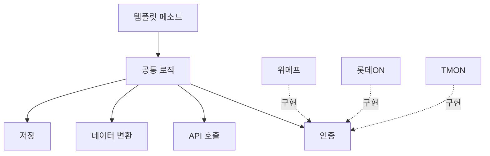

## 개요
템플릿 메소드 패턴을 활용하여 다중 커머스 플랫폼의 주문 수집 배치 시스템을 설계하고 구축하여 처리 성능을 10배 개선하고 신규 커머스 추가 시간을 2주에서 2일로 단축했습니다.

## 문제 상황

**다중 커머스 플랫폼 연동:**

위메프, 롯데ON, TMON 등 여러 외부 커머스 플랫폼과 연동하여 주문 데이터를 수집해야 했습니다. 각 플랫폼별 API 스펙이 완전히 상이했습니다:

- **응답 형식:** JSON, XML, CSV 등 다양
- **인증 방식:** API Key, OAuth, Basic Auth 등 제각각
- **데이터 구조:** 주문 정보 필드명 및 계층 구조 모두 상이

**기존 시스템의 문제:**

- **성능 저하:** 주문 10,000건 수집에 30분 소요 (순차 처리)
- **코드 중복:** 커머스별로 거의 동일한 로직을 중복 구현 (인증 → 조회 → 파싱 → 저장)
- **유지보수 어려움:** 새로운 커머스 추가 시 2주 이상 소요, 버그 수정 시 모든 커머스 코드 수정 필요

## 주요 성과

- 처리 시간: 30분 → 3분 (10배 향상)
- 코드 중복: 70% 감소
- 신규 커머스 추가: 2주 → 2일

## 아키텍처

## 주요 기능

**템플릿 메소드 패턴 적용:**

- **공통 로직 추상화:** 인증 → API 호출 → 데이터 변환 → 저장 플로우를 상위 클래스에서 정의
- **커머스별 특화 로직 분리:** 각 커머스 구현체는 인증 방식, 파싱 로직만 구현
- **신규 커머스 추가 용이:** 추상 클래스 상속 후 3개 메서드만 구현하면 완료 (2주 → 2일)
- **병렬 처리:** CompletableFuture를 활용하여 여러 커머스 동시 수집 (처리 시간 10배 향상)

**Jenkins 기반 배치 관리:**

- LocalDateTime 파라미터로 특정 기간 재수집 가능
- 실패한 작업만 선택적으로 재실행
- 재시도 로직 + Slack 알림 연동

**에러 핸들링:**

- 커머스별 독립적 에러 처리 (한 커머스 실패해도 다른 커머스 계속 수집)
- 상세한 로깅으로 장애 원인 추적 용이

## 기술 스택

- Java 11, Spring Boot 2, Jenkins, Slack API

## 배운 점

- 디자인 패턴(템플릿 메소드)을 실전에 효과적으로 적용하는 경험
- 배치 시스템의 성능 최적화 기법 (병렬 처리, 비동기 I/O)
- 유지보수성과 확장성을 고려한 아키텍처 설계 능력 향상
- 다양한 외부 시스템 통합 시 추상화 계층의 중요성 학습
