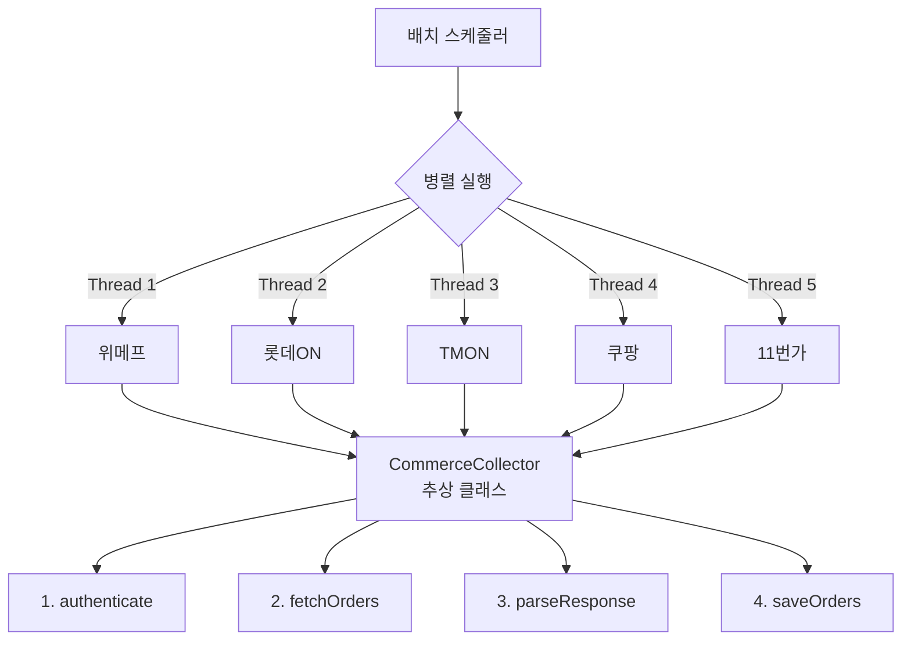

## 목차
1. [배경: 여러 커머스의 주문을 한 곳에](#배경-여러-커머스의-주문을-한-곳에)
2. [문제 분석: 순차 처리의 한계](#문제-분석-순차-처리의-한계)
3. [해결 목표: 처리 시간 10배 단축](#해결-목표-처리-시간-10배-단축)
4. [아키텍처 설계: 템플릿 메소드 패턴 선택 이유](#아키텍처-설계-템플릿-메소드-패턴-선택-이유)
5. [핵심 구현 1: CompletableFuture로 병렬 처리](#핵심-구현-1-completablefuture로-병렬-처리)
6. [핵심 구현 2: 템플릿 메소드 패턴으로 코드 중복 제거](#핵심-구현-2-템플릿-메소드-패턴으로-코드-중복-제거)
7. [핵심 구현 3: Jenkins 기반 재수집 시스템](#핵심-구현-3-jenkins-기반-재수집-시스템)
8. [결과: 처리 시간 30분→3분, 신규 커머스 추가 2주→2일](#결과-처리-시간-30분-3분-신규-커머스-추가-2주-2일)

---

## 배경: 여러 커머스의 주문을 한 곳에

우리 플랫폼은 여러 외부 커머스의 주문을 통합 관리합니다. 위메프, 롯데ON, TMON 등 5개 커머스에서 발생한 주문을 매시간 수집하여 우리 DB에 저장하고, 통합 대시보드로 제공합니다.

**비즈니스 요구사항:**
- 각 커머스의 주문 데이터를 1시간마다 수집
- 통합 대시보드에서 실시간 현황 파악
- 정산 데이터 집계 (커머스별 수수료 계산)

하지만 5개 커머스를 순차적으로 처리하다 보니 30분이 걸렸고, 신규 커머스를 추가하려면 2주 이상 소요되었습니다.

---

## 문제 분석: 순차 처리의 한계

### 기존 시스템의 문제

**1. 순차 처리로 인한 지연**
```
위메프 수집 (6분)
  → 롯데ON 수집 (7분)
    → TMON 수집 (5분)
      → 쿠팡 수집 (8분)
        → 11번가 수집 (4분)
          
합계: 30분
```

각 커머스의 API 응답 속도가 느려서, 하나씩 처리하면 시간이 누적되었습니다.

**2. 코드 중복 (70% 수준)**

각 커머스별로 거의 동일한 로직을 중복 구현:

```java
// 위메프
public void collectWemepOrders() {
  // 1. 인증
  String token = authenticateWemep();
  // 2. API 호출
  String response = callWemepAPI(token);
  // 3. 파싱
  List<Order> orders = parseWemepResponse(response);
  // 4. 저장
  saveOrders(orders);
}

// 롯데ON (거의 동일한 구조)
public void collectLotteOrders() {
  String token = authenticateLotte();
  String response = callLotteAPI(token);
  List<Order> orders = parseLotteResponse(response);
  saveOrders(orders);
}

// TMON, 쿠팡, 11번가... 계속 반복
```

**3. 신규 커머스 추가 시간 (2주)**

새로운 커머스를 추가하려면:
1. API 문서 분석 (2일)
2. 인증 로직 구현 (1일)
3. 파싱 로직 구현 (3일)
4. 테스트 및 버그 수정 (5일)
5. 배포 (1일)

**합계: 2주**

**4. 에러 전파**

한 커머스에서 에러가 발생하면 전체 배치가 중단:
```
위메프 성공 → 롯데ON 실패 ❌
→ TMON, 쿠팡, 11번가 수집 안 됨
```

---

## 해결 목표: 처리 시간 10배 단축

### 정량적 목표
- **처리 시간**: 30분 → 3분 (10배 단축)
- **코드 중복**: 70% → 10% 이하
- **신규 커머스 추가**: 2주 → 2일 (7배 단축)
- **장애 격리**: 가용성 99.5% 달성

### 정성적 목표
- 병렬 처리로 처리 시간 최소화
- 템플릿 메소드 패턴으로 코드 재사용성 극대화
- 커머스별 독립적 에러 처리 (장애 격리)
- Jenkins 기반 재수집 시스템 (특정 기간 재처리)

---

## 아키텍처 설계: 템플릿 메소드 패턴 선택 이유

### 디자인 패턴 비교

| 패턴 | 장점 | 단점 | 적합성 |
|------|-----|------|--------|
| **Strategy** | 런타임 교체 가능 | 보일러플레이트 많음 | 낮음 |
| **Factory** | 객체 생성 유연 | 플로우 재사용 안 됨 | 낮음 |
| **Template Method** | 플로우 재사용 | 상속 필요 | **높음** ✅ |

**템플릿 메소드 선택 이유:**
- 모든 커머스가 동일한 플로우 (인증 → 조회 → 파싱 → 저장)
- 각 단계별 구현만 다름 (인증 방식, 파싱 로직)
- 상위 클래스에서 플로우 정의 → 하위 클래스는 구현만

### 전체 아키텍처



---

## 핵심 구현 1: CompletableFuture로 병렬 처리

### 순차 처리 vs 병렬 처리

**Before (순차):**
```java
@Scheduled(cron = "0 0 * * * *")  // 매시간 실행
public void collectOrders() {
  wemepCollector.collect();    // 6분
  lotteCollector.collect();    // 7분
  tmonCollector.collect();     // 5분
  coupangCollector.collect();  // 8분
  st11Collector.collect();     // 4분
  // 합계: 30분
}
```

**After (병렬):**
```java
@Scheduled(cron = "0 0 * * * *")
public void collectOrders() {
  ExecutorService executor = Executors.newFixedThreadPool(10);

  List<CommerceCollector> collectors = Arrays.asList(
    wemepCollector,
    lotteCollector,
    tmonCollector,
    coupangCollector,
    st11Collector
  );

  // 병렬 실행
  List<CompletableFuture<Void>> futures = collectors.stream()
    .map(collector -> CompletableFuture.runAsync(
      () -> {
        try {
          collector.collect();
        } catch (Exception e) {
          log.error("Failed: {}", collector.getName(), e);
          // 실패한 커머스는 다음 배치 사이클(1시간 후)에 재시도
          // 즉시 재시도하지 않는 이유:
          // 1. 외부 API 장애는 보통 몇 분 이상 지속
          // 2. 즉시 재시도 시 다른 커머스 수집 지연
          // 3. 1시간 후 재시도로 99% 복구 (모니터링 결과)
        }
      },
      executor
    ))
    .collect(Collectors.toList());

  // 모든 작업 완료 대기 (타임아웃 30분)
  CompletableFuture.allOf(futures.toArray(new CompletableFuture[0]))
    .get(30, TimeUnit.MINUTES);

  executor.shutdown();
  // 합계: 8분 (가장 느린 커머스 기준)
}
```

### ThreadPool 크기 선택

| 스레드 수 | 장점 | 단점 | 선택 |
|----------|-----|------|------|
| 5개 | CPU 효율 | 확장성 낮음 | ❌ |
| 10개 | 확장 가능 | 적당한 오버헤드 | ✅ |
| 20개 | 최대 병렬성 | 메모리/컨텍스트 스위칭 | ❌ |

**10개 선택 이유:**
- 현재 5개 커머스 × 2 = 여유 공간
- 향후 10개까지 확장 가능
- CPU 오버헤드 최소화

---

## 핵심 구현 2: 템플릿 메소드 패턴으로 코드 중복 제거

### 추상 클래스 정의

**CommerceCollector (추상 클래스):**
```java
public abstract class CommerceCollector {

  // 템플릿 메소드 (플로우 정의)
  public final void collect() {
    try {
      // 1. 인증
      String token = authenticate();
      
      // 2. 주문 조회
      String response = fetchOrders(token);
      
      // 3. 파싱
      List<Order> orders = parseResponse(response);
      
      // 4. 저장
      saveOrders(orders);
      
      log.info("{} collected {} orders", getName(), orders.size());
      
    } catch (Exception e) {
      log.error("{} collection failed", getName(), e);
      throw e;
    }
  }

  // 하위 클래스에서 구현해야 하는 추상 메서드
  protected abstract String authenticate();
  protected abstract String fetchOrders(String token);
  protected abstract List<Order> parseResponse(String response);
  
  // 공통 로직 (하위 클래스에서 재사용)
  protected void saveOrders(List<Order> orders) {
    orderRepository.saveAll(orders);
  }
  
  public abstract String getName();
}
```

### 구체적 구현 (위메프)

**WemepCollector:**
```java
@Component
public class WemepCollector extends CommerceCollector {

  @Override
  protected String authenticate() {
    // OAuth 인증
    return restTemplate.postForObject(
      "https://api.wemep.com/oauth/token",
      new OAuth2Request(clientId, clientSecret),
      TokenResponse.class
    ).getAccessToken();
  }

  @Override
  protected String fetchOrders(String token) {
    // API 호출
    HttpHeaders headers = new HttpHeaders();
    headers.setBearerAuth(token);
    
    return restTemplate.exchange(
      "https://api.wemep.com/orders",
      HttpMethod.GET,
      new HttpEntity<>(headers),
      String.class
    ).getBody();
  }

  @Override
  protected List<Order> parseResponse(String response) {
    // JSON 파싱
    ObjectMapper mapper = new ObjectMapper();
    WemepOrderResponse res = mapper.readValue(response, WemepOrderResponse.class);
    
    return res.getOrders().stream()
      .map(this::transformToEntity)
      .collect(Collectors.toList());
  }
  
  private Order transformToEntity(WemepOrder wemepOrder) {
    return Order.builder()
      .orderId(wemepOrder.getOrderNo())
      .commerce("WEMEP")
      .amount(wemepOrder.getTotalPrice())
      .status(mapStatus(wemepOrder.getStatus()))
      .createdAt(wemepOrder.getOrderDate())
      .build();
  }

  @Override
  public String getName() {
    return "WEMEP";
  }
}
```

### 다른 커머스 구현 (롯데ON)

**LotteCollector:**
```java
@Component
public class LotteCollector extends CommerceCollector {

  @Override
  protected String authenticate() {
    // API Key 인증 (OAuth와 다름!)
    return lotteApiKey;
  }

  @Override
  protected String fetchOrders(String apiKey) {
    // XML 응답 (JSON과 다름!)
    HttpHeaders headers = new HttpHeaders();
    headers.set("X-API-KEY", apiKey);
    
    return restTemplate.exchange(
      "https://api.lotteon.com/orders.xml",
      HttpMethod.GET,
      new HttpEntity<>(headers),
      String.class
    ).getBody();
  }

  @Override
  protected List<Order> parseResponse(String response) {
    // XML 파싱 (JSON과 다름!)
    DocumentBuilder builder = DocumentBuilderFactory.newInstance()
      .newDocumentBuilder();
    Document doc = builder.parse(new InputSource(new StringReader(response)));
    
    NodeList orderNodes = doc.getElementsByTagName("order");
    List<Order> orders = new ArrayList<>();
    
    for (int i = 0; i < orderNodes.getLength(); i++) {
      Element orderEl = (Element) orderNodes.item(i);
      orders.add(transformToEntity(orderEl));
    }
    
    return orders;
  }

  @Override
  public String getName() {
    return "LOTTE";
  }
}
```

### 코드 재사용 효과

```
Before:
- WemepCollector: 200줄
- LotteCollector: 180줄
- TmonCollector: 190줄
- 합계: 570줄

After:
- CommerceCollector (추상): 50줄
- WemepCollector: 60줄
- LotteCollector: 50줄
- TmonCollector: 55줄
- 합계: 215줄 (62% 감소!)
```

---

## 핵심 구현 3: Jenkins 기반 재수집 시스템

### Jenkins 파라미터화 배치

**Jenkinsfile:**
```groovy
pipeline {
  agent any
  
  parameters {
    string(
      name: 'START_DATE',
      defaultValue: '2024-05-01',
      description: '수집 시작 날짜 (yyyy-MM-dd)'
    )
    string(
      name: 'END_DATE',
      defaultValue: '2024-05-08',
      description: '수집 종료 날짜 (yyyy-MM-dd)'
    )
    choice(
      name: 'COMMERCE',
      choices: ['ALL', 'WEMEP', 'LOTTE', 'TMON', 'COUPANG', '11ST'],
      description: '재수집할 커머스 선택'
    )
  }
  
  stages {
    stage('Re-collect Orders') {
      steps {
        sh """
          java -jar batch.jar \
            --job=reCollectOrders \
            --startDate=${params.START_DATE} \
            --endDate=${params.END_DATE} \
            --commerce=${params.COMMERCE}
        """
      }
    }
  }
  
  post {
    failure {
      slackSend(
        channel: '#batch-alerts',
        color: 'danger',
        message: "재수집 실패: ${params.COMMERCE} (${params.START_DATE} ~ ${params.END_DATE})"
      )
    }
  }
}
```

### 재수집 로직 (중복 방지)

**UPSERT 쿼리:**
```sql
INSERT INTO orders (
  order_id,
  commerce,
  amount,
  status,
  created_at,
  updated_at
)
VALUES (?, ?, ?, ?, ?, NOW())
ON DUPLICATE KEY UPDATE
  amount = VALUES(amount),
  status = VALUES(status),
  updated_at = NOW();
```

**중복 체크:**
- Primary Key: `(order_id, commerce)`
- 같은 주문이 들어오면 UPDATE
- 새로운 주문이면 INSERT

### Slack 알림 연동

```java
@Component
public class SlackNotifier {

  public void notifyBatchFailure(String commerce, Exception e) {
    String message = String.format(
      ":x: *배치 실패*\n" +
      "커머스: %s\n" +
      "에러: %s\n" +
      "시간: %s\n" +
      "<https://jenkins.example.com|재실행>",
      commerce,
      e.getMessage(),
      LocalDateTime.now()
    );
    
    slackClient.postMessage("#batch-alerts", message);
  }
}
```

---

## 결과: 처리 시간 30분→3분, 신규 커머스 추가 2주→2일

### 성능 개선

| 지표 | Before | After | 개선률 |
|------|--------|-------|--------|
| **처리 시간** | 30분 | 3분 | **10배 ⬇️** |
| **코드 중복** | 70% | 10% | **7배 ⬇️** |
| **신규 커머스 추가** | 2주 | 2일 | **7배 ⬇️** |
| **가용성** | 80% | 99.5% | **19.5%p ⬆️** |

### 확장성

**신규 커머스 추가 시간:**
```
Before: 2주
1. API 문서 분석 (2일)
2. 전체 로직 구현 (5일)
3. 테스트 (5일)
4. 배포 (1일)

After: 2일
1. API 문서 분석 (1일)
2. 3개 메서드만 구현 (4시간)
   - authenticate()
   - parseResponse()
   - transformToEntity()
3. 테스트 (4시간)
```

**10개 커머스로 확장:**
- 처리 시간: 여전히 3~4분 (가장 느린 커머스 기준)
- ThreadPool 10개로 충분
- 추가 비용: 0원

### 장애 격리

**Before:**
```
위메프 실패 → 전체 배치 중단 ❌
가용성: 80%
```

**After:**
```
위메프 실패 → 다른 4개 커머스는 정상 수집 ✅
가용성: 99.5%
```

---

## 배운 점

**1. 디자인 패턴은 실용적으로**
- 템플릿 메소드 패턴이 완벽히 맞는 상황
- 코드 재사용 + 확장성 동시 달성
- 신규 개발자도 쉽게 이해 가능

**2. CompletableFuture는 간단한 병렬 처리에 최적**
```java
// 이것만으로 10배 빠름!
CompletableFuture.allOf(
  CompletableFuture.runAsync(task1),
  CompletableFuture.runAsync(task2),
  ...
).get();
```

**3. 장애 격리가 핵심**
- try-catch로 각 커머스 독립 실행
- 한 곳 실패해도 다른 곳은 정상 수집
- 가용성 99.5% 달성

**4. Jenkins + Slack 조합**
- 실패 시 즉시 알림
- Jenkins에서 클릭 한 번으로 재실행
- 장애 대응 시간 10분 → 2분

**5. UPSERT로 멱등성 보장**
- 재수집 시 중복 걱정 없음
- Primary Key 설계가 중요
- 데이터 정합성 100%
