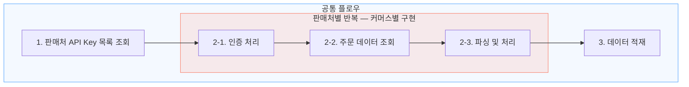
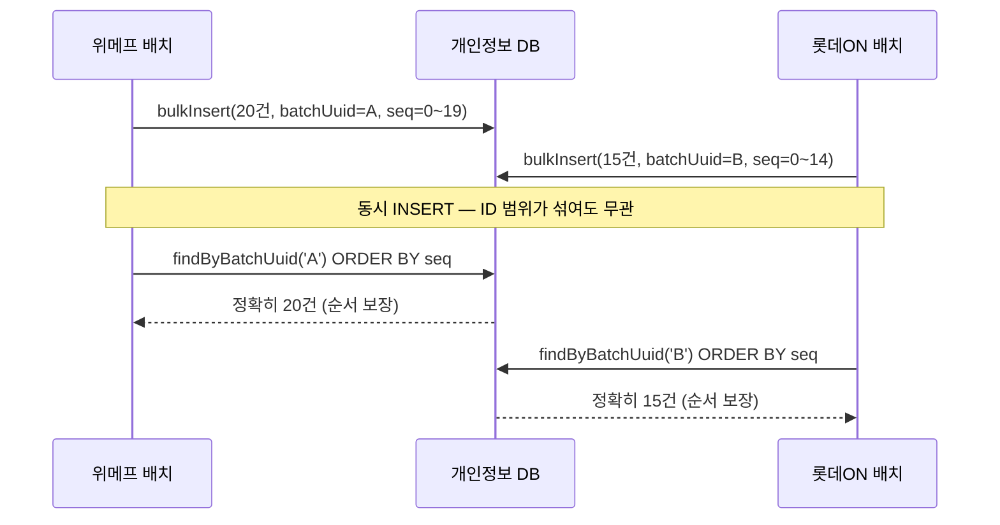
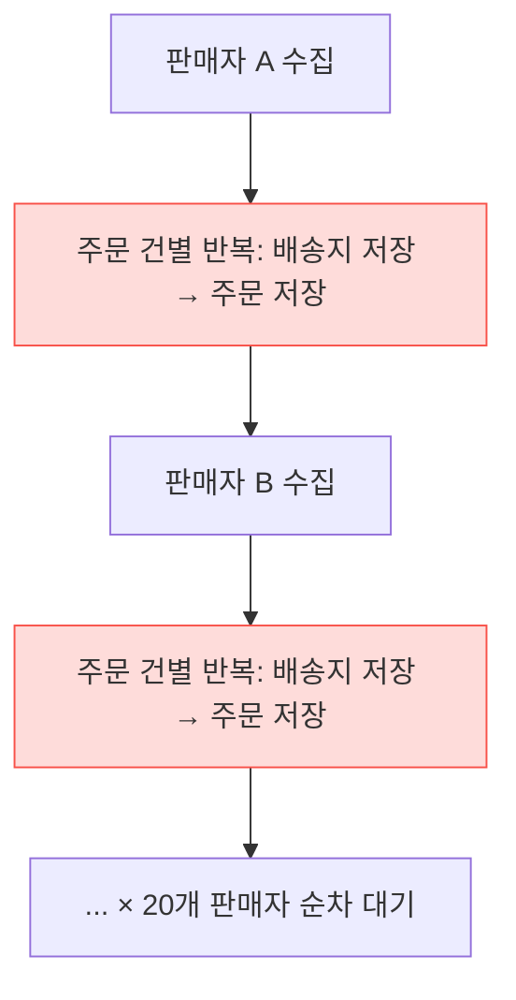
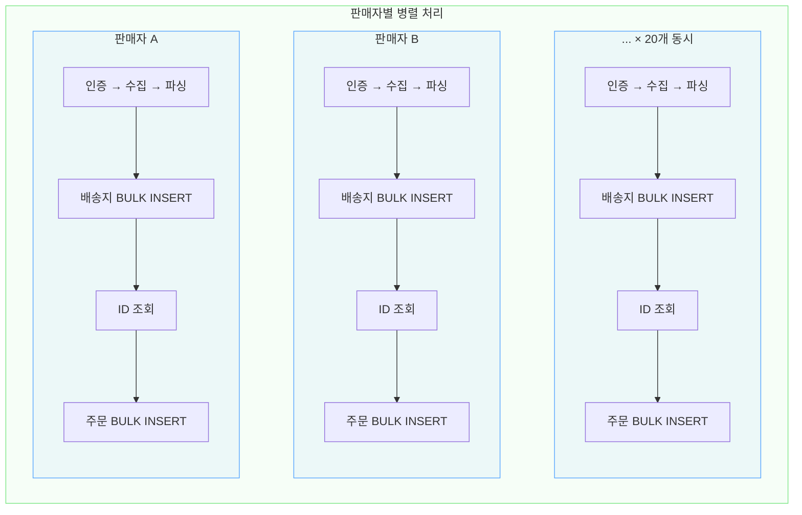

## 목차
1. [배경: 여러 커머스의 주문을 한 곳에](#배경-여러-커머스의-주문을-한-곳에)
2. [문제: 커머스 하나 추가하는 데 한 달](#문제-커머스-하나-추가하는-데-한-달)
3. [아키텍처 설계: 템플릿 메소드 패턴 선택 이유](#아키텍처-설계-템플릿-메소드-패턴-선택-이유)
4. [핵심 구현 1: 템플릿 메소드 패턴으로 코드 중복 제거](#핵심-구현-1-템플릿-메소드-패턴으로-코드-중복-제거)
5. [또 다른 문제: 배치 성능](#또-다른-문제-배치-성능)
6. [핵심 구현 2: 판매자별 비동기 병렬 처리](#핵심-구현-2-판매자별-비동기-병렬-처리)
7. [핵심 구현 3: 벌크 처리로 DB 라운드트립 최적화](#핵심-구현-3-벌크-처리로-db-라운드트립-최적화)
8. [결과: 신규 커머스 추가 한 달→2~3주, 처리 시간 30분→3분](#결과-신규-커머스-추가-한-달23주-처리-시간-30분3분)

---

## 배경: 여러 커머스의 주문을 한 곳에

카카오 i LaaS의 OMS(주문 관리 시스템)는 여러 외부 커머스의 주문을 통합 관리합니다. 위메프, 롯데ON, TMON 등 5개 커머스에서 발생한 주문을 **5분 주기로** 수집하여 DB에 저장하고, 통합 대시보드에서 실시간 현황을 제공합니다.

각 커머스별 배치는 **여러 판매자의 API Key**를 통해 주문 데이터를 수집합니다. 하나의 커머스에 수십 개의 판매자가 등록되어 있으며, 판매자마다 개별 API Key로 인증하여 주문을 조회합니다.

서비스가 성장하면서 두 가지 압박이 동시에 들어왔습니다. 첫째, 사업 확장으로 **신규 커머스 연동 요청이 연이어** 들어왔지만 기존 구조로는 추가에 한 달 이상이 걸렸고, 둘째, 판매자 수와 주문량이 늘면서 **기존 배치가 5분 주기를 지키지 못하는 커머스**가 생겼습니다. 이 두 문제를 함께 해결해야 했습니다.

---

## 문제: 커머스 하나 추가하는 데 한 달

신규 커머스를 연동하려면 수집 배치를 처음부터 개발해야 했습니다. 커머스마다 인증 방식, API 응답 포맷, 파싱 로직이 달랐지만, 공통 플로우(인증 → 조회 → 파싱 → 저장)는 동일했습니다. 그럼에도 코드를 재사용할 수 있는 구조가 아니었습니다.

**1. 코드 중복 (70% 수준)**

기존에는 커머스별로 각각 다른 개발자가 담당했기 때문에, 공통 플로우임에도 구현 방식이 제각각이었습니다. 거의 동일한 로직을 중복 구현하고 있었고, **각 커머스 수집 클래스가 1,000줄 이상**의 코드를 포함하고 있었습니다.

아래 코드는 이해를 돕기 위한 **예시 코드**입니다.

```java
// 위메프 배치
public void collectWemepOrders() {
  for (String apiKey : wemepApiKeys) {
    // 1. 인증
    String token = authenticateWemep(apiKey);
    // 2. API 호출
    String response = callWemepAPI(token);
    // 3. 파싱
    List<Order> orders = parseWemepResponse(response);
    // 4. 저장
    saveOrders(orders);
  }
}

// 롯데ON 배치 (거의 동일한 구조)
public void collectLotteOrders() {
  for (String apiKey : lotteApiKeys) {
    String token = authenticateLotte(apiKey);
    String response = callLotteAPI(token);
    List<Order> orders = parseLotteResponse(response);
    saveOrders(orders);
  }
}

// TMON, 쿠팡, 11번가... 계속 반복
```

**2. 신규 커머스 추가 시간 (한 달)**

기존 배치 구조가 통일되어 있지 않아 새로운 커머스를 추가하려면 처음부터 전체 로직을 구현해야 했습니다.

1. API 문서 분석 (3일)
2. 인증 로직 구현 (2일)
3. 수집/파싱 로직 구현 (1주)
4. 테스트 및 버그 수정 (2주)
5. 배포 및 안정화 (3일)

**합계: 약 한 달**

코드 중복을 해결하고, 신규 커머스를 추가할 때 **어떤 부분만 개발하면 되는지 코드 레벨에서 정립**하기 위해 디자인 패턴 도입을 검토했습니다.

---

## 아키텍처 설계: 템플릿 메소드 패턴 선택 이유

### 기존 배치 플로우 분석

커머스별 배치는 모두 동일한 큰 흐름을 따르고 있었습니다. 판매처 목록을 조회한 뒤, 각 판매처별로 반복하며 주문을 수집하고, 마지막에 데이터를 적재하는 구조입니다.


```mermaid
graph TB
    subgraph 공통["공통 플로우"]
        A["1. 판매처 API Key 목록 조회"] --> B
        subgraph 커머스별["판매처별 반복 — 커머스별 구현"]
            B["2-1. 인증 처리"] --> C["2-2. 주문 데이터 조회"]
            C --> D["2-3. 파싱 및 처리"]
        end
        D --> E["3. 데이터 적재"]
    end

    style 커머스별 fill:#f9826c22,stroke:#f9826c
    style 공통 fill:#58a6ff11,stroke:#58a6ff
```

크게 3단계로 나뉘는데, **앞(키 목록 조회)과 뒤(데이터 적재)는 모든 커머스가 동일**하고, **가운데 3개 단계(인증 → 조회 → 파싱)만 커머스별로 구현이 달랐습니다.** 즉, 커머스별로 실제 개발이 필요한 부분은 가운데뿐이었습니다.

### 디자인 패턴 비교

| 패턴 | 장점 | 단점 | 적합성 |
|------|-----|------|--------|
| **Strategy** | 런타임 교체 가능 | 단계별 Strategy 객체를 각각 만들고 조합해야 함 | 낮음 |
| **Factory** | 객체 생성 유연 | 플로우 자체를 재사용할 수 없음 | 낮음 |
| **Template Method** | 플로우 고정 + 단계별 구현 분리 | 상속 필요 | **높음** |

**템플릿 메소드 선택 이유:**

핵심은 **"플로우는 동일하고, 각 단계의 구현만 다르다"**는 점이었습니다.

- **플로우 고정**: 공통 플로우(키 조회 → 수집 → 적재)를 상위 클래스의 `final` 메서드로 고정하여 커머스별로 플로우가 달라질 여지를 차단
- **구현만 분리**: 커머스별로 달라지는 가운데 3단계(인증, 조회, 파싱)를 추상 메서드로 분리
- **컴파일 타임 강제**: 추상 메서드를 구현하지 않으면 컴파일 에러가 발생하므로, 신규 커머스 추가 시 **무엇을 개발해야 하는지 코드가 알려줌**
- **항상 함께 변경**: 한 커머스의 인증/조회/파싱은 항상 세트로 사용됩니다. Strategy처럼 단계별로 분리할 필요 없이, 하나의 클래스에서 함께 관리하는 것이 자연스러움

**Strategy를 선택하지 않은 이유:**

Strategy 패턴은 런타임에 알고리즘을 교체해야 할 때 적합합니다. 하지만 이 시스템에서는 위메프의 인증을 롯데ON의 파서와 조합하는 일이 없습니다. 커머스별 구현은 항상 하나의 단위로 움직이므로, 단계별 Strategy 객체를 만들고 조합하는 것은 불필요한 복잡도만 추가합니다.

---

## 핵심 구현 1: 템플릿 메소드 패턴으로 코드 중복 제거

### 추상 클래스 정의

배치의 단계를 명확히 나누고, 커머스별로 상이한 부분만 추상화하여 개별 구현하도록 했습니다.

**CommerceCollector (추상 클래스):**

아래 코드는 핵심 구조를 설명하기 위한 **예시 코드**입니다.

```java
public abstract class CommerceCollector {

  // 템플릿 메소드 (플로우 정의)
  public final void collect() {
    List<String> apiKeys = getApiKeys();
    List<Order> allOrders = new ArrayList<>();

    for (String apiKey : apiKeys) {
      // 1. 인증 처리 (커머스별 상이)
      String token = authenticate(apiKey);

      // 2. 주문 데이터 조회 (커머스별 상이)
      String response = fetchOrders(token);

      // 3. 파싱 및 처리 (커머스별 상이)
      List<Order> orders = parseResponse(response);

      // 4. 데이터 적재 (공통 로직 - 건별 저장)
      for (Order order : orders) {
        Address address = personalInfoDb.save(order.getAddress());
        order.setAddressId(address.getId());
        orderDb.save(order);
      }
      allOrders.addAll(orders);
    }

    log.info("{} collected {} orders from {} sellers",
      getName(), allOrders.size(), apiKeys.size());
  }

  // 커머스별로 구현해야 하는 추상 메서드
  protected abstract String authenticate(String apiKey);
  protected abstract String fetchOrders(String token);
  protected abstract List<Order> parseResponse(String response);
  protected abstract List<String> getApiKeys();
  public abstract String getName();
}
```

### 구체적 구현 (위메프)

**WemepCollector:**
```java
@Component
public class WemepCollector extends CommerceCollector {

  @Override
  protected String authenticate(String apiKey) {
    // OAuth 인증
    return restTemplate.postForObject(
      "https://api.wemep.com/oauth/token",
      new OAuth2Request(apiKey, clientSecret),
      TokenResponse.class
    ).getAccessToken();
  }

  @Override
  protected String fetchOrders(String token) {
    HttpHeaders headers = new HttpHeaders();
    headers.setBearerAuth(token);

    return restTemplate.exchange(
      "https://api.wemep.com/orders",
      HttpMethod.GET,
      new HttpEntity<>(headers),
      String.class
    ).getBody();
  }

  @Override
  protected List<Order> parseResponse(String response) {
    // JSON 파싱
    WemepOrderResponse res = objectMapper.readValue(
      response, WemepOrderResponse.class);

    return res.getOrders().stream()
      .map(this::transformToEntity)
      .collect(Collectors.toList());
  }

  @Override
  protected List<String> getApiKeys() {
    return sellerRepository.findApiKeysByCommerce("WEMEP");
  }

  @Override
  public String getName() {
    return "WEMEP";
  }
}
```

### 다른 커머스 구현 (롯데ON)

**LotteCollector:**
```java
@Component
public class LotteCollector extends CommerceCollector {

  @Override
  protected String authenticate(String apiKey) {
    // API Key 인증 (OAuth와 다름)
    return apiKey;
  }

  @Override
  protected String fetchOrders(String apiKey) {
    // XML 응답 (JSON과 다름)
    HttpHeaders headers = new HttpHeaders();
    headers.set("X-API-KEY", apiKey);

    return restTemplate.exchange(
      "https://api.lotteon.com/orders.xml",
      HttpMethod.GET,
      new HttpEntity<>(headers),
      String.class
    ).getBody();
  }

  @Override
  protected List<Order> parseResponse(String response) {
    // XML 파싱 (JSON과 다름)
    Document doc = DocumentBuilderFactory.newInstance()
      .newDocumentBuilder()
      .parse(new InputSource(new StringReader(response)));

    NodeList orderNodes = doc.getElementsByTagName("order");
    List<Order> orders = new ArrayList<>();

    for (int i = 0; i < orderNodes.getLength(); i++) {
      Element orderEl = (Element) orderNodes.item(i);
      orders.add(transformToEntity(orderEl));
    }

    return orders;
  }

  @Override
  protected List<String> getApiKeys() {
    return sellerRepository.findApiKeysByCommerce("LOTTE");
  }

  @Override
  public String getName() {
    return "LOTTE";
  }
}
```

### 코드 재사용 효과

```
Before:
- WemepCollector: 200줄
- LotteCollector: 180줄
- TmonCollector: 190줄
- 합계: 570줄

After:
- CommerceCollector (추상): 50줄
- WemepCollector: 60줄
- LotteCollector: 50줄
- TmonCollector: 55줄
- 합계: 215줄 (62% 감소)
```

### 구조 개선 결과

추상 클래스만 보면 주문 수집의 전체 플로우를 파악할 수 있게 되었고, 신규 커머스를 추가할 때 어떤 메서드를 구현해야 하는지 컴파일 타임에 명확하게 알 수 있었습니다. 이에 따라 개발자들이 커머스별 API 연동과 데이터 처리 로직에 집중할 수 있게 되었고, **신규 커머스 추가 기간이 한 달에서 2주로 단축**되었습니다.

---

## 또 다른 문제: 배치 성능

구조 문제 외에도 성능 문제가 존재했습니다. 템플릿 메소드 패턴으로 각 단계가 분리되면서, 단계별 로그를 찍어 병목 지점을 확인할 수 있었습니다. 5분마다 수집해야 하는데, 주문이 20,000건 이상인 커머스는 **한 번 배치에 30분**이 걸리고 있었습니다. 수집 주기의 6배를 초과하는 지연이었습니다.

**1. 순차적 API 호출로 인한 HTTP 대기 시간**

주문 수집 API 호출이 동기적으로 진행되어 불필요한 HTTP 대기 시간이 발생하고 있었습니다. 계정(API Key)이 N개라면 N번의 호출이 순차적으로 완료될 때까지 대기하는 구조였습니다.

```
[위메프 배치]
판매자 A 수집 (3분) → 판매자 B 수집 (2분) → 판매자 C 수집 (4분) → ...
→ 전체 판매자 순차 처리 합계: 30분
```

**2. 주문 건별 DB I/O**

주문 한 건마다 배송지를 추출하여 개인정보 DB에 저장하고, 채번된 배송지 ID를 받아와 주문 DB에 주문 정보를 저장하는 구조였습니다. 주문 건별로 2번의 DB I/O가 발생하고 있었습니다.

```java
for (Order order : orders) {
  // 1. 배송지 추출 → 개인정보 DB 저장 → ID 채번
  Address address = personalInfoDb.save(order.getAddress());

  // 2. 채번된 배송지 ID로 주문 DB 저장
  order.setAddressId(address.getId());
  orderDb.save(order);
}
// 주문 10,000건 → DB I/O 20,000번
```

---

## 핵심 구현 2: 판매자별 비동기 병렬 처리

### 순차 처리 vs 병렬 처리

핵심 구현 1에서 정리한 `collect()` 메서드는 판매자별로 순차 처리하는 구조였습니다.

**Before (판매자별 순차):**
```java
// CommerceCollector.collect() 내부
for (String apiKey : apiKeys) {
  String token = authenticate(apiKey);       // 인증
  String response = fetchOrders(token);      // API 호출 (느림)
  List<Order> orders = parseResponse(response);

  for (Order order : orders) {               // 건별 DB 저장
    Address address = personalInfoDb.save(order.getAddress());
    order.setAddressId(address.getId());
    orderDb.save(order);
  }
}
// 판매자 20개 × 평균 1.5분 = 30분
```

**After (판매자별 병렬):**

`CompletableFuture`는 기본적으로 `ForkJoinPool.commonPool()`을 사용합니다. 하지만 ForkJoinPool은 CPU 연산을 재귀적으로 분할하는 작업에 최적화된 풀로, 기본 스레드 수가 `CPU 코어 - 1`개입니다. 외부 API 호출처럼 I/O 대기가 대부분인 작업에서는 스레드가 응답을 기다리며 블로킹되어 풀 전체가 [고갈될 수 있습니다](https://11st-tech.github.io/2024/01/04/completablefuture/). 또한 common pool은 JVM 전체에서 공유되어 다른 비동기 작업에도 영향을 줍니다.

이를 방지하기 위해 Spring의 [`TaskExecutor`](https://docs.spring.io/spring-framework/reference/integration/scheduling.html#scheduling-task-executor)를 별도 빈으로 등록하여, I/O 대기 시간을 고려한 충분한 스레드 수(10개)를 가진 배치 전용 스레드 풀을 분리했습니다.

```java
@Configuration
public class BatchConfig {
  @Bean("commerceTaskExecutor")
  public TaskExecutor commerceTaskExecutor() {
    ThreadPoolTaskExecutor executor = new ThreadPoolTaskExecutor();
    executor.setCorePoolSize(10);
    executor.setMaxPoolSize(10);
    executor.setThreadNamePrefix("commerce-");
    executor.initialize();
    return executor;
  }
}
```

```java
// CommerceCollector.collect() 내부 - 판매자별 전체 플로우를 병렬 처리
List<CompletableFuture<Void>> futures = apiKeys.stream()
  .map(apiKey -> CompletableFuture.runAsync(
    () -> {
      try {
        String token = authenticate(apiKey);
        String response = fetchOrders(token);
        List<Order> orders = parseResponse(response);

        for (Order order : orders) {
          Address address = personalInfoDb.save(order.getAddress());
          order.setAddressId(address.getId());
          orderDb.save(order);
        }
      } catch (Exception e) {
        log.error("Failed: {} - {}", getName(), apiKey, e);
      }
    },
    taskExecutor
  ))
  .collect(Collectors.toList());

// 모든 판매자 완료 대기
CompletableFuture.allOf(futures.toArray(new CompletableFuture[0])).join();

// 판매자 20개 병렬 → 가장 느린 판매자 기준 약 2분
```

---

## 핵심 구현 3: 벌크 처리로 DB 라운드트립 최적화

### 분산 DB 구조

주문 데이터는 개인정보 보호를 위해 분산 DB 구조로 저장됩니다.

```
개인정보 DB: 배송지 데이터 (주소, 수령인 등)
주문 DB: 주문 정보 (상품, 금액, 상태 등)
```

주문을 저장하려면 먼저 개인정보 DB에 배송지를 저장하고, 채번된 배송지 ID(FK)를 주문 DB의 주문 데이터에 매핑해야 합니다.

### 문제: 주문 10,000건 = DB 라운드트립 20,000번

기존 방식은 주문 하나를 처리할 때마다 2번의 DB I/O가 발생했습니다.

```java
// 기존 방식 (주문 하나씩 처리)
for (Order order : orders) {
  // 1. 개인정보 DB - 배송지 저장
  Address address = personalInfoDb.save(order.getAddress());

  // 2. 주문 DB - 주문 정보 저장 (배송지 FK 매핑)
  order.setAddressId(address.getId());
  orderDb.save(order);
}

// 주문 10,000건 → DB 라운드트립 20,000번
```

### 해결: PreparedStatement 벌크 INSERT로 전환

JPA의 `IDENTITY` ID 생성 전략에서는 배치 INSERT가 비활성화되므로, JPA의 `saveAll()`을 사용할 수 없었습니다. 이를 우회하기 위해 `PreparedStatement`로 벌크 INSERT 로직을 직접 구현했습니다.

```java
public void saveOrdersBulk(List<Order> orders) {
  String batchUuid = UUID.randomUUID().toString();

  // 1. 개인정보 DB - 배송지 벌크 저장 (PreparedStatement)
  List<Address> addresses = orders.stream()
    .map(Order::getAddress)
    .collect(Collectors.toList());

  for (int i = 0; i < addresses.size(); i++) {
    addresses.get(i).setBatchUuid(batchUuid);
    addresses.get(i).setSequence(i);
  }
  bulkInsertAddresses(addresses);  // PreparedStatement batch execute

  // 2. 개인정보 DB - 저장된 배송지 조회
  List<Address> savedAddresses = personalInfoDb
    .findByBatchUuidOrderBySequence(batchUuid);

  // 3. 주문 DB - FK 매핑 후 벌크 저장 (PreparedStatement)
  for (int i = 0; i < orders.size(); i++) {
    orders.get(i).setAddressId(savedAddresses.get(i).getId());
  }
  bulkInsertOrders(orders);  // PreparedStatement batch execute
}
```

```java
private void bulkInsertAddresses(List<Address> addresses) {
  jdbcTemplate.execute((Connection conn) -> {
    String sql = "INSERT INTO address (batch_uuid, sequence, recipient, address, ...) "
               + "VALUES (?, ?, ?, ?, ...)";

    try (PreparedStatement ps = conn.prepareStatement(sql)) {
      for (Address addr : addresses) {
        ps.setString(1, addr.getBatchUuid());
        ps.setInt(2, addr.getSequence());
        ps.setString(3, addr.getRecipient());
        ps.setString(4, addr.getAddress());
        ps.addBatch();
      }
      ps.executeBatch();
    }
    return null;
  });
}
// 주문 10,000건 처리도 "저장 로직 기준 3단계"로 단순화
```

### 재실행 멱등성: 주문 DB는 UPSERT로 처리

배치는 네트워크 장애나 외부 API 지연으로 재실행이 자주 발생할 수 있어, 주문 DB 저장은 `INSERT ... ON DUPLICATE KEY UPDATE` 기반 UPSERT로 구성했습니다.  
고유 키(`commerce_code`, `seller_id`, `external_order_id`) 기준으로 중복 수집 시 신규 INSERT가 아닌 UPDATE가 수행되어 중복 적재를 방지합니다.

```sql
INSERT INTO orders (
  commerce_code, seller_id, external_order_id, address_id, status, amount
) VALUES (?, ?, ?, ?, ?, ?)
ON DUPLICATE KEY UPDATE
  address_id = VALUES(address_id),
  status = VALUES(status),
  amount = VALUES(amount),
  updated_at = NOW();
```

### 실패 처리 전략

- **판매자 단위 격리**: 한 판매자의 API 호출/파싱 실패는 해당 판매자만 실패 처리하고, 나머지 판매자는 계속 수집
- **DB 저장 실패 시 재실행**: UPSERT 기반이라 동일 배치를 다시 실행해도 중복 적재 없이 최신 상태로 수렴
- **주소-주문 매핑 불일치 방지**: `batchUuid + sequence`로 조회 범위를 고정해 동시 실행 중에도 정확한 FK 매핑 보장

### 벌크 INSERT 시 동시성 문제

벌크 저장 후 채번된 배송지 ID를 주문에 매핑해야 합니다. 처음에는 MySQL의 `LAST_INSERT_ID()`로 마지막 채번 ID를 가져온 뒤, 삽입 건수만큼 역산하여 ID 범위를 계산하는 방식을 시도했습니다.

```sql
-- 배송지 20건 벌크 INSERT 후
SELECT LAST_INSERT_ID();  -- 520
-- 501~520이 이번 배치라고 역산
```

하지만 여러 커머스 배치가 동시에 실행되는 환경에서 이 방식은 문제가 있었습니다.

```
위메프 배치: 배송지 20개 저장 → LAST_INSERT_ID: 520
롯데ON 배치: 동시에 배송지 15개 저장 → LAST_INSERT_ID: 535
위메프 배치: LAST_INSERT_ID 조회 → 520 (세션 단위라 안전)
하지만 실제 ID 범위: 501~520이 아닌 중간에 롯데ON 데이터가 끼어 있을 수 있음
→ ID 역산 자체가 불안정
```

**해결: UUID + Sequence**

ID 역산 대신, 배치 작업마다 고유한 UUID를 발급하고 각 배송지에 sequence를 부여하여 저장하는 방식을 채택했습니다. 조회 시 UUID로 격리하면 다른 배치의 데이터와 섞일 여지가 없습니다.


```mermaid
sequenceDiagram
    participant W as 위메프 배치
    participant DB as 개인정보 DB
    participant L as 롯데ON 배치

    W->>DB: bulkInsert(20건, batchUuid=A, seq=0~19)
    L->>DB: bulkInsert(15건, batchUuid=B, seq=0~14)
    Note over W,L: 동시 INSERT — ID 범위가 섞여도 무관
    W->>DB: findByBatchUuid('A') ORDER BY seq
    DB-->>W: 정확히 20건 (순서 보장)
    L->>DB: findByBatchUuid('B') ORDER BY seq
    DB-->>L: 정확히 15건 (순서 보장)
```

Sequence가 필요한 이유는 벌크 INSERT 시 삽입 순서와 조회 순서가 일치한다는 보장이 없기 때문입니다.

```sql
INSERT INTO addresses VALUES (...), (...), (...);
-- 저장 순서: 1, 2, 3 (예상)
-- 실제 순서: 2, 1, 3 (가능)
```

Sequence를 함께 저장하면 `ORDER BY sequence`로 정확한 순서를 보장할 수 있습니다.

---

## 결과: 신규 커머스 추가 한 달→2~3주, 처리 시간 30분→3분

### Before: 순차 처리


```mermaid
graph TD
    A["판매자 A 수집"] --> A1["주문 건별 반복: 배송지 저장 → 주문 저장"]
    A1 --> B["판매자 B 수집"]
    B --> B1["주문 건별 반복: 배송지 저장 → 주문 저장"]
    B1 --> C["... × 20개 판매자 순차 대기"]

    style A1 fill:#f8514933,stroke:#f85149
    style B1 fill:#f8514933,stroke:#f85149
```

### After: 병렬 + 벌크


```mermaid
graph TD
    subgraph 동시처리["판매자별 병렬 처리"]
        subgraph S1["판매자 A"]
            A1["인증 → 수집 → 파싱"] --> A2["배송지 BULK INSERT"]
            A2 --> A3["ID 조회"]
            A3 --> A4["주문 BULK INSERT"]
        end
        subgraph S2["판매자 B"]
            B1["인증 → 수집 → 파싱"] --> B2["배송지 BULK INSERT"]
            B2 --> B3["ID 조회"]
            B3 --> B4["주문 BULK INSERT"]
        end
        subgraph S3["... × 20개 동시"]
            C1["인증 → 수집 → 파싱"] --> C2["배송지 BULK INSERT"]
            C2 --> C3["ID 조회"]
            C3 --> C4["주문 BULK INSERT"]
        end
        S1 ~~~ S2
        S2 ~~~ S3
    end

    style 동시처리 fill:#7ee78711,stroke:#7ee787
    style S1 fill:#58a6ff11,stroke:#58a6ff
    style S2 fill:#58a6ff11,stroke:#58a6ff
    style S3 fill:#58a6ff11,stroke:#58a6ff
```

### 개선 결과

| 지표 | Before | After | 개선률 |
|------|--------|-------|--------|
| **코드량 (주요 모듈)** | 570줄 | 215줄 | **62% 감소** |
| **신규 커머스 추가** | 한 달 | 2~3주 | **약 2배 단축** |
| **배치 처리 시간** | 30분 | 3분 | **10배 단축** |
| **DB 저장 방식** | 주문당 개별 저장(2회) | 3단계 벌크 처리 | **대폭 단순화** |

---

## 배운 점

**1. 디자인 패턴은 "맞는 범위"에서만 추상화해야 한다**
- 템플릿 메소드 패턴으로 공통 플로우를 정리하면서 중복 제거와 온보딩 속도 개선 효과를 얻었습니다.
- 다만 커머스별 플로우가 100% 동일하지는 않아서, 변동이 큰 부분까지 무리하게 추상화하면 오히려 유지보수 비용이 커질 수 있다는 점도 배웠습니다.
- 이후에는 "안정적인 공통부만 추상화"하고, 변화가 잦은 영역은 명시적 확장 포인트로 남기는 기준을 세웠습니다.

**2. ForkJoinPool과 전용 ThreadPool은 목적이 다르다**
- `ForkJoinPool.commonPool()`은 CPU 바운드 작업에는 효율적이지만, 외부 API 호출처럼 I/O 대기가 많은 작업에서는 스레드 고갈과 지연 전파가 발생하기 쉽습니다.
- 배치 전용 `ThreadPoolTaskExecutor`를 분리하니, 스레드 수를 I/O 특성에 맞게 제어하고 다른 비동기 작업과의 간섭도 줄일 수 있었습니다.
- "병렬화" 자체보다 "워크로드 특성에 맞는 풀 선택"이 더 중요하다는 걸 체감했습니다.

**3. JPA `saveAll()`은 항상 벌크가 아니다**
- `IDENTITY` 전략에서는 JPA 배치 INSERT가 비활성화되어 `saveAll()`을 써도 기대한 벌크 효과가 나지 않았습니다.
- 결국 `PreparedStatement` 기반 벌크 INSERT로 내려가면서 성능은 확보했지만, 그만큼 SQL/매핑/에러 처리를 직접 책임져야 했습니다.
- ORM 편의성과 성능 제어력 사이에서 무엇을 우선할지 명확히 결정해야 한다는 점을 배웠습니다.

**4. 벌크 삽입은 강력하지만 대가가 있다**
- 장점: DB 라운드트립과 커넥션 점유 시간을 크게 줄여 처리량을 높일 수 있습니다.
- 단점: 실패 지점 분석, 재시도 전략, 배치 크기 튜닝, 메모리 사용량 관리 등 운영 복잡도가 함께 증가합니다.
- 특히 분산 DB에서 FK 매핑이 필요한 경우, `UUID + sequence` 같은 정합성 장치를 반드시 같이 설계해야 합니다.

**5. 실패를 전제로 설계해야 운영이 안정된다**
- 판매자 단위 장애 격리, UPSERT 기반 재실행 멱등성, 배치 단위 식별자 관리를 통해 부분 실패 상황에서도 전체 파이프라인이 수렴하도록 설계했습니다.
- 정상 경로 최적화만큼, 실패 경로를 어떻게 복구할지 정의하는 작업이 배치 품질에 결정적이라는 점을 배웠습니다.

---

## 기술 스택

| 분류 | 기술 |
|------|------|
| **언어** | Java |
| **프레임워크** | Spring Boot |
| **비동기 처리** | CompletableFuture |
| **디자인 패턴** | Template Method Pattern |
| **데이터베이스** | MySQL (분산 DB: 개인정보 DB + 주문 DB) |
