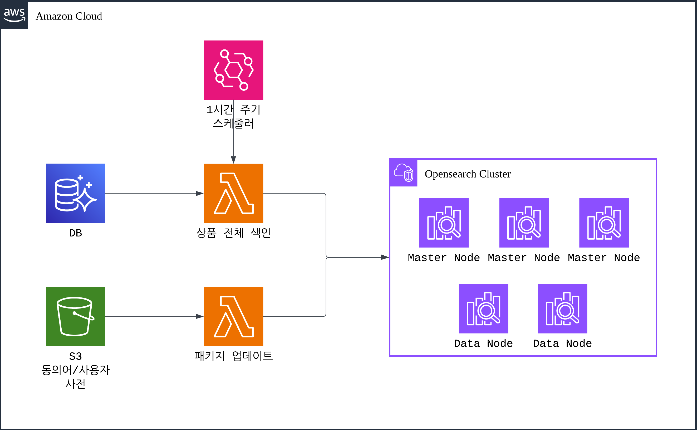
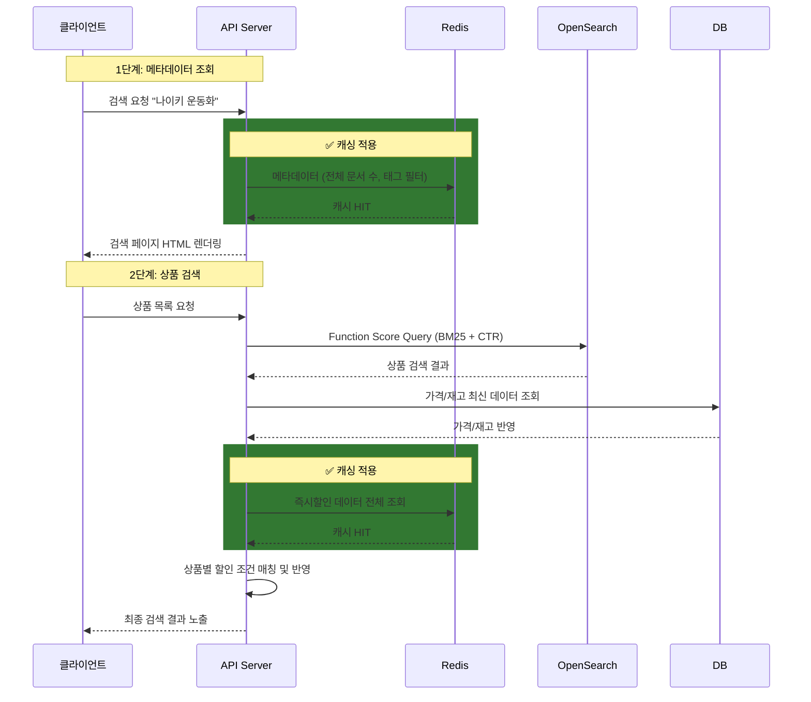

## 목차
1. [배경: 느린 검색, 불안정한 서버](#배경-느린-검색-불안정한-서버)
2. [문제 분석: Fuse.js의 한계](#문제-분석-fusejs의-한계)
3. [해결 목표: 무엇을 달성하려 했나](#해결-목표-무엇을-달성하려-했나)
4. [아키텍처 설계: OpenSearch를 선택한 이유](#아키텍처-설계-opensearch를-선택한-이유)
5. [OpenSearch 전환 결과](#opensearch-전환-결과)
6. [핵심 구현 1: CTR 기반 동적 랭킹](#핵심-구현-1-ctr-기반-동적-랭킹)
7. [핵심 구현 2: 캐시 전략으로 응답 속도 개선](#핵심-구현-2-캐시-전략으로-응답-속도-개선)
8. [결과: 숫자로 증명하는 개선 효과](#결과-숫자로-증명하는-개선-효과)

---

## 배경: 느린 검색, 불안정한 서버

300만 회원이 사용하는 커머스 플랫폼에서 검색은 핵심 기능입니다. 하지만 "나이키 운동화"를 검색하면 결과가 나오기까지 1~2초가 걸렸고, 키워드가 길어지면 훨씬 더 오래 걸렸습니다. 검색 후 상품을 클릭하는 비율(CTR)은 17%에 불과했습니다.

더 심각한 문제는 서버 안정성이었습니다. 검색을 위해 서버 메모리에 전체 상품 데이터를 올려놓는 구조였기 때문에, 상품 수가 증가할수록 서버 메모리와 CPU에 부담이 가중되었습니다. 검색 순위를 조정하려면 코드를 수정하고 프로덕션에 배포해야 했고, 마케팅팀의 요청 하나에도 30분이 소요되었습니다.

검색 엔진을 전면 개편하기로 결정했습니다.

---

## 문제 분석: Fuse.js의 한계

기존 시스템은 **Fuse.js**라는 JavaScript 기반 퍼지 검색 라이브러리를 사용했습니다. Fuse.js는 역 인덱스(inverted index) 없이 전체 데이터를 순회하며 문자열 유사도를 계산하는 방식으로 동작합니다. 이를 서버 메모리에 전체 상품 데이터를 로드한 후 검색을 수행하는 방식으로 사용하고 있었습니다.

### 왜 문제였을까?

1. **서버 자원 과다 사용**
   - 전체 상품 데이터(수만 건)를 서버 메모리에 상주시켜야 함
   - 검색할 때마다 전체 데이터를 순회하며 유사도 계산 → CPU 스파이크 발생
   - 검색 외 다른 API 응답 속도까지 저하되는 영향

2. **상품 수 증가에 취약한 구조**
   - 역 인덱스가 없어 상품이 늘어날수록 검색 시간이 선형으로 증가
   - "나이키 에어맥스 270 블랙 런닝화" 같은 긴 검색어는 특히 느림
   - 서버 메모리 부족으로 재시작이 빈번

3. **비즈니스 민첩성 부족**
   - 검색 순위 조정 = 코드 수정 + 배포 (30분)
   - A/B 테스트 불가능
   - 동의어 추가도 배포 필요

4. **데이터 품질 오염**
   - 검색 정확도를 높이기 위해 상품명에 검색용 키워드를 강제로 부착
   - 예: "나이키 신발" → "나이키 신발 운동화 스니커즈 런닝화"
   - 사용자에게 보이는 상품명도 지저분해짐

---

## 해결 목표: 무엇을 달성하려 했나

### 정량적 목표
- **응답 속도**: 1~2초 → 핵심 검색 엔드포인트 p95 200ms 이하
- **CTR**: 17% → 20% 이상 (30% 향상)

### 정성적 목표
- 상품 수가 증가해도 대응 가능한 확장 가능 구조
- 배포 없이 검색 알고리즘을 조정할 수 있는 유연한 방식
- 서버 메모리 부담 감소로 안정성 확보

---

## 아키텍처 설계: OpenSearch를 선택한 이유

### OpenSearch vs CloudSearch

AWS에는 두 가지 관리형 검색 서비스가 있습니다. 저희는 AWS 생태계 내에서 인프라를 운영 중이었기 때문에, 검색 서비스인 Amazon CloudSearch와 Amazon OpenSearch Service 중 하나를 선택해야 했습니다.

| 기준 | CloudSearch | OpenSearch |
|------|-------------|------------|
| **기반 엔진** | Apache Solr | Elasticsearch 포크 (OpenSearch) |
| **커스텀 스코어링** | 제한적 (표현식 기반) | Function Score Query로 자유로운 구현 |
| **한국어 분석** | 기본 토크나이저 | Nori 형태소 분석기 |
| **플러그인 확장** | 미지원 | 커스텀 플러그인 지원 |
| **스케일링** | 자동 | 인스턴스/샤드 직접 제어 |

> **참고**: Amazon CloudSearch는 현재 신규 고객에게 더 이상 제공되지 않으며, AWS는 OpenSearch Service로의 전환을 권장하고 있습니다.

**OpenSearch를 선택한 이유:**
- CTR 기반 커스텀 스코어링(Function Score Query) 구현 가능
- Nori 형태소 분석기로 한국어 검색 품질 확보
- 기존 AWS 인프라(Redshift, Lambda, S3)와 자연스러운 통합
- 동의어/사용자 사전을 플러그인으로 관리 가능

### 전체 아키텍처


**핵심 컴포넌트:**
1. **NestJS API (ECS)**: 검색 요청 처리 및 비즈니스 로직
2. **Redis (ElastiCache)**: 메타데이터(상품 수, 필터), 즉시할인 비용, 상단 노출 리스트 캐싱
3. **OpenSearch 클러스터**: Master Node 3대 + Data Node 2대로 전문 검색 및 CTR 기반 랭킹

**아키텍처 구성 이유:**

- **ECS 검색 컨테이너 2대 + ALB**: 검색 서비스를 별도 컨테이너로 분리하여, 검색 트래픽 급증 시에도 메인 API 서버에 영향을 주지 않도록 격리했습니다. ALB를 통해 두 컨테이너에 트래픽을 분산하여 가용성을 확보합니다.
- **Master Node 3대 (전용)**: AWS가 프로덕션 환경에서 권장하는 구성으로, 전용 Master Node를 홀수(3대)로 배치하여 Split-Brain 방지를 위한 과반수 투표(quorum)를 보장합니다. Master와 Data 역할을 분리함으로써, 무거운 검색/색인 작업이 클러스터 안정성에 영향을 주지 않습니다.
- **Data Node 2대**: 실제 데이터 저장과 검색 쿼리를 처리합니다. Replica 1로 설정하여 한 노드에 장애가 발생해도 검색이 중단되지 않습니다.
- **ElastiCache Redis**: OpenSearch 앞단에 캐시 레이어를 두어, 메타데이터 등 반복 조회를 흡수하고 OpenSearch 부하를 줄입니다.

### 인덱스 설계

인덱스 설계의 핵심 원칙은 두 가지였습니다. 첫째, **상품 검색 키워드와 사전(동의어/사용자 사전)을 통해 검색 품질을 최대화**하는 것. 둘째, **검색 점수에 영향을 주는 요소들을 운영팀이 직접 관리**할 수 있도록 하는 것. 이를 위해 불필요한 복잡성은 최대한 덜어내고, 분석기와 매핑을 다음과 같이 설계했습니다.

**한국어 분석기 구성:**

```json
{
  "settings": {
    "analysis": {
      "char_filter": {
        "ascii_lowercase_filter": {
          "type": "mapping",
          "mappings": ["A => a", "B => b", "..."]
        }
      },
      "tokenizer": {
        "mixed_nori_tokenizer": {
          "type": "nori_tokenizer",
          "decompound_mode": "mixed",
          "discard_punctuation": true,
          "user_dictionary": "user_dictionary.txt"
        }
      },
      "filter": {
        "synonym_filter": {
          "type": "synonym_graph",
          "synonyms_path": "synonyms.txt",
          "updateable": true
        }
      },
      "analyzer": {
        "index_analyzer": {
          "char_filter": ["ascii_lowercase_filter"],
          "tokenizer": "mixed_nori_tokenizer",
          "filter": ["lowercase", "trim"]
        },
        "search_analyzer": {
          "char_filter": ["ascii_lowercase_filter"],
          "tokenizer": "mixed_nori_tokenizer",
          "filter": ["lowercase", "synonym_filter", "trim"]
        }
      }
    }
  }
}
```

| 설정 | 값 | 이유 |
|------|-----|------|
| `decompound_mode` | `mixed` | "삼성전자" → ["삼성전자", "삼성", "전자"] 원본 + 분해 토큰을 모두 생성하여 복합어/단독 검색 모두 대응 |
| `user_dictionary` | 사용자 사전 파일 | Nori 기본 사전에 없는 브랜드명, 신조어 등을 등록하여 형태소 분석 정확도 향상 |
| `char_filter` | ASCII 소문자 변환 | Nori 토크나이저 진입 전에 대소문자를 통일하여, "Nike"와 "nike"가 동일 토큰으로 처리 |
| `synonym_graph` | `updateable: true` | 검색 분석기에만 적용하여 재색인 없이 동의어 업데이트 가능 |
| 분석기 분리 | index / search | 색인 시에는 원본 그대로, 검색 시에만 동의어를 확장하여 인덱스 크기 증가 없이 검색 품질 확보 |

**매핑 최적화:**

```json
{
  "mappings": {
    "properties": {
      "front_name": {
        "type": "text",
        "fields": {
          "keyword": { "type": "keyword" },
          "nori": {
            "type": "text",
            "analyzer": "index_analyzer",
            "search_analyzer": "search_analyzer"
          }
        }
      },
      "tag_groups": { "type": "keyword", "eager_global_ordinals": true },
      "tag_names": { "type": "keyword", "eager_global_ordinals": true },
      "category_mains": {
        "type": "nested",
        "properties": {
          "name": {
            "type": "text",
            "analyzer": "index_analyzer",
            "copy_to": "combined_category_name"
          }
        }
      },
      "thumbnail_url": { "type": "keyword", "index": false },
      "description": { "type": "text", "index": false }
    }
  }
}
```

| 설정 | 적용 필드 | 이유 |
|------|----------|------|
| `eager_global_ordinals` | `tag_groups`, `tag_names` | 태그 집계(terms aggregation) 시 Global Ordinals를 미리 로드하여 첫 쿼리 지연 제거 |
| `copy_to` | 카테고리(main/sub/third) → `combined_category_name` | 3단계 카테고리 이름을 하나의 필드로 합쳐서 단일 쿼리로 전체 카테고리 검색 |
| `index: false` | `thumbnail_url`, `description` 등 | 표시 전용 필드는 역 인덱스를 생성하지 않아 디스크/메모리 절약 |

### 색인 및 사전 업데이트 파이프라인

검색 아키텍처와 별도로, 상품 데이터를 OpenSearch에 동기화하고 검색 품질을 관리하는 파이프라인을 구성했습니다.



- **상품 전체 색인 (Lambda)**: EventBridge 스케줄러가 1시간 주기로 Lambda를 트리거하여, DB에서 상품 데이터를 읽고 OpenSearch에 전체 색인을 수행합니다. 이때 Athena에서 집계한 CTR 데이터도 함께 색인됩니다.
- **동의어 업데이트 (Lambda)**: 운영팀이 S3에 업로드한 동의어 파일을 Lambda가 감지하여 OpenSearch 패키지를 자동으로 업데이트합니다. `synonym_graph`의 `updateable: true` 설정 덕분에 재색인 없이 반영됩니다.
- **사용자 사전 업데이트 (Lambda)**: 사용자 사전은 토크나이저에서 사용되므로 패키지 업데이트 후 재색인이 필요합니다. 1시간 주기 전체 색인 시 자동으로 반영되기 때문에 별도 작업 없이 다음 색인 사이클에서 적용됩니다.

**상품 전체 색인 플로우:**

색인 Lambda는 단순히 DB를 복사하는 것이 아니라, 여러 소스의 데이터를 조합하여 검색에 최적화된 문서를 생성합니다.

```
1. 타임스탬프 기반 새 인덱스 생성 (예: items_2024-06-01-14-00-00)
2. Athena에서 7일 롤링 CTR 집계
3. DB에서 커서 기반으로 1,000건씩 조회하며:
   - 상품 기본 정보 + 브랜드/카테고리 메타 (DB JOIN)
   - 태그, 리뷰, 추천 점수 (DB)
   - CTR (Athena 집계 결과)
   - 상품코드 정규화 (code_normalized)
   → 조합하여 Bulk 색인
4. Alias를 새 인덱스로 원자적 전환
5. 1일 이전 구 인덱스 삭제
```

핵심은 **Alias 전환이 원자적(atomic)**이라는 점입니다. 기존 인덱스 제거와 새 인덱스 추가를 단일 API 호출로 처리하므로, 전환 과정에서 검색이 실패하는 순간이 없습니다.

```typescript
// Alias 전환 - 단일 API 호출로 원자적 처리
await opensearchClient.indices.updateAliases({
  body: {
    actions: [
      ...oldIndexNames.map(name => ({
        remove: { index: name, alias: ALIAS }
      })),
      { add: { index: newIndexName, alias: ALIAS } }
    ]
  }
});
```

**커서 기반 Bulk 색인:**

수만 건의 상품을 한 번에 메모리에 올리면 Lambda의 메모리 한계에 도달할 수 있습니다. `lastId` 기반 커서 페이지네이션으로 1,000건씩 처리하여 메모리 사용량을 일정하게 유지합니다.

```typescript
const CHUNK_SIZE = 1000;
let lastId: number = 0;

const searchCTRMap = await getSearchCTRFromAthena();

while (true) {
  const [items] = await getItemInfo(dbConnection, CHUNK_SIZE, lastId);
  if (items.length === 0) break;
  lastId = items[items.length - 1].id;

  // 태그, 리뷰, 추천 점수를 병렬 조회
  const [tags, reviews, recommendRatings] = await Promise.all([
    getItemTags(items, dbConnection),
    getReviews(items, dbConnection),
    getRecommendRatings(items, dbConnection)
  ]);

  const bulkOps = items.flatMap(item => [
    { index: { _index: newIndexName, _id: item.id } },
    {
      ...item,
      recommend_rating: recommendRatings.get(item.id) ?? 0,
      review_count: reviews.get(item.id)?.reviewCount ?? 0,
    }
  ]);
  await opensearchClient.bulk({ refresh: true, body: bulkOps });
}
```

---

## OpenSearch 전환 결과

Fuse.js에서 OpenSearch로 전환한 것만으로도 핵심 문제들이 해소되었습니다.

| 지표 | Before (Fuse.js) | After (OpenSearch) |
|------|-------------------|---------------------|
| **검색 응답 속도** | 1~2초 | 300ms |
| **서버 메모리** | 전체 상품 데이터 상주 (수백 MB) | 검색 전용 클러스터로 분리 |
| **상품 수 증가 대응** | 선형으로 느려짐 | 역 인덱스 기반으로 일정한 성능 유지 |

서버 메모리에 상품 데이터를 올려놓고 전체 순회하던 구조에서, 검색을 OpenSearch 클러스터로 완전히 분리함으로써 **서버 안정성이 확보**되었고, **검색 응답 속도가 약 5배 개선**되었습니다.

하지만 여기서 멈추지 않았습니다. 300ms는 충분히 빠르지만, 검색 품질(CTR 17%)에는 여전히 개선 여지가 있었습니다. 이를 해결하기 위해 두 가지 핵심 고도화를 진행했습니다.

---

## 핵심 구현 1: CTR 기반 동적 랭킹

### 문제: 검색 결과를 어떻게 정렬할 것인가?

OpenSearch 전환 후 기본 BM25 스코어만 사용했습니다. 하지만 이는 텍스트 유사도만 고려할 뿐, 실제로 사용자가 선호하는 상품을 반영하지 못했습니다.

예를 들어, "운동화" 검색 시:
- 상품 A: 상품명에 "운동화"가 3번 등장 → 높은 점수
- 상품 B: 상품명에 "운동화"가 1번만 등장 → 낮은 점수

하지만 **상품 B의 CTR이 25%**, **상품 A의 CTR은 5%**라면 어떨까요? 사용자는 명백히 상품 B를 선호하는데, 검색 결과는 상품 A를 상위에 노출하고 있었습니다.

### 해결: 색인 시 CTR 데이터를 함께 저장

**CTR(Click-Through Rate, 클릭률)**을 검색 랭킹에 반영하기 위해, 상품 데이터를 색인할 때 CTR 정보를 함께 저장하는 방식을 채택했습니다.

**1단계: Athena에서 7일 롤링 CTR 집계**

매 색인 시, Athena(Presto SQL)에서 최근 7일간의 사용자 행동 로그를 분석하여 상품별 CTR을 집계합니다. 검색 결과 노출(`view_search_result`)과 상품 클릭(`view_item`) 이벤트를 별도로 집계한 뒤 `FULL OUTER JOIN`으로 결합합니다.

```sql
-- Presto/Athena SQL
WITH search_views AS (
    SELECT item.item_id, COUNT(*) as view_count
    FROM user_action_log
    CROSS JOIN UNNEST(
        CAST(json_parse(items) AS ARRAY(ROW(item_id INTEGER)))
    ) AS t(item)
    WHERE event_type = 'view_search_result'
        AND dt BETWEEN DATE '${oneWeekAgo}' AND DATE '${today}'
    GROUP BY item.item_id
),
search_clicks AS (
    SELECT item_id, COUNT(*) as click_count
    FROM user_action_log
    WHERE event_type = 'view_item'
        AND item_list_name LIKE '/search%'
        AND dt BETWEEN DATE '${oneWeekAgo}' AND DATE '${today}'
    GROUP BY item_id
)
SELECT
    COALESCE(sv.item_id, sc.item_id) as item_id,
    CASE
        WHEN COALESCE(sv.view_count, 0) >= 100
        THEN CAST(sc.click_count AS DOUBLE) / CAST(sv.view_count AS DOUBLE) * 100
        ELSE NULL
    END as ctr
FROM search_views sv
FULL OUTER JOIN search_clicks sc ON sv.item_id = sc.item_id
WHERE COALESCE(sv.view_count, 0) >= 100  -- 최소 노출 100회 이상
```

`CROSS JOIN UNNEST`를 사용하는 이유는, 검색 결과 노출 이벤트에 노출된 상품 목록이 JSON 배열로 저장되어 있기 때문입니다. 이를 풀어서 상품별 노출 횟수를 집계합니다.

**2단계: 색인 시 CTR을 상품 문서에 포함**

1단계에서 집계한 CTR 데이터는 색인 파이프라인에서 상품 정보와 함께 OpenSearch에 저장됩니다. 이렇게 하면 검색 시 별도의 CTR 조회 없이, Function Score Query로 CTR을 랭킹에 바로 반영할 수 있습니다.

**신규 상품의 Cold-start 처리:**

CTR 기반 랭킹의 가장 큰 약점은 신규 상품입니다. 노출 데이터가 없는 상품은 CTR이 0이므로, 검색 결과에서 밀려나 노출 기회를 얻지 못하는 악순환이 발생합니다(Exploration vs Exploitation 문제).

이를 해결하기 위해 **최소 노출 기준(100회) 미달 상품에는 기본 CTR 값을 부여**했습니다. 기본 CTR은 해당 카테고리 상품들의 평균 CTR로 설정하여, 검색 점수에 중립적 영향(증가도 감소도 아닌)을 미치도록 했습니다. 신규 상품이 자연스럽게 노출되어 실제 CTR 데이터가 쌓이면 기본값은 실측값으로 교체됩니다.

```sql
-- 신규 상품에 카테고리 평균 CTR 부여
WITH category_avg AS (
  SELECT category_id, AVG(ctr) AS avg_ctr
  FROM product_ctr_stats
  WHERE impressions >= 100
  GROUP BY category_id
)
SELECT
  p.product_id,
  COALESCE(s.ctr, ca.avg_ctr, 5.0) AS ctr  -- 실측값(%) → 카테고리 평균(%) → 기본값 5%
FROM products p
LEFT JOIN product_ctr_stats s ON p.product_id = s.product_id AND s.impressions >= 100
LEFT JOIN category_avg ca ON p.category_id = ca.category_id;
```

**3단계: Function Score Query + Painless Script로 BM25 + CTR 결합**

실제 운영에서는 OpenSearch의 `function_score` 쿼리 안에 Painless 스크립트를 넣어 CTR을 반영했습니다. CTR은 퍼센트 단위(예: 22.5)로 저장하고, 최종 점수는 `BM25 * log10(10 + CTR%)`로 계산했습니다.

```json
{
  "query": {
    "function_score": {
      "query": {
        "bool": {
          "must": [
            {
              "multi_match": {
                "query": "나이키 운동화",
                "fields": ["product_name^3", "brand^2", "category"]
              }
            }
          ]
        }
      },
      "functions": [
        {
          "script_score": {
            "script": {
              "lang": "painless",
              "source": "double ctr = doc['search_ctr'].size() == 0 ? params.default_ctr : doc['search_ctr'].value; return Math.log10(params.offset + ctr);",
              "params": {
                "offset": 10.0,
                "default_ctr": 1.0
              }
            }
          }
        }
      ],
      "boost_mode": "multiply",
      "score_mode": "sum"
    }
  }
}
```

- `Math.log10(10 + CTR%)` — CTR=0이어도 `log10(10)=1`로 안전하게 계산되고, 극단값 영향도 완화
- `default_ctr: 1.0` — `search_ctr`가 없는 문서(신규/누락 데이터)는 기본 CTR 1% 사용
- `boost_mode: "multiply"` — BM25 스코어에 스크립트 점수를 곱해 최종 점수 산출
- 최종 점수: `BM25 * log10(10 + CTR%)`

### 검증: A/B 테스트

1주일간 세션 기반 A/B 테스트를 진행했습니다.
- **그룹 A (기존)**: Fuse.js 기반 기존 검색 시스템
- **그룹 B (개선)**: OpenSearch + CTR 기반 랭킹 시스템

**결과:**
- CTR: 17% → 22.5% (**+5.5%p, 상대 32% 향상**)
- 상품 상세 페이지 진입률: (**11.75% 증가**) (A/B Test, p < 0.01)
- 측정 기준: 세션 기반 A/B 테스트, 1주 관측

---

## 핵심 구현 2: 캐시 전략으로 응답 속도 개선

### 문제: 검색 과정에서 부가 조회가 많다

검색은 단순히 OpenSearch에 쿼리 한 번으로 끝나지 않습니다. 실제 검색 요청은 두 단계로 이루어집니다.

**1단계: 메타데이터 조회 → HTML 렌더링**
- 검색어에 해당하는 전체 문서 수, 태그 필터 옵션을 OpenSearch에서 조회
- 이 데이터로 검색 결과 페이지 HTML을 렌더링하여 클라이언트에 전달

**2단계: 상품 검색 → 가격/할인 반영 → 최종 노출**
- 클라이언트에서 검색어에 매칭되는 상품을 OpenSearch에서 조회
- 조회된 상품에 대해 DB에서 최신 가격/재고 데이터를 갱신
- 즉시할인 데이터를 전체 조회하여 각 상품에 조건 매칭 후 할인 반영
- 최종 검색 결과 노출

OpenSearch 전환으로 검색 자체는 300ms로 개선되었지만, 메타데이터 조회와 즉시할인 계산 등 부가 작업까지 합치면 추가 개선 여지가 있었습니다.



### 해결: Redis 캐싱 (1분 TTL)

자주 변하지 않는 부가 데이터를 Redis에 1분 주기로 캐싱했습니다.

**캐싱 대상:**

| 캐싱 항목 | 단계 | 설명 | TTL |
|-----------|------|------|-----|
| 메타데이터 | 1단계 | 전체 문서 수, 태그 필터 옵션 | 1분 |
| 즉시할인 데이터 | 2단계 | 전체 즉시할인 목록 (조건 매칭에 사용) | 1분 |

```typescript
async getSearchMetadata(keyword: string): Promise<SearchMetadata> {
  const cacheKey = `search:meta:${keyword}`;

  const cached = await this.redis.get(cacheKey);
  if (cached) {
    return JSON.parse(cached);
  }

  const metadata = await this.openSearch.getMetadata(keyword);
  await this.redis.setex(cacheKey, 60, JSON.stringify(metadata));  // TTL 60초

  return metadata;
}
```

캐시 키는 **검색어 기반**으로 구성합니다. 동일한 검색어에 대한 메타데이터(문서 수, 태그 필터)는 1분간 동일하므로, 같은 검색어 요청이 반복될 때 OpenSearch 조회를 생략합니다.

1분 TTL을 선택한 이유는, 상품 수나 필터 옵션, 할인 정보가 초 단위로 변하지 않으면서도 너무 오래된 데이터를 보여주지 않기 위한 균형점이었습니다.

**캐싱 대상의 범위:**

Redis에 캐싱하는 데이터는 **변동이 적은 메타데이터**에 한정했습니다. 검색 필터 옵션, 전체 상품 수, 즉시할인 데이터 등이 이에 해당합니다. 반면 **가격, 재고 등 실시간 정합성이 중요한 데이터는 캐싱하지 않고**, OpenSearch 검색 후 DB에서 직접 조회하여 반영합니다.

### 결과: 핵심 검색 엔드포인트 p95 200ms 이하 달성

- **검색 페이지 렌더링 (`/search`, p95)**: 122.9ms
- **실제 상품 검색 API (`/api/items/search`, p95)**: 194.9ms
- 기존 1~2초 대비 엔드포인트별 **약 5~16배 개선**

---

## 결과: 숫자로 증명하는 개선 효과

### 정량적 성과

| 지표 | Before | After | 개선율 | 측정 기준                                   |
|------|--------|-------|--------|-----------------------------------------|
| **검색 페이지 렌더링 (`/search`, p95)** | 1~2초 | 122.9ms | **약 8~16배** | 에브리유니즈 액세스 로그 (1주 관측)       |
| **상품 검색 API (`/api/items/search`, p95)** | 1~2초 | 194.9ms | **약 5~10배** | 에브리유니즈 액세스 로그 (1주 관측) |
| **CTR** | 17% | 22.5% | **+5.5%p (상대 32% 향상)** | 세션 기반 A/B 테스트 (p < 0.01)                |
| **상품 상세 페이지 진입률** | 기준군 | 실험군 | **11.75% 증가** | 세션 기반 A/B 테스트 (p < 0.01)                |
| **동의어 업데이트** | 30분 | 5분 | **6배 단축** | 운영 요청 1건 처리 리드타임                        |

### 비즈니스 임팩트

- **서버 안정성 확보**: 서버 메모리에 상품 데이터를 적재하지 않아 서버 지표가 안정적으로 개선
- **운영 효율**: 검색 관련 개발 요청 80% 감소 (마케팅/운영팀 셀프 서비스)

### 기술적 성과

- **확장성**: 상품 수 증가에도 검색 성능 유지 (OpenSearch의 분산 아키텍처)
- **안정성**: 서버 메모리 부담 제거로 서버 전체 안정성 향상
- **유지보수성**: 신규 랭킹 요소 추가 시 1일 작업 (기존 1주)

---

## 배운 점

### 1. 검색은 "찾기"가 아니라 "예측"이다

검색 엔진을 개편하면서 깨달은 점은, 검색이 단순히 데이터를 찾는 것이 아니라 **사용자가 원하는 것을 예측하는 것**이라는 점입니다. BM25 텍스트 유사도만으로는 사용자가 실제로 클릭하는 상품을 상위에 노출할 수 없었고, CTR 기반 랭킹을 결합해서야 검색 품질이 체감될 만큼 개선되었습니다.

### 2. 캐싱은 "어디에 적용할지"가 핵심이다

OpenSearch는 강력하지만 모든 요청을 직접 처리하면 비용이 높습니다. 메타데이터와 즉시할인 데이터처럼 변동이 적은 데이터만 선별하여 캐싱하고, 가격·재고처럼 실시간 정합성이 중요한 데이터는 캐싱하지 않는 판단이 중요했습니다.

### 3. 운영팀이 스스로 할 수 있는 구조를 만들어야 한다

동의어·사용자 사전을 코드에 하드코딩하던 구조에서, 운영팀이 어드민에서 직접 수정하면 S3 → Lambda를 통해 자동 반영되는 구조로 전환했습니다. 검색 품질 개선 요소를 운영팀이 직접 관리할 수 있게 되면서, 개발팀은 검색 인프라 고도화에 집중할 수 있었습니다.

---

## 기술 스택

- **검색 엔진**: AWS OpenSearch Service
- **백엔드**: NestJS (TypeScript)
- **캐시**: ElastiCache (Redis)
- **데이터 분석**: Amazon Athena
- **자동화**: AWS Lambda, S3, EventBridge
- **모니터링**: CloudWatch
