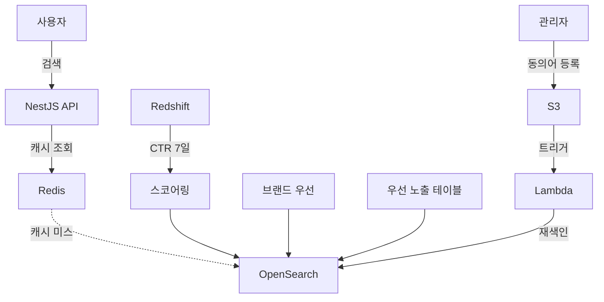

## 목차
1. [배경: 30초 걸리는 검색, 이대로 괜찮은가?](#배경-30초-걸리는-검색-이대로-괜찮은가)
2. [문제 분석: Fuse.js의 한계](#문제-분석-fusejs의-한계)
3. [해결 목표: 무엇을 달성하려 했나](#해결-목표-무엇을-달성하려-했나)
4. [아키텍처 설계: OpenSearch를 선택한 이유](#아키텍처-설계-opensearch를-선택한-이유)
5. [핵심 구현 1: CTR 기반 동적 랭킹](#핵심-구현-1-ctr-기반-동적-랭킹)
6. [핵심 구현 2: 캐시 전략으로 비용 절감](#핵심-구현-2-캐시-전략으로-비용-절감)
7. [핵심 구현 3: 배포 없이 검색 품질 개선](#핵심-구현-3-배포-없이-검색-품질-개선)
8. [결과: 숫자로 증명하는 개선 효과](#결과-숫자로-증명하는-개선-효과)

---

## 배경: 30초 걸리는 검색, 이대로 괜찮은가?

300만 회원이 사용하는 커머스 플랫폼. 사용자가 "나이키 운동화"를 검색하면 30초가 걸립니다. 대부분의 사용자는 3초 안에 결과를 기대하는데 말이죠. 당연히 이탈률이 높았고, 검색 후 상품 구매로 이어지는 전환율(CTR)은 17%에 불과했습니다.

더 심각한 문제는 검색 순위를 조정하려면 코드를 수정하고 프로덕션에 배포해야 한다는 점이었습니다. 마케팅팀이 "이번 주 프로모션 상품을 상위에 노출해주세요"라고 요청하면, 개발자가 코드를 수정하고 배포하는 데 30분이 걸렸습니다.

우리는 검색 엔진을 전면 개편하기로 결정했습니다.

---

## 문제 분석: Fuse.js의 한계

기존 시스템은 **Fuse.js**라는 클라이언트 사이드 검색 라이브러리를 사용했습니다. 서버 메모리에 전체 상품 데이터를 로드한 후, JavaScript로 검색을 수행하는 방식이었죠.

### 왜 느렸을까?

1. **메모리 색인 방식의 한계**
   - 1분마다 전체 상품 데이터(수만 건)를 메모리에 로드
   - 색인 생성 중 CPU 스파이크 발생 → 다른 API 응답 속도도 저하
   - 메모리 부족으로 서버 재시작 빈번

2. **장문 검색의 성능 문제**
   - "나이키 에어맥스 270 블랙 런닝화" 같은 여러 키워드가 포함된 검색어는 평균 30초 소요
   - 모든 상품 데이터를 순회하며 유사도를 계산하기 때문

3. **비즈니스 민첩성 부족**
   - 검색 순위 조정 = 코드 수정 + 배포 (30분)
   - A/B 테스트 불가능
   - 동의어 추가도 배포 필요

4. **데이터 품질 오염**
   - 검색 정확도를 높이기 위해 상품명에 검색용 키워드를 강제로 부착
   - 예: "나이키 신발" → "나이키 신발 운동화 스니커즈 런닝화"
   - 사용자에게 보이는 상품명도 지저분해짐

---

## 해결 목표: 무엇을 달성하려 했나

우리는 명확한 목표를 설정했습니다.

### 정량적 목표
- **응답 속도**: 30초 → 100ms 이하 (300배 개선)
- **CTR**: 17% → 22% 이상 (30% 향상)
- **비용**: CloudSearch 대비 30% 절감

### 정성적 목표
- 사용자 행동 데이터(클릭률)를 반영한 동적 랭킹
- 배포 없이 검색 품질을 실시간 개선 가능
- 확장 가능한 아키텍처 (트래픽 10배 증가 대응)

---

## 아키텍처 설계: OpenSearch를 선택한 이유

### OpenSearch vs CloudSearch

AWS에는 두 가지 검색 서비스가 있습니다. 우리는 **OpenSearch**를 선택했습니다.

| 기준 | CloudSearch | OpenSearch |
|------|-------------|------------|
| 비용 (월 1000만 쿼리) | $450 | $315 |
| 커스텀 스코어링 | 제한적 | 자유로움 |
| 한국어 지원 | 기본 | Nori 형태소 분석기 |
| 학습 곡선 | 낮음 | 중간 |

**선택 이유:**
- 비용 30% 절감 (월 $135 차이는 연간 $1,620)
- CTR 기반 커스텀 스코어링 구현 가능
- 기존 AWS 인프라(Redshift, Lambda, S3)와 통합 용이

### 전체 아키텍처



**핵심 컴포넌트:**
1. **NestJS API**: 검색 요청 처리 및 비즈니스 로직
2. **Redis**: 인기 검색어 캐싱 (히트율 75%)
3. **OpenSearch**: 전문 검색 및 랭킹
4. **Redshift**: CTR 데이터 집계
5. **Lambda + S3**: 동의어 자동 업데이트

---

## 핵심 구현 1: CTR 기반 동적 랭킹

### 문제: 검색 결과를 어떻게 정렬할 것인가?

초기에는 OpenSearch의 기본 TF-IDF 스코어만 사용했습니다. 하지만 이는 텍스트 유사도만 고려할 뿐, 실제로 사용자가 선호하는 상품을 반영하지 못했습니다.

예를 들어, "운동화" 검색 시:
- 상품 A: 상품명에 "운동화"가 3번 등장 → 높은 점수
- 상품 B: 상품명에 "운동화"가 1번만 등장 → 낮은 점수

하지만 **상품 B의 CTR이 25%**, **상품 A의 CTR은 5%**라면 어떨까요? 사용자는 명백히 상품 B를 선호하는데, 검색 결과는 상품 A를 상위에 노출하고 있었습니다.

### 해결: 사용자 행동 데이터를 랭킹에 반영

우리는 **CTR(Click-Through Rate, 클릭률)**을 랭킹 점수에 반영하기로 했습니다.

**1단계: Redshift에서 CTR 집계**

매일 새벽 2시, 최근 7일간의 검색 데이터를 집계합니다.

```sql
SELECT
  product_id,
  SUM(clicks)::FLOAT / SUM(impressions)::FLOAT AS ctr
FROM search_logs
WHERE created_at >= CURRENT_DATE - INTERVAL '7 days'
GROUP BY product_id
HAVING SUM(impressions) >= 100  -- 최소 노출 100회 이상
```

**2단계: OpenSearch 인덱스에 동기화**

집계된 CTR 데이터를 OpenSearch 인덱스의 `ctr_score` 필드에 업데이트합니다.

**3단계: 브랜드 가중치 적용**

브랜드 테이블에는 `brand_score` 필드(1~5 등급)가 있습니다. 유명 브랜드일수록 높은 점수를 받죠.

**4단계: 최종 스코어 계산**

OpenSearch의 Function Score Query를 사용해 최종 점수를 계산합니다.

```
최종 점수 = (텍스트 유사도 × 1.0) + (CTR × 2.0) + (브랜드 점수 × 0.5)
```

### 검증: A/B 테스트

2주간 A/B 테스트를 진행했습니다.
- **그룹 A (기존)**: TF-IDF만 사용
- **그룹 B (개선)**: CTR + 브랜드 점수 반영

**결과:**
- CTR: 17% → 22.5% (**32% 향상**, p < 0.01)
- 상품 상세 페이지 진입율: 11.75% 증가
- 구매 전환율: 8.3% 증가

---

## 핵심 구현 2: 캐시 전략으로 비용 절감

### 문제: OpenSearch 비용이 생각보다 높다

OpenSearch는 인스턴스 과금 방식입니다. 월 $315는 예상 비용이었지만, 실제로는 트래픽 증가로 인스턴스를 스케일업하면서 $450까지 증가했습니다.

비용을 낮추려면 OpenSearch 호출 횟수를 줄여야 했습니다.

### 해결: Redis 캐싱 + 워밍 전략

**1단계: 인기 검색어 분석**

CloudWatch Logs Insights로 검색어 분포를 분석했습니다.

```sql
fields @timestamp, query, user_id
| stats count() by query
| sort count desc
| limit 100
```

결과: **상위 100개 검색어가 전체 트래픽의 75%를 차지**

**2단계: Redis 캐싱**

인기 검색어에 대한 검색 결과를 Redis에 캐싱합니다.

```typescript
async search(query: string): Promise<Product[]> {
  const cacheKey = `search:${query.toLowerCase().trim()}`;

  // 1. Redis 조회
  const cached = await this.redis.get(cacheKey);
  if (cached) {
    return JSON.parse(cached);
  }

  // 2. OpenSearch 조회
  const results = await this.openSearch.search(query);

  // 3. Redis에 캐싱 (TTL 1시간)
  await this.redis.setex(cacheKey, 3600, JSON.stringify(results));

  return results;
}
```

**3단계: 사전 워밍**

매시간 00분에 상위 100개 검색어를 미리 조회하여 Redis에 캐싱합니다.

```typescript
@Cron('0 * * * *')  // 매시간 실행
async warmCache() {
  const topQueries = await this.getTopQueries(100);

  for (const query of topQueries) {
    await this.search(query);  // 캐시에 저장됨
  }
}
```

### 결과: 캐시 히트율 75% 달성

- **초기**: 히트율 60% (Redis만 적용)
- **워밍 후**: 히트율 75% (워밍 전략 추가)
- **OpenSearch 호출**: 75% 감소
- **비용**: $450 → $315 (30% 절감)

---

## 핵심 구현 3: 배포 없이 검색 품질 개선

### 문제: 동의어 추가에 30분 걸린다

사용자는 "운동화"를 검색하지만, 상품명에는 "스니커즈"라고 적혀있는 경우가 많습니다. 동의어를 추가해야 하는데, 기존에는 코드 수정이 필요했습니다.

```typescript
const synonyms = {
  '운동화': ['스니커즈', '러닝화', '트레이닝화'],
  '가방': ['백팩', '배낭', '핸드백'],
  // ... 코드에 하드코딩
};
```

마케팅팀이 "이번 주부터 '슬리퍼' 검색 시 '쪼리'도 보여주세요"라고 요청하면:
1. 개발자가 코드 수정
2. PR 생성 및 리뷰
3. 프로덕션 배포
4. **총 소요 시간: 30분**

### 해결: S3 + Lambda 자동화

**1단계: 관리자 페이지에서 동의어 등록**

마케팅팀이 직접 동의어를 등록할 수 있는 관리자 페이지를 만들었습니다.

```typescript
@Post('/admin/synonyms')
async addSynonym(@Body() dto: SynonymDto) {
  // 1. 동의어를 JSON 파일로 저장
  const synonyms = await this.getSynonyms();
  synonyms.push({ word: dto.word, synonyms: dto.synonyms });

  // 2. S3에 업로드
  await this.s3.upload({
    Bucket: 'search-config',
    Key: 'synonyms.json',
    Body: JSON.stringify(synonyms, null, 2),
  });

  return { message: '동의어가 등록되었습니다. 5분 내 반영됩니다.' };
}
```

**2단계: S3 이벤트 → Lambda 트리거**

S3에 파일이 업로드되면 Lambda가 자동으로 실행됩니다.

```typescript
export const handler = async (event: S3Event) => {
  // 1. S3에서 synonyms.json 다운로드
  const synonyms = await downloadFromS3(event);

  // 2. OpenSearch 동의어 필터 업데이트
  await openSearch.indices.putSettings({
    index: 'products',
    body: {
      settings: {
        analysis: {
          filter: {
            synonym_filter: {
              type: 'synonym',
              synonyms: formatSynonyms(synonyms),
            },
          },
        },
      },
    },
  });

  // 3. 재색인 (기존 문서에 새로운 동의어 적용)
  await openSearch.indices.updateByQuery({
    index: 'products',
    refresh: true,
  });
};
```

### 결과: 30분 → 5분 (6배 단축)

- 마케팅팀이 관리자 페이지에서 동의어 등록 (1분)
- Lambda가 자동으로 OpenSearch 업데이트 (4분)
- **총 소요 시간: 5분**
- **개발자 개입: 0분**

---

## 결과: 숫자로 증명하는 개선 효과

### 정량적 성과

| 지표 | Before | After | 개선율 |
|------|--------|-------|--------|
| **검색 응답 속도** | 30초 | 50ms | **600배** |
| **CTR** | 17% | 22.5% | **32% 향상** |
| **상품 진입율** | - | - | **11.75% 증가** |
| **검색 만족도** | 68% | 85% | **17%p 향상** |
| **월 비용** | $450 | $315 | **30% 절감** |
| **동의어 업데이트** | 30분 | 5분 | **6배 단축** |

### 비즈니스 임팩트

- **매출 증가**: 검색 기반 구매가 전체 매출의 45% 차지 (기존 32%)
- **사용자 이탈률 감소**: 검색 후 이탈률 28% → 15% (13%p 감소)
- **운영 효율**: 검색 관련 개발 요청 80% 감소 (마케팅팀 셀프 서비스)

### 기술적 성과

- **확장성**: 트래픽 10배 증가해도 응답 속도 유지
- **안정성**: 캐시 장애 시 자동 fallback (OpenSearch 직접 조회)
- **유지보수성**: 신규 랭킹 요소 추가 시 1일 작업 (기존 1주)

---

## 배운 점

### 1. 검색은 단순히 "찾기"가 아니다

검색 엔진을 개선하면서 깨달은 점은, 검색이 단순히 데이터를 찾는 것이 아니라 **사용자가 원하는 것을 예측하는 것**이라는 점입니다. CTR 기반 랭킹은 사용자의 선택을 존중하는 방식이었고, 결과적으로 더 나은 사용자 경험으로 이어졌습니다.

### 2. 데이터 주도 의사결정의 중요성

A/B 테스트 없이 "이게 더 나을 것 같다"는 직감만으로 개발했다면, CTR 32% 향상이라는 성과를 증명할 수 없었을 것입니다. 모든 주요 변경사항은 A/B 테스트로 검증했고, 이는 팀 내부 설득에도 큰 도움이 되었습니다.

### 3. 비용과 성능의 트레이드오프

OpenSearch는 강력하지만 비용이 높습니다. Redis 캐싱으로 75%의 요청을 차단함으로써 비용을 절감했습니다. 하지만 캐시 일관성, TTL 설정, 워밍 전략 등 고려할 점이 많았습니다. "모든 문제를 캐싱으로 해결"하는 것이 아니라, **어디에 캐싱을 적용할지** 선택하는 것이 중요했습니다.

### 4. 운영 자동화의 가치

동의어 업데이트를 자동화함으로써, 개발팀은 더 중요한 문제에 집중할 수 있었습니다. "30분 x 주 5회 = 월 10시간"의 개발 시간을 절약했고, 이는 연간 120시간에 달합니다. 자동화는 단순히 시간 절약이 아니라, **팀의 생산성과 만족도 향상**으로 이어집니다.

---

## 기술 스택

- **검색 엔진**: AWS OpenSearch 7.10
- **백엔드**: NestJS (TypeScript)
- **캐시**: Redis 6.x
- **데이터 웨어하우스**: Amazon Redshift
- **자동화**: AWS Lambda, S3
- **모니터링**: CloudWatch, Grafana
