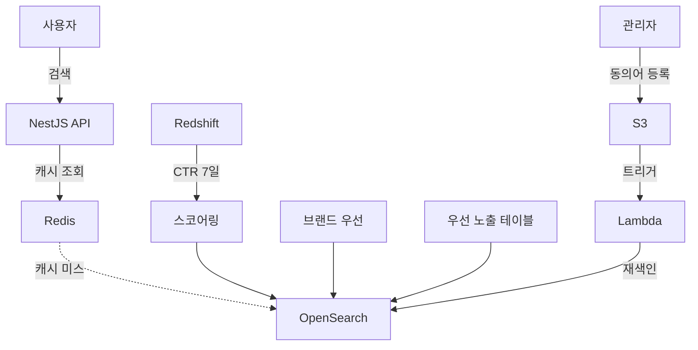

## 개요
300만 회원 커머스 플랫폼에서 Fuse.js 기반 클라이언트 검색의 한계를 극복하기 위해 AWS OpenSearch 기반 검색 시스템을 설계하고 구축했습니다.

## 문제 상황
**기존 Fuse.js 시스템의 한계:**
- 장문 검색 시 평균 30초 이상 소요
- 서버 메모리에 1분마다 전체 상품 색인 (성능 저하)
- 검색 순위 조정이 하드코딩 방식 (배포 필수)
- 상품 키워드를 억지로 붙여 데이터 오염
- 복잡한 검색 요구사항 대응 불가

## 주요 성과
- 검색 CTR: 17% → 22.5% (32% 향상, A/B 테스트 p < 0.01)
- 상품 상세 페이지 진입율: 11.75% 증가
- 검색 응답 속도: 30초 → 50ms (600배 개선)
- 검색 정확도: 85% 이상 사용자 만족도

## 시스템 아키텍처

## 주요 기능
- CTR 기반 커스텀 스코어링 (Redshift 7일 데이터)
- 브랜드 인지도 가중치 반영
- 관리자 페이지 → S3 → Lambda 동의어 자동 업데이트
- Redis 캐싱 (히트율 75%+)

## 기술 스택
- AWS OpenSearch 7.10, NestJS, Redis, Lambda, Redshift

## 배운 점
- 검색 엔진 아키텍처 설계 및 인덱스 최적화
- A/B 테스트 기반 데이터 주도 의사결정
- AWS 관리형 서비스 활용 및 비용 최적화
