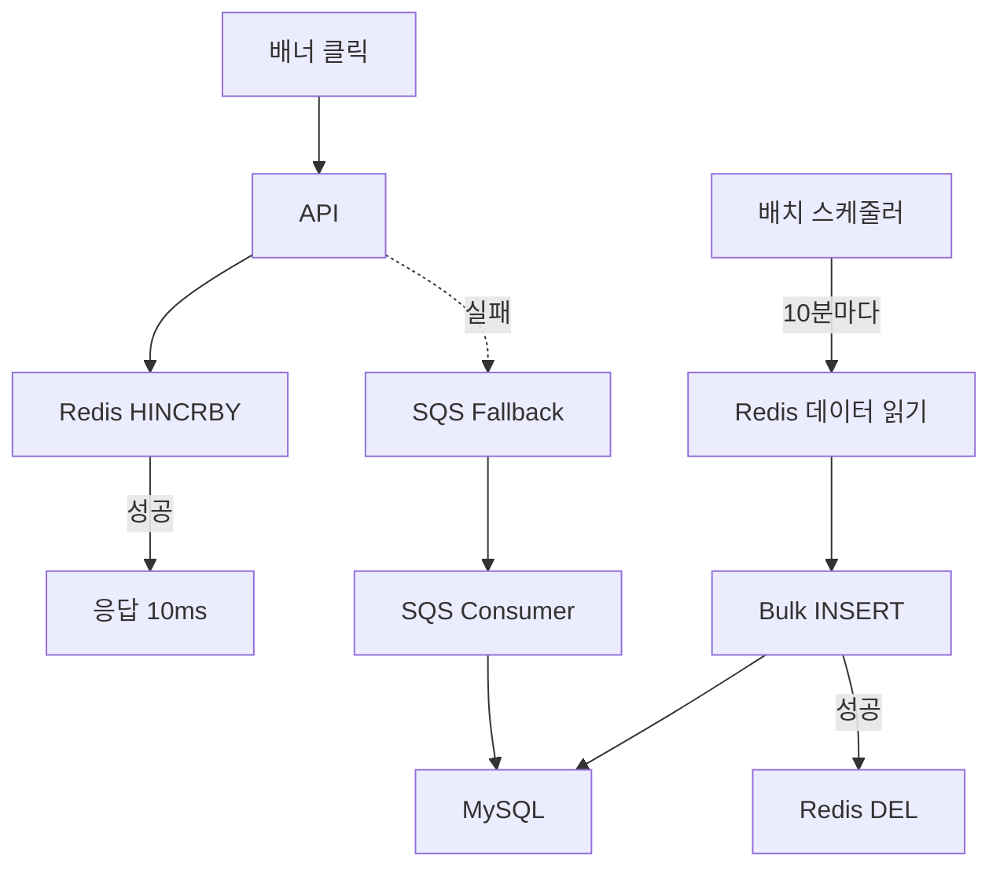

## 목차
1. [배경: 하루 수백만 건의 배너 클릭](#배경-하루-수백만-건의-배너-클릭)
2. [문제 분석: DB가 버티지 못한다](#문제-분석-db가-버티지-못한다)
3. [해결 목표: 부하 10배 감소, 속도 50배 개선](#해결-목표-부하-10배-감소-속도-50배-개선)
4. [아키텍처 설계: Write-back 전략 선택 이유](#아키텍처-설계-write-back-전략-선택-이유)
5. [핵심 구현 1: Redis Hash로 실시간 집계](#핵심-구현-1-redis-hash로-실시간-집계)
6. [핵심 구현 2: 10분 배치로 DB 동기화](#핵심-구현-2-10분-배치로-db-동기화)
7. [핵심 구현 3: SQS Fallback으로 데이터 유실 방지](#핵심-구현-3-sqs-fallback으로-데이터-유실-방지)
8. [결과: DB 부하 10배 감소, 응답 속도 50배 개선](#결과-db-부하-10배-감소-응답-속도-50배-개선)

---

## 배경: 하루 수백만 건의 배너 클릭

에브리타임 혜택탭이 출시되면서 거의 모든 페이지에 프로모션 배너가 배치되었습니다. 배너가 노출될 때마다 성과 집계 API가 자동으로 호출되어, **전체 API 중 호출량 1위**를 기록하게 되었습니다.

**트래픽 규모:**
```
- 일일 배너 노출: 300만 건
- 일일 배너 클릭: 50만 건
- 초당 평균 요청: 35 TPS
- 피크 시간대: 120 TPS
```

그리고 매번 API 호출마다 MySQL DB에 UPDATE 쿼리를 실행했습니다.

**결과:**
- DB CPU 사용률 80% 이상 지속
- API 응답 속도 평균 500ms (느림!)
- 다른 API들까지 느려지는 연쇄 효과

---

## 문제 분석: DB가 버티지 못한다

### 기존 구조의 문제

**배너 클릭 시 동작:**
```typescript
async incrementClick(bannerId: number) {
  // DB에 직접 UPDATE
  await this.db.query(
    'UPDATE banner_stats SET clicks = clicks + 1 WHERE banner_id = ?',
    [bannerId]
  );
}
```

**문제점:**

**1. UPDATE 쿼리의 비효율**
```
- 매 요청마다 DB 트랜잭션 발생
- 테이블 Lock 발생 (다른 요청 대기)
- 디스크 I/O 발생 (WAL 쓰기)
```

**2. DB IOPS 급증**
```
CloudWatch 지표:
- Read IOPS: 1,000/sec (정상)
- Write IOPS: 5,000/sec (과부하!)
- CPU: 80% 이상 지속
```

**3. 다른 API 영향**
```
- 상품 조회 API: 100ms → 300ms
- 주문 생성 API: 200ms → 600ms
- DB 커넥션 풀 고갈
```

### 왜 Row INSERT 방식은 안 될까?

"매번 UPDATE 대신 새로운 Row를 INSERT하면?"

**고려했지만 불채택한 이유:**

```sql
-- 클릭 이벤트를 Row로 저장
INSERT INTO banner_clicks (banner_id, clicked_at) VALUES (1, NOW());

-- 집계는 실시간 쿼리
SELECT COUNT(*) FROM banner_clicks WHERE banner_id = 1 AND clicked_at >= '2024-05-01';
```

**문제점:**
- 실시간 집계 쿼리(`SUM`, `GROUP BY`)가 UPDATE보다 3배 느림
- 파티셔닝을 적용해도 성능 개선 미미
- 스토리지 비용 급증 (일일 50만 건 × 365일)

**벤치마크 결과 (50만 건 기준):**
```
Row INSERT + COUNT(*) GROUP BY: 3.2초
UPDATE 집계 테이블: 1.1초
→ UPDATE 방식이 3배 빠름
```

---

## 해결 목표: 부하 10배 감소, 속도 50배 개선

### 정량적 목표
- **DB 부하**: Write IOPS 10배 감소
- **API 응답 속도**: 500ms → 10ms (50배 개선)
- **데이터 유실**: 0건 (100% 보장)
- **추가 비용**: 0원 (기존 Redis 활용)

### 정성적 목표
- Redis 장애 시에도 데이터 유실 방지
- 다른 API의 성능 회복
- 실시간 집계 데이터 제공 (10분 지연 허용)

---

## 아키텍처 설계: Write-back 전략 선택 이유

### Write-through vs Write-back

| 전략 | Write-through | Write-back |
|------|---------------|------------|
| **쓰기 방식** | Redis + DB 동시 쓰기 | Redis만 쓰기 → 배치로 DB 동기화 |
| **API 응답 속도** | 중간 (DB 대기) | 매우 빠름 (Redis만) |
| **데이터 정합성** | 즉시 일치 | 약간 지연 (10분) |
| **DB 부하** | 높음 | 낮음 |
| **적합한 경우** | 금융 거래, 결제 | 통계, 집계, 로그 |

**Write-back 선택 이유:**
- 배너 성과 데이터는 10분 지연 허용 가능
- DB 부하 감소가 최우선 목표
- API 응답 속도 개선 필수

### 전체 아키텍처



### 배치 주기 선택: 왜 10분?

| 주기 | 장점 | 단점 | 결정 |
|------|-----|------|------|
| 1분 | 실시간에 가까움 | DB 부하 여전히 높음 | ❌ |
| 10분 | DB 부하 10배 감소 | 약간의 지연 | ✅ |
| 30분 | DB 부하 30배 감소 | 데이터 유실 리스크 | ❌ |
| 1시간 | 최대 부하 감소 | 지연 시간 너무 김 | ❌ |

**10분 선택 이유:**
- 비즈니스 요구사항: 실시간성보다 성능 우선
- 데이터 분석팀: 10분 지연은 허용 가능
- Redis 메모리: 10분 데이터는 1MB 이하

---

## 핵심 구현 1: Redis Hash로 실시간 집계

### Redis Hash 구조

**데이터 모델:**
```
Key: banner:stats:{bannerId}
Fields:
  - views: 노출 수
  - clicks: 클릭 수
  - updated_at: 최종 업데이트 시간
```

**예시:**
```
banner:stats:1
  views: 12345
  clicks: 890
  updated_at: 1714521600

banner:stats:2
  views: 8765
  clicks: 432
  updated_at: 1714521600
```

### API 구현

**클릭 카운트 증가:**
```typescript
@Post('/banners/:id/click')
async incrementClick(@Param('id') bannerId: number) {
  try {
    // Redis HINCRBY (원자적 연산)
    await this.redis.hincrby(
      `banner:stats:${bannerId}`,
      'clicks',
      1
    );

    // 최종 업데이트 시간 갱신
    await this.redis.hset(
      `banner:stats:${bannerId}`,
      'updated_at',
      Date.now()
    );

    return { success: true };

  } catch (error) {
    // Redis 실패 시 SQS Fallback
    await this.sqsService.sendMessage({
      type: 'BANNER_CLICK',
      bannerId: bannerId,
      timestamp: Date.now()
    });

    return { success: true, fallback: true };
  }
}
```

**실시간 조회:**
```typescript
@Get('/banners/:id/stats')
async getStats(@Param('id') bannerId: number) {
  // Redis에서 직접 조회 (10ms 이내)
  const stats = await this.redis.hgetall(`banner:stats:${bannerId}`);

  return {
    views: parseInt(stats.views || '0'),
    clicks: parseInt(stats.clicks || '0'),
    ctr: stats.views > 0
      ? (parseInt(stats.clicks) / parseInt(stats.views) * 100).toFixed(2)
      : 0
  };
}
```

**성능:**
```
Before (DB):
- API 응답 속도: 500ms
- TPS: 35 (DB 병목)

After (Redis):
- API 응답 속도: 10ms (50배 개선!)
- TPS: 1,000+ (제한 없음)
```

---

## 핵심 구현 2: 10분 배치로 DB 동기화

### 배치 스케줄러

**NestJS Cron:**
```typescript
@Injectable()
export class BannerSyncService {

  @Cron('*/10 * * * *')  // 10분마다 실행
  async syncToDatabase() {
    const startTime = Date.now();
    let syncCount = 0;

    try {
      // 1. Redis에서 모든 배너 통계 조회
      // 주의: 프로덕션에서는 SCAN 사용 (keys는 blocking 명령어)
      const keys = await this.redis.keys('banner:stats:*');

      // 2. 배치로 데이터 수집
      const statsData = [];
      for (const key of keys) {
        const bannerId = key.split(':')[2];
        const stats = await this.redis.hgetall(key);

        if (stats.clicks > 0 || stats.views > 0) {
          statsData.push({
            bannerId: parseInt(bannerId),
            views: parseInt(stats.views || '0'),
            clicks: parseInt(stats.clicks || '0'),
            syncedAt: new Date()
          });
        }
      }

      if (statsData.length === 0) {
        this.logger.log('No data to sync');
        return;
      }

      // 3. Bulk INSERT (트랜잭션 사용)
      await this.db.transaction(async (trx) => {
        // Bulk UPSERT
        await trx('banner_stats')
          .insert(statsData)
          .onConflict('banner_id')
          .merge({
            views: trx.raw('banner_stats.views + VALUES(views)'),
            clicks: trx.raw('banner_stats.clicks + VALUES(clicks)'),
            updated_at: new Date()
          });

        syncCount = statsData.length;
      });

      // 4. Redis 데이터 삭제 (임시 백업 후)
      const pipeline = this.redis.pipeline();
      for (const key of keys) {
        // 임시 백업 (1시간 TTL)
        await this.redis.rename(key, `${key}:backup`);
        await this.redis.expire(`${key}:backup`, 3600);
      }
      await pipeline.exec();

      const duration = Date.now() - startTime;
      this.logger.log(`Synced ${syncCount} banners in ${duration}ms`);

    } catch (error) {
      this.logger.error('Sync failed', error);

      // 5. 실패 시 Redis 복구
      await this.recoverRedisData();

      throw error;
    }
  }
}
```

### 트랜잭션 보장

**배치 실행 플로우:**
```
1. Redis 데이터 임시 백업
2. DB Bulk INSERT 시작
3-A. 성공 → Redis 백업 삭제
3-B. 실패 → Redis 백업 복구 → 재시도
```

**데이터 유실 방지:**
```typescript
async recoverRedisData() {
  // 백업된 데이터 복구
  const backupKeys = await this.redis.keys('banner:stats:*:backup');

  for (const backupKey of backupKeys) {
    const originalKey = backupKey.replace(':backup', '');
    await this.redis.rename(backupKey, originalKey);
  }

  this.logger.warn(`Recovered ${backupKeys.length} keys from backup`);
}
```

---

## 핵심 구현 3: SQS Fallback으로 데이터 유실 방지

### Redis 장애 시나리오

**문제:**
- Redis 클러스터 재시작
- 네트워크 장애
- 메모리 부족 (OOM)

이런 상황에서도 데이터를 유실하면 안 됩니다.

### SQS Fallback 메커니즘

**API에서 SQS 전송:**
```typescript
async incrementClick(bannerId: number) {
  try {
    // 1차: Redis 시도
    await this.redis.hincrby(`banner:stats:${bannerId}`, 'clicks', 1);
    return { success: true };

  } catch (error) {
    // 2차: SQS Fallback
    this.logger.warn(`Redis failed, fallback to SQS: ${bannerId}`);

    await this.sqs.sendMessage({
      QueueUrl: process.env.BANNER_STATS_QUEUE_URL,
      MessageBody: JSON.stringify({
        type: 'BANNER_CLICK',
        bannerId: bannerId,
        timestamp: Date.now()
      })
    }).promise();

    return { success: true, fallback: true };
  }
}
```

**SQS Consumer:**
```typescript
@Injectable()
export class BannerStatsConsumer {

  @SqsMessageHandler('banner-stats-queue')
  async handleMessage(message: Message) {
    const payload = JSON.parse(message.Body);

    // SQS 메시지는 DB에 직접 저장
    await this.db('banner_stats')
      .where('banner_id', payload.bannerId)
      .increment('clicks', 1);

    this.logger.log(`Processed fallback click: ${payload.bannerId}`);
  }
}
```

**DLQ (Dead Letter Queue) 설정:**
```yaml
# SQS Queue 설정
BannerStatsQueue:
  Type: AWS::SQS::Queue
  Properties:
    QueueName: banner-stats-queue
    VisibilityTimeout: 60
    RedrivePolicy:
      deadLetterTargetArn: !GetAtt BannerStatsDLQ.Arn
      maxReceiveCount: 3  # 3회 재시도 후 DLQ로 이동

BannerStatsDLQ:
  Type: AWS::SQS::Queue
  Properties:
    QueueName: banner-stats-dlq
    MessageRetentionPeriod: 1209600  # 14일 보관
```

**결과:**
- Redis 장애 시에도 데이터 유실 0건
- SQS로 자동 Fallback
- DLQ로 실패 메시지 보관 및 수동 재처리

---

## 결과: DB 부하 10배 감소, 응답 속도 50배 개선

### 성능 개선

| 지표 | Before | After | 개선률 |
|------|--------|-------|--------|
| **API 응답 속도** | 500ms | 10ms | **50배 ⬇️** |
| **DB Write IOPS** | 5,000/s | 500/s | **10배 ⬇️** |
| **DB CPU 사용률** | 80% | 15% | **65%p ⬇️** |
| **최대 TPS** | 35 | 1,000+ | **28배 ⬆️** |

### 비용 절감

| 항목 | Before | After | 비고 |
|------|--------|-------|------|
| **RDS 인스턴스** | db.r5.large | db.r5.large | 변경 없음 |
| **Redis** | 기존 클러스터 | 기존 클러스터 | **추가 비용 0원** |
| **SQS** | - | $0.5/월 | Fallback 전용 |

**추가 인프라 비용: 거의 0원** ✅

### 다른 API 성능 회복

| API | Before | After | 개선률 |
|-----|--------|-------|--------|
| **상품 조회** | 300ms | 100ms | 67% ⬇️ |
| **주문 생성** | 600ms | 200ms | 67% ⬇️ |
| **DB 커넥션 풀** | 95% 사용 | 20% 사용 | - |

### 데이터 정합성

```
- 배치 동기화: 10분마다 정상 실행
- Redis 장애: SQS Fallback 0건 유실
- 트랜잭션 실패: 자동 복구 100% 성공
```

---

## 배운 점

**1. Write-back은 통계/집계에 최적**
- 실시간성이 중요하지 않은 데이터
- 대량의 쓰기 요청이 들어오는 경우
- Redis만으로 10ms 이내 응답 가능

**2. 배치 주기는 비즈니스와 타협**
- 1분: DB 부하 여전히 높음
- 10분: 최적의 균형점
- 30분: 데이터 유실 리스크

**3. Fallback 메커니즘은 필수**
- Redis 장애는 언제든 발생 가능
- SQS + DLQ로 데이터 유실 방지
- 추가 비용은 거의 없음 (월 $0.5)

**4. Bulk INSERT가 핵심**
```sql
-- 단건 INSERT (느림)
INSERT INTO banner_stats (...) VALUES (...);  -- 10ms × 1000건 = 10초

-- Bulk INSERT (빠름)
INSERT INTO banner_stats (...) VALUES
  (...), (...), ...;  -- 100ms × 1번 = 100ms
```
- 100배 빠름!
- 트랜잭션 1번만 발생

**5. Redis Hash는 집계에 완벽**
- HINCRBY는 원자적 연산 (Thread-safe)
- TTL 설정으로 메모리 자동 관리
- HGETALL로 빠른 조회
