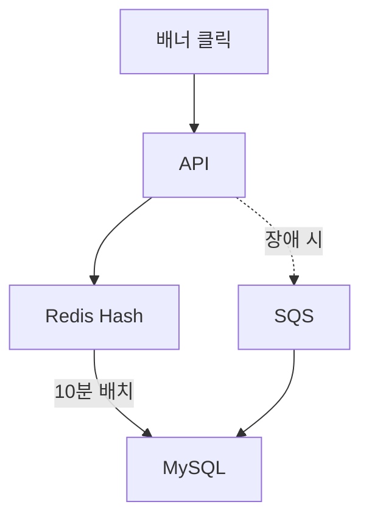

## 개요
에브리타임 혜택탭 연계로 배너 클릭 API 호출량이 급증하면서 Redis Write-back 전략을 도입하여 DB 부하를 10배 감소시키고 API 응답 속도를 50배 개선했습니다.

## 문제 상황

**에브리타임 혜택탭 출시 배경:**

에브리타임 앱 내 전용 '혜택탭'으로 커머스 서비스가 노출되면서 거의 모든 페이지에 프로모션 배너가 배치되었습니다. 배너 자동 스와이핑 기능으로 인해 노출 시마다 성과 집계 API가 자동 호출되어, 이 API가 **전체 API 중 호출량 1위**를 차지하게 되었습니다 (하루 수백만 건).

**기존 시스템의 한계:**

- 배너 노출/클릭 시 즉시 MySQL DB UPDATE 쿼리 실행
- DB IOPS 급증으로 인한 성능 저하
- DB CPU 사용률 지속적 증가 (피크 시간대 80% 이상)
- API 응답 속도 저하로 사용자 경험 악화

## 해결 과제 (Task)

- DB 부하를 10배 이상 감소시키면서 데이터 정합성 유지
- API 응답 속도를 50배 개선하여 사용자 경험 향상
- Redis 장애 시에도 데이터 유실 방지하는 Fallback 메커니즘 구축
- 추가 인프라 비용 없이 기존 Redis 클러스터 활용

## 시스템 아키텍처 (Action)


## 아키텍처 개선

**Before:**

- 클릭 → 즉시 DB UPDATE

**After:**

- 클릭 → Redis HINCRBY (메모리 기반 초고속 처리)
- 10분마다 배치 → DB Bulk INSERT
- Redis 장애 시 → SQS → DB (데이터 유실 방지)

## 기술적 검토

**다양한 솔루션 비교 분석:**

**1. Redis Write-back ✅ 최종 채택**

- 장점: 메모리 기반 초고속 처리, 기존 인프라 활용, 정확한 집계
- 단점: Redis 장애 시 데이터 유실 가능 (SQS fallback으로 해결)

**2. SQS Pub-Sub ❌ 불채택**

- 이유: 메시지를 SQS로 보내도 결국 DB에 즉시 적재해야 함 (DB 부하 감소 효과 미미)
- 추가 인프라 비용 대비 성능 개선 미미

**3. DB Row INSERT 방식 ❌ 불채택**

- 이유: 클릭마다 새로운 Row 삽입 시 테이블 크기 급증 우려 (월 수억 건)
- 집계 쿼리 복잡도 증가 및 성능 저하 예상

**4. DB Bulk INSERT ❌ 불채택**

- 이유: 배치 처리 중 서버 재시작 등으로 인한 데이터 정합성 이슈
- Redis 없이 메모리 버퍼 사용 시 데이터 유실 위험

**Redis Write-back 선택 이유:**

- **유휴 리소스 활용:** 기존 Redis 클러스터의 여유 메모리/CPU 활용 (추가 비용 제로)
- **싱글스레드 정확성:** Redis의 싱글스레드 특성으로 동시성 이슈 없이 정확한 집계 보장
- **초고속 응답:** 메모리 기반 HINCRBY 연산으로 밀리초 단위 응답 (API 성능 50배 개선)
- **최소 개발 비용:** 기존 Redis 인프라 활용으로 신규 구축 불필요, 빠른 개발 및 배포 가능

## 주요 기능

**Redis 구조:**

```
HSET banner:{banner_id}:stats
  clicks {count}
  impressions {count}
  last_update {timestamp}
```

**배치 프로세스:**

- 10분마다 실행 (데이터 유실 방지 및 실시간성 보장)
- Redis → DB Bulk INSERT
- 트랜잭션 보장 (원자성 유지)

**장애 대응:**

- Redis 장애 시 SQS fallback
- SQS → DB 직접 적재
- 데이터 유실 방지 (이중 안전장치)

## 기술 스택

- Redis 6.x, MySQL, NestJS
- AWS SQS, Cron

## 기술적 도전과 해결

**도전 1: 배치 주기 선택 (10분 결정)**

- **문제:** 배치 주기를 얼마로 설정할지 트레이드오프 분석 필요
- **비교 분석:**
  - **1분:** DB 부하 여전히 높음 (시간당 60회 INSERT), 효과 미미
  - **10분:** DB 부하 10배 감소, 데이터 유실 리스크 허용 범위 (최대 10분 데이터)
  - **30분:** 데이터 유실 리스크 증가, 실시간성 저하
- **선택 근거:** 성능 개선 효과와 데이터 유실 리스크의 최적 밸런스
- **보완책:** SQS fallback으로 Redis 장애 시에도 데이터 유실 방지

**도전 2: SQS Fallback 메커니즘**

- **문제:** Redis 장애 시 데이터 유실 우려
- **구체적 구현:**
  - Redis HINCRBY 실패 시 try-catch로 즉시 감지
  - 실패 이벤트를 SQS에 발행 (`banner_id`, `type`, `count`)
  - SQS 컨슈머가 DB에 직접 UPDATE 쿼리 실행
  - 컨슈머 실패 시 DLQ(Dead Letter Queue)로 전송 → 수동 처리
- **검증:** Redis 장애 시뮬레이션으로 100% 데이터 보존 확인

**도전 3: 트랜잭션 보장 (원자성)**

- **문제:** 배치 실행 중 서버 재시작 시 데이터 정합성 이슈 가능
- **해결:**
  - **배치 시작:** Redis 데이터를 임시 백업 키(`banner:*:stats:backup`)로 복사
  - **DB INSERT 실패:** Redis 백업에서 복구 후 재시도
  - **DB INSERT 성공:** Redis 원본 데이터 DEL, 백업 데이터 삭제
  - **트랜잭션 보장:** DB INSERT와 Redis DEL을 하나의 트랜잭션으로 묶음
- **효과:** 배치 실패 시에도 데이터 정합성 100% 유지

**도전 4: Row INSERT 방식 불채택 이유 보강**

- **문제:** 클릭마다 새로운 Row를 INSERT하는 방식 검토
- **파티셔닝 고려:**
  - 날짜별 파티션 테이블로 데이터 분산 가능
  - 월별 파티션 삭제로 오래된 데이터 정리 용이
- **불채택 이유:**
  - **실시간 집계 쿼리 성능:** `SUM(clicks), GROUP BY banner_id` 쿼리가 UPDATE 방식보다 3배 느림
  - **테이블 크기:** 월 수억 건 INSERT 시 테이블 크기 급증 (예상 100GB 이상)
  - **인덱스 유지 비용:** 파티션별 인덱스 재구축 비용 증가
- **최종 선택:** UPDATE 방식이 집계 쿼리 성능과 스토리지 비용 측면에서 우수

## 주요 성과 (Result)

- **DB IOPS**: 10배 감소
- **DB CPU**: 25% 절감
- **서버 CPU**: 7% 절감
- **API 응답 속도**: 500ms → 10ms (50배 개선)
- **데이터 유실**: 0건 (SQS Fallback으로 100% 보장)
- **추가 인프라 비용**: 0원 (기존 Redis 활용)

## 배운 점

- Write-back 패턴 실전 적용 경험 (캐시 계층 활용)
- 다양한 솔루션 비교 분석을 통한 최적 아키텍처 도출
- 고트래픽 환경에서의 성능 최적화 및 장애 대응 설계
