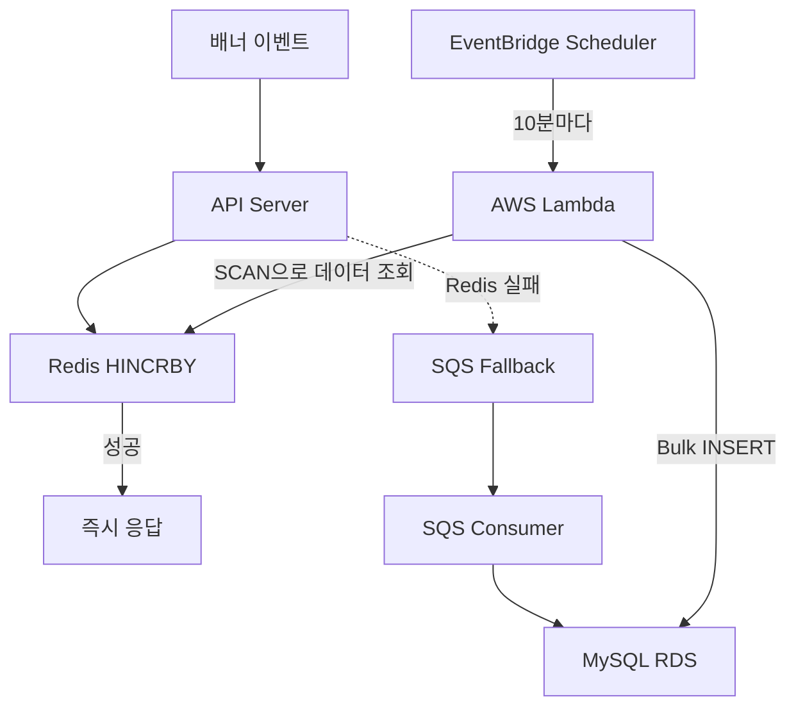

## 목차
1. [배경: 일일 70만 건의 배너 이벤트 수집](#배경-일일-70만-건의-배너-이벤트-수집)
2. [문제 분석: Row-level Lock과 Deadlock](#문제-분석-row-level-lock과-deadlock)
3. [해결 방안 검토: 3가지 옵션 비교](#해결-방안-검토-3가지-옵션-비교)
4. [아키텍처 설계: Redis Write-back 전략](#아키텍처-설계-redis-write-back-전략)
5. [핵심 구현 1: Redis Hash로 실시간 집계](#핵심-구현-1-redis-hash로-실시간-집계)
6. [핵심 구현 2: EventBridge + Lambda 배치 동기화](#핵심-구현-2-eventbridge--lambda-배치-동기화)
7. [핵심 구현 3: SQS Fallback으로 데이터 유실 방지](#핵심-구현-3-sqs-fallback으로-데이터-유실-방지)
8. [결과: DB 부하 10배 감소](#결과-db-부하-10배-감소)

---

## 배경: 일일 70만 건의 배너 이벤트 수집

에브리타임 혜택탭이 출시되면서 거의 모든 페이지에 프로모션 배너가 배치되었습니다. 배너가 노출되거나 클릭될 때마다 성과 집계 API가 호출되어, **전체 API 중 호출량 1위**를 기록하게 되었습니다.

**트래픽 규모:**
```
- 일일 배너 이벤트(노출+클릭): 약 70만 건
- 초당 수~수십 건의 SQL UPDATE 발생
```

매번 API 호출마다 MySQL DB에 직접 UPDATE 쿼리를 실행하는 구조였습니다.

---

## 문제 분석: Row-level Lock과 Deadlock

### 기존 구조의 문제

**배너 이벤트 발생 시 동작:**
```javascript
router.post("/api/banner/performance/impression", async (req, res, next) => {
  const { bannerId } = req.body;
  const date = new Date();

  await usMapper.queryWithValues(`
    INSERT INTO banner_performance (banner_id, impression, click, date) VALUES (?)
    ON DUPLICATE KEY UPDATE impression = impression + 1
  `, [[bannerId, 1, 0, date]]);

  apiHandler.send(res, { success: true }, next);
});
```

**문제점:**

**1. `INSERT ON DUPLICATE KEY UPDATE`의 Lock 경합**

이 구문은 단순 UPDATE와 달리, 먼저 Shared Lock(S)을 획득한 뒤 중복 키 감지 시 Exclusive Lock(X)으로 업그레이드하는 과정을 거칩니다. 같은 키(banner_id + date)에 동시 요청이 들어오면 Lock 대기가 발생합니다.

```
요청 A: INSERT 시도 → S Lock 획득 → 중복 감지 → X Lock 대기
요청 B: INSERT 시도 → S Lock 획득 → 중복 감지 → X Lock 대기
요청 C: INSERT 시도 → S Lock 획득 → 중복 감지 → X Lock 대기
```

**2. Deadlock 발생**

동시에 같은 키에 여러 요청이 `INSERT ON DUPLICATE KEY UPDATE`를 실행하면, S Lock → X Lock 업그레이드 과정에서 서로의 S Lock 해제를 기다리며 교착 상태가 발생합니다.

```
트랜잭션 A: S Lock 획득 → X Lock 필요 (B의 S Lock 대기)
트랜잭션 B: S Lock 획득 → X Lock 필요 (A의 S Lock 대기)
→ Deadlock!
```

**3. 다른 API에 대한 연쇄 영향**

배너 집계 API의 DB 부하로 인해 같은 RDS를 사용하는 다른 API들도 느려지는 현상이 발생했습니다.

---

## 해결 방안 검토: 3가지 옵션 비교

### 방안 1: 데이터 구조 변경 (Row INSERT)

집계 테이블 UPDATE 대신 이벤트를 Row로 저장하는 방식입니다.

```sql
-- 클릭 이벤트를 Row로 저장
INSERT INTO banner_clicks (banner_id, clicked_at) VALUES (1, NOW());

-- 집계는 별도 쿼리
SELECT COUNT(*) FROM banner_clicks WHERE banner_id = 1 AND clicked_at >= '2024-05-01';
```

**불채택 이유:**
- 데이터 적재량 증가로 인한 스토리지 비용 부담 (일일 70만 건 × 365일)
- 실시간 집계 쿼리(`COUNT`, `GROUP BY`)가 느림
- 개발 리소스 및 인프라 변경 비용이 높음

### 방안 2: 메시지 큐 비동기 처리

SQS 등 메시지 큐로 이벤트를 비동기 처리하는 방식입니다.

**불채택 이유:**
- 운영 복잡도 증가
- 메시지 큐 인프라 추가 비용
- 결국 DB에 쓰는 구조는 동일하여 근본적 해결이 아님

### 방안 3: Redis 집계 + 배치 동기화 (채택)

Redis에서 실시간 집계 후 주기적으로 DB에 동기화하는 Write-back 방식입니다.

**채택 이유:**
- 기존 ElastiCache 인프라를 그대로 활용 (추가 비용 없음)
- 성능, 비용, 안정성 모두 균형
- DB 부하를 근본적으로 해소

---

## 아키텍처 설계: Redis Write-back 전략

### 전체 아키텍처



### 배치 주기: 일일 1회에서 10분으로 변경

초기에는 일일 1회(오전 6시, 트래픽 최소 시간대) 배치로 운영했습니다. 그러나 Redis 장애 발생 시 하루치 데이터가 유실될 위험이 있어, **10분 주기로 변경**했습니다.

| 주기 | 장점 | 단점 | 결정 |
|------|-----|------|------|
| 1분 | 데이터 유실 최소화 | DB 부하 여전히 높음 | ❌ |
| **10분** | **유실 위험 최소화 + DB 부하 감소** | **약간의 데이터 지연** | **✅** |
| 1시간 | DB 부하 크게 감소 | 유실 시 1시간 데이터 손실 | ❌ |
| 일일 1회 | DB 부하 최소 | 장애 시 하루치 데이터 유실 | ❌ (기존) |

---

## 핵심 구현 1: Redis Hash로 실시간 집계

### Redis Hash 구조

단순 카운터 누적 용도에는 인메모리 데이터 스토어가 적합합니다. 개별 String Key 대신 Hash Key로 통합하여 메모리를 최적화했습니다.

**데이터 모델:**
```
Key: {date}:{banner_id}
Fields:
  - IMPRESSION: 노출 수
  - CLICK: 클릭 수
명령어: HINCRBY
```

**예시:**
```
20240501:1
  IMPRESSION: 12345
  CLICK: 890

20240501:2
  IMPRESSION: 8765
  CLICK: 432
```

Redis는 싱글스레드로 동작하기 때문에 HINCRBY 명령어로 Lock 경합 없이 안정적으로 값을 누적할 수 있습니다. MySQL에서 발생하던 Row-level Lock과 Deadlock 문제가 원천적으로 해소됩니다.

### API 구현

**이벤트 카운트 증가:**
```typescript
@Post('/banners/:id/click')
async incrementClick(@Param('id') bannerId: number) {
  const dateKey = dayjs().format('YYYYMMDD');

  try {
    // Redis HINCRBY (원자적 연산, Lock 없음)
    await this.redis.hincrby(
      `${dateKey}:${bannerId}`,
      'CLICK',
      1
    );
    return { success: true };

  } catch (error) {
    // Redis 실패 시 SQS Fallback
    await this.sqsService.sendMessage({
      type: 'BANNER_CLICK',
      bannerId,
      timestamp: Date.now()
    });
    return { success: true, fallback: true };
  }
}
```

**실시간 조회:**
```typescript
@Get('/banners/:id/stats')
async getStats(@Param('id') bannerId: number) {
  const dateKey = dayjs().format('YYYYMMDD');
  const stats = await this.redis.hgetall(`${dateKey}:${bannerId}`);

  return {
    impressions: parseInt(stats.IMPRESSION || '0'),
    clicks: parseInt(stats.CLICK || '0'),
    ctr: stats.IMPRESSION > 0
      ? (parseInt(stats.CLICK) / parseInt(stats.IMPRESSION) * 100).toFixed(2)
      : 0
  };
}
```

---

## 핵심 구현 2: EventBridge + Lambda 배치 동기화

### 배치 아키텍처

EventBridge Scheduler가 10분마다 Lambda를 트리거하여 Redis 데이터를 RDS에 동기화합니다.

**Lambda 함수:**
```typescript
export const handler = async () => {
  let cursor = '0';
  const statsData = [];

  // 1. SCAN으로 Redis 데이터 조회
  do {
    const [nextCursor, keys] = await redis.scan(
      cursor, 'MATCH', '*:*', 'COUNT', 100
    );
    cursor = nextCursor;

    for (const key of keys) {
      const [date, bannerId] = key.split(':');
      const stats = await redis.hgetall(key);

      if (stats.IMPRESSION || stats.CLICK) {
        statsData.push({
          date,
          bannerId: parseInt(bannerId),
          impressions: parseInt(stats.IMPRESSION || '0'),
          clicks: parseInt(stats.CLICK || '0'),
        });
      }
    }
  } while (cursor !== '0');

  if (statsData.length === 0) return;

  // 2. RDS에 Bulk INSERT
  await db.transaction(async (trx) => {
    await trx('banner_daily_stats')
      .insert(statsData)
      .onConflict(['date', 'banner_id'])
      .merge({
        impressions: trx.raw('banner_daily_stats.impressions + VALUES(impressions)'),
        clicks: trx.raw('banner_daily_stats.clicks + VALUES(clicks)'),
      });
  });

  // 3. 동기화 완료된 Redis 데이터 정리
  await cleanupOldRedisData(7); // 일주일 이상 된 데이터 삭제
};
```

### SCAN을 사용하는 이유

`KEYS` 명령어는 전체 키를 한 번에 탐색하여 Redis를 블로킹합니다. 반면 `SCAN`은 반복적으로 점진 탐색을 수행하기 때문에, Redis의 싱글스레드 특성상 다른 요청을 차단하지 않고 부하를 최소화합니다.

---

## 핵심 구현 3: SQS Fallback으로 데이터 유실 방지

### Redis 장애 시나리오

- Redis 클러스터 재시작
- 네트워크 장애
- 메모리 부족 (OOM)

이런 상황에서도 배너 성과 데이터를 유실하면 안 됩니다.

### SQS Fallback 메커니즘

**API에서 SQS 전송:**
```typescript
async incrementClick(bannerId: number) {
  try {
    // 1차: Redis 시도
    const dateKey = dayjs().format('YYYYMMDD');
    await this.redis.hincrby(`${dateKey}:${bannerId}`, 'CLICK', 1);
    return { success: true };

  } catch (error) {
    // 2차: SQS Fallback
    this.logger.warn(`Redis failed, fallback to SQS: ${bannerId}`);

    await this.sqs.sendMessage({
      QueueUrl: process.env.BANNER_STATS_QUEUE_URL,
      MessageBody: JSON.stringify({
        type: 'BANNER_CLICK',
        bannerId,
        timestamp: Date.now()
      })
    }).promise();

    return { success: true, fallback: true };
  }
}
```

**SQS Consumer:**
```typescript
@SqsMessageHandler('banner-stats-queue')
async handleMessage(message: Message) {
  const payload = JSON.parse(message.Body);

  // SQS 메시지는 DB에 직접 저장
  await this.db('banner_daily_stats')
    .where('banner_id', payload.bannerId)
    .increment('clicks', 1);
}
```

**DLQ (Dead Letter Queue) 설정:**
```yaml
BannerStatsQueue:
  Type: AWS::SQS::Queue
  Properties:
    QueueName: banner-stats-queue
    VisibilityTimeout: 60
    RedrivePolicy:
      deadLetterTargetArn: !GetAtt BannerStatsDLQ.Arn
      maxReceiveCount: 3

BannerStatsDLQ:
  Type: AWS::SQS::Queue
  Properties:
    QueueName: banner-stats-dlq
    MessageRetentionPeriod: 1209600  # 14일 보관
```

---

## 결과: DB 부하 10배 감소

### 성능 개선

| 지표 | 개선 내용 |
|------|----------|
| **Write IOPS** | 10배 이상 감소 |
| **RDS CPU 사용률** | 약 20% 감소 |
| **EC2 CPU 사용률** | 약 8% 감소 |
| **Row-level Lock** | 완전 해소 |
| **Deadlock** | 완전 해소 |

ElastiCache 측은 CPU나 메모리 사용률에 유의미한 영향이 없었습니다. 단순 카운터 누적은 Redis에게 매우 가벼운 연산입니다.

### 비용

| 항목 | 변경 내용 |
|------|----------|
| **ElastiCache** | 기존 인프라 활용 (추가 비용 없음) |
| **EventBridge + Lambda** | 월 $1 미만 |
| **SQS** | Fallback 전용 (월 $0.5 미만) |

기존 인프라를 그대로 활용하면서 성능, 비용, 안정성 모두 개선할 수 있었습니다.

### 다른 API 성능 회복

DB 부하가 감소하면서 같은 RDS를 사용하는 다른 API들의 응답 속도도 함께 개선되었습니다.

---

## 배운 점

**1. 단순 카운터에는 인메모리 스토어가 적합**
- MySQL의 UPDATE + Lock 구조는 고빈도 카운터에 부적합
- Redis HINCRBY는 싱글스레드 특성으로 Lock 없이 원자적 처리

**2. 배치 주기는 데이터 유실 리스크와 타협**
- 일일 1회: DB 부하 최소지만 장애 시 하루치 유실 위험
- 10분: 유실 리스크와 DB 부하의 균형점
- EventBridge + Lambda로 서버리스 배치 구현

**3. SCAN은 프로덕션의 필수**
- KEYS 명령어는 Redis를 블로킹하여 서비스 장애 유발 가능
- SCAN으로 점진 탐색하여 부하 최소화

**4. Fallback 메커니즘은 필수**
- Redis 장애는 언제든 발생 가능
- SQS + DLQ로 데이터 유실 방지
- 추가 비용은 거의 없음

**5. Bulk INSERT의 효과**
- 개별 INSERT 대비 DB 트랜잭션 횟수를 대폭 감소
- 10분간 누적된 데이터를 한 번의 트랜잭션으로 동기화

---

## 기술 스택

| 분류 | 기술 |
|------|------|
| **캐시** | Redis (ElastiCache) |
| **데이터베이스** | MySQL (RDS) |
| **배치 스케줄러** | AWS EventBridge Scheduler |
| **배치 처리** | AWS Lambda |
| **Fallback** | AWS SQS + DLQ |
