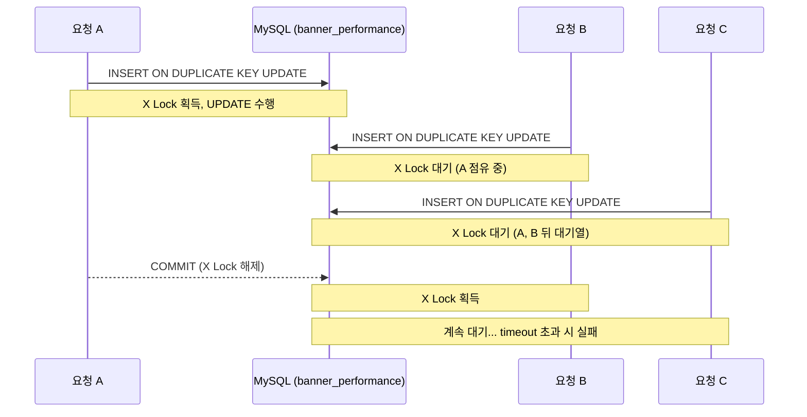
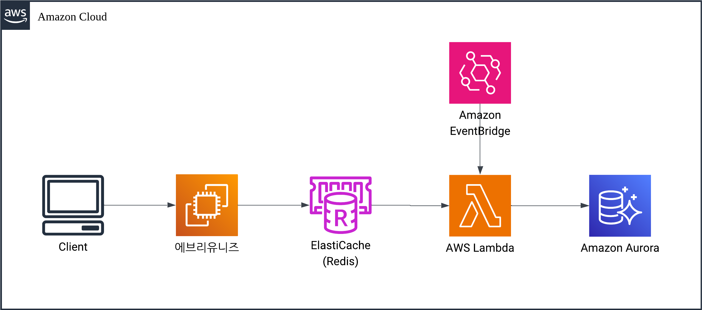

## 목차
1. [배경: 일일 90만 건의 배너 이벤트 수집](#배경-일일-90만-건의-배너-이벤트-수집)
2. [문제 분석: Row-level Lock 경합](#문제-분석-row-level-lock-경합)
3. [해결 방안 검토: 3가지 옵션 비교](#해결-방안-검토-3가지-옵션-비교)
4. [아키텍처 설계: Redis 집계 + 배치 동기화](#아키텍처-설계-redis-집계--배치-동기화)
5. [핵심 구현 1: Redis Hash로 실시간 집계](#핵심-구현-1-redis-hash로-실시간-집계)
6. [핵심 구현 2: EventBridge + Lambda 배치 동기화](#핵심-구현-2-eventbridge-lambda-배치-동기화)
7. [결과](#결과)

---

## 배경: 일일 90만 건의 배너 이벤트 수집

에브리타임 앱 내에 에브리유니즈 단독 '혜택탭'이 출시되면서, 에브리유니즈로의 전환율이 크게 증가했고 전체 트래픽이 **30% 이상 급증**했습니다. 거의 모든 페이지에 프로모션 배너가 배치되어 있었기 때문에, 배너 성과 집계 API도 트래픽에 비례하여 선형적으로 증가하며 **전체 API 중 호출량 1위**를 기록하게 되었습니다.

**트래픽 규모:**
```
- 일일 배너 이벤트(노출+클릭): 약 90만 건
- 평균 초당 약 10건이지만, 인기 배너에 동시 요청이 집중되는 핫스팟 패턴
```

평균 수치만 보면 MySQL이 충분히 처리할 수 있는 수준이지만, 문제는 트래픽이 균등하게 분산되지 않는다는 점입니다. 특정 프로모션 배너에 노출/클릭이 집중되면서 DB에 부하가 집중되기 시작했고, Lock 경합과 Lock Wait Timeout이 빈번하게 발생했습니다.

---

## 문제 분석: Row-level Lock 경합

### 기존 구조의 문제

기존 시스템은 배너 이벤트가 발생할 때마다 MySQL에 직접 `INSERT ON DUPLICATE KEY UPDATE`를 실행하는 구조였습니다. 이 구문은 중복 키가 감지되면 해당 Row에 Exclusive Lock(X Lock)을 획득한 뒤 UPDATE를 수행합니다. 같은 키(`banner_id + date`)에 동시 요청이 집중되면 X Lock 경합이 발생하고, 이는 단순 트래픽 과부하가 아닌 구조적 Lock 메커니즘에 기인한 문제였습니다.

**배너 이벤트 발생 시 동작:**
```javascript
router.post("/api/banner/performance/impression", async (req, res, next) => {
  const { bannerId } = req.body;
  const date = new Date();

  await usMapper.queryWithValues(`
    INSERT INTO banner_performance (banner_id, impression, click, date) VALUES (?)
    ON DUPLICATE KEY UPDATE impression = impression + 1
  `, [[bannerId, 1, 0, date]]);

  apiHandler.send(res, { success: true }, next);
});
```

**문제점:**

**1. X Lock 경합과 Lock Wait Timeout**

같은 키에 동시 요청이 집중되면 X Lock 대기열이 길어지고, 대기 시간이 `innodb_lock_wait_timeout`을 초과하면 트랜잭션이 실패합니다.

```
요청 A: INSERT → 중복 감지 → X Lock 획득 → UPDATE 수행 중
요청 B: INSERT → 중복 감지 → X Lock 대기 (A가 점유 중)
요청 C: INSERT → 중복 감지 → X Lock 대기 (A, B 뒤에 대기)
→ 대기열이 길어지면 Lock wait timeout exceeded
```


```mermaid
sequenceDiagram
    participant A as 요청 A
    participant DB as MySQL (banner_performance)
    participant B as 요청 B
    participant C as 요청 C

    A->>DB: INSERT ON DUPLICATE KEY UPDATE
    Note over A,DB: X Lock 획득, UPDATE 수행
    B->>DB: INSERT ON DUPLICATE KEY UPDATE
    Note over B,DB: X Lock 대기 (A 점유 중)
    C->>DB: INSERT ON DUPLICATE KEY UPDATE
    Note over C,DB: X Lock 대기 (A, B 뒤 대기열)
    A-->>DB: COMMIT (X Lock 해제)
    Note over B,DB: X Lock 획득
    Note over C,DB: 계속 대기... timeout 초과 시 실패
```

**2. 다른 API에 대한 연쇄 영향**

배너 집계 API의 DB 부하로 인해 같은 RDS를 사용하는 다른 API들도 느려지는 현상이 발생했습니다.

---

## 해결 방안 검토: 3가지 옵션 비교

검토 시 가장 중요했던 기준은 **기존 시스템 영향도 최소화**였습니다. 어드민의 집계 조회 로직은 변경하지 않고, API의 Write 경로만 수정하여 빠르게 적용할 수 있는 방안을 우선했습니다.

### 방안 1: 데이터 구조 변경 (Row INSERT)

집계 테이블에 UPDATE하는 대신 이벤트를 개별 Row로 저장하는 방식입니다. INSERT only이므로 같은 Row에 대한 X Lock 경합은 해소됩니다.

```sql
-- 클릭 이벤트를 Row로 저장
INSERT INTO banner_clicks (banner_id, clicked_at) VALUES (1, NOW());

-- 집계는 별도 쿼리
SELECT COUNT(*) FROM banner_clicks WHERE banner_id = 1 AND clicked_at >= '2024-05-01';
```

**불채택 이유:**
- 데이터 적재량 증가로 인한 스토리지 비용 부담 (일일 90만 건 × 365일)
- 기존 어드민의 집계 조회 쿼리를 `COUNT`, `GROUP BY` 기반으로 전면 변경해야 함
- Lock 문제는 해소되지만, API뿐 아니라 어드민까지 수정 범위가 확대됨

### 방안 2: 메시지 큐 비동기 처리

SQS 등 메시지 큐를 두어 API에서는 이벤트만 발행하고, Consumer가 비동기로 DB에 적재하는 방식입니다.

**불채택 이유:**
- Consumer가 결국 동일한 `INSERT ON DUPLICATE KEY UPDATE`를 실행하므로 Lock 경합이 그대로 발생
- API의 응답 속도는 개선되지만 DB 부하의 근본적 해결이 아님
- 메시지 큐 인프라 추가 비용과 운영 복잡도 증가

### 방안 3: Redis 집계 + 배치 동기화 (채택)

Redis에서 실시간 집계 후 주기적으로 DB에 동기화하는 방식입니다(캐시 패턴으로는 Write-back에 해당). Redis는 싱글스레드로 동작하기 때문에 `HINCRBY` 명령어 자체가 원자적이며, Lock이라는 개념 자체가 불필요합니다.

**채택 이유:**
- 기존 ElastiCache(Redis) 인프라를 그대로 활용 (추가 비용 없음)
- API의 Write 경로만 Redis로 변경하면 되어 기존 어드민 조회 로직에 영향 없음
- DB에는 배치로 동기화하므로 Lock 경합을 근본적으로 해소

| 기준 | Row INSERT | 메시지 큐 | Redis 집계            |
|------|-----------|----------|---------------------|
| Lock 경합 해소 | O (INSERT only) | X (동일 구문) | O (Lock 불필요)        |
| DB 부하 감소 | X (쓰기량 증가) | X (동일) | O (배치 동기화)          |
| 기존 시스템 영향 | 어드민 조회 전면 수정 | 낮음 | API Write만 변경       |
| 추가 인프라 비용 | 스토리지 증가 | SQS 인프라 | 없음 (기존 ElastiCache) |
| 개발 공수 | 높음 | 중간 | **낮음**              |

> 당시에는 "고빈도 카운터 성능 문제를 가장 빠르게 해소"하는 것이 1순위였기 때문에 Redis 집계 방식이 최적의 선택이었습니다.

---

## 아키텍처 설계: Redis 집계 + 배치 동기화

### 전체 아키텍처



**핵심 흐름:**
1. **실시간 집계**: 배너 이벤트 → API Server → Redis `HINCRBY` (즉시 응답)
2. **배치 동기화**: EventBridge가 10분마다 Lambda를 트리거 → Redis `SCAN` → MySQL `Bulk REPLACE`
3. **조회**: 어드민 API는 MySQL만 조회 (기존 로직 변경 없음)

---

## 핵심 구현 1: Redis Hash로 실시간 집계

### Redis Hash 구조

같은 배너의 IMPRESSION과 CLICK을 하나의 키로 논리적으로 묶기 위해 Hash 구조를 선택했습니다. `HGETALL`로 한 번에 조회할 수 있어 배치 동기화 시에도 효율적입니다.

```
# String Key 방식 — 카운터마다 개별 키
SET banner_stats:20240501:1:IMPRESSION 12345
SET banner_stats:20240501:1:CLICK 890
→ 일 평균 3,000개 배너 × 2 카운터 = 6,000개 키

# Hash Key 방식 — 배너당 1개의 키에 필드 통합
HSET banner_stats:20240501:1 IMPRESSION 12345 CLICK 890
→ 일 평균 3,000개 배너 = 3,000개 키
```

키 수가 절반으로 줄어드는 것 외에 메모리 측면의 이점도 있습니다. Redis에서 String Key는 키마다 [`dictEntry`(32바이트, jemalloc 할당) + `redisObject`(16바이트) + SDS 헤더](https://github.com/redis/redis/discussions/13677) 등 약 70-90바이트의 메타데이터 오버헤드가 발생합니다. Hash Key는 필드 수가 [`hash-max-ziplist-entries`](https://redis.io/docs/latest/operate/oss_and_stack/management/optimization/memory-optimization/)(기본 128) 이하이면 내부적으로 **ziplist**(Redis 7.0부터는 [**listpack**](https://github.com/redis/redis/issues/8702))로 인코딩되어, 필드를 연속된 메모리 블록에 순차 저장합니다. 배너 집계는 Hash당 필드가 2개뿐이므로 ziplist 인코딩이 확정적으로 적용됩니다.

**데이터 모델:**
```
Key: banner_stats:{date}:{banner_id}
Fields:
  - IMPRESSION: 노출 수
  - CLICK: 클릭 수
명령어: HINCRBY
```

Redis는 싱글스레드로 동작하기 때문에 HINCRBY 명령어로 Lock 경합 없이 안정적으로 값을 누적할 수 있습니다. MySQL에서 발생하던 Row-level Lock 경합 문제가 원천적으로 해소됩니다.

**TTL 및 메모리 관리:**

각 키에 7일 TTL을 설정했습니다. 10분 주기 배치가 정상 동작하면 데이터는 즉시 DB에 반영되지만, 배치 실패나 Redis 장애 시 데이터 유실을 대비하여 보수적으로 7일간 보관하도록 결정했습니다.

```
- 일당 활성 배너 키: 약 3,000개
- 7일 보관: 약 21,000개 키
- 키당 크기: Hash 2필드 (IMPRESSION, CLICK), ziplist ≈ 100바이트
- 총 메모리: 약 2.1MB
```

기존 ElastiCache 인스턴스에서 유의미한 메모리 영향이 없는 수준이며, 별도의 메모리 관리 전략이 불필요했습니다.

### API 구현

**이벤트 카운트 증가:**
```typescript
@Post('/banners/:id/click')
async incrementClick(@Param('id') bannerId: number) {
  const dateKey = dayjs().format('YYYYMMDD');

  try {
    await this.redis.hincrby(
      `banner_stats:${dateKey}:${bannerId}`,
      'CLICK',
      1
    );
    return { success: true };
  } catch (error) {
    this.logger.error(
      `Banner stats increment failed - bannerId: ${bannerId}, type: CLICK`,
      error,
    );
    throw error;
  }
}
```

---

## 핵심 구현 2: EventBridge + Lambda 배치 동기화

### 배치 주기 결정

초기에는 일일 1회(오전 6시, 트래픽 최소 시간대) 배치로 운영했습니다. 그러나 Redis 장애 발생 시 하루치 데이터가 유실될 위험이 있어, 실제 데이터를 소비하는 마케팅팀과 논의하여 **10분 주기**로 결정했습니다. 마케팅팀 기준으로 실시간 정확도보다는 일 단위 집계의 정확성이 중요했기 때문에, 최대 10분 지연은 허용 가능한 수준이었습니다.

| 주기 | 장점 | 단점 | 결정 |
|------|-----|------|------|
| 1분 | 데이터 유실 최소화 | DB 부하 여전히 높음 | ❌ |
| **10분** | **유실 위험 최소화 + DB 부하 감소** | **최대 10분 지연** | **✅** |
| 1시간 | DB 부하 크게 감소 | 유실 시 1시간 데이터 손실 | ❌ |
| 일일 1회 | DB 부하 최소 | 장애 시 하루치 데이터 유실 | ❌ (기존) |

### 배치 아키텍처

EventBridge Scheduler가 Lambda를 두 가지 모드로 트리거합니다.

```yaml
# 10분마다 정기 동기화
BannerStatsSyncSchedule:
  Type: AWS::Scheduler::Schedule
  Properties:
    ScheduleExpression: rate(10 minutes)
    Target:
      Input: '{"mode":"regular"}'

# 매일 00:05 전일(D-1) 최종 확정
BannerStatsFinalizeSchedule:
  Type: AWS::Scheduler::Schedule
  Properties:
    ScheduleExpression: cron(5 0 * * ? *)
    Target:
      Input: '{"mode":"finalize_yesterday"}'
```

1. **정기 동기화 (10분마다)**: Redis `SCAN`으로 당일 데이터를 조회하여 DB에 REPLACE
2. **전일 최종 확정 (자정 이후 1회)**: Redis 데이터와 CloudWatch 로그를 함께 집계하여, 배치 실패나 날짜 경계(23:59-00:xx) 구간에서 누락된 이벤트까지 보정한 뒤 최종 REPLACE

**Lambda 함수:**
```typescript
export const handler = async (event: { mode: string }) => {
  const isFinalize = event.mode === 'finalize_yesterday';
  const targetDate = isFinalize
    ? dayjs().subtract(1, 'day').format('YYYYMMDD')
    : dayjs().format('YYYYMMDD');

  // 1. Redis SCAN으로 데이터 조회 (KEYS 대신 SCAN으로 점진 탐색하여 블로킹 방지)
  const redisStats = await scanBannerStats(targetDate);

  // 2. 전일 최종 확정 시 CloudWatch 로그에서 누락 이벤트 합산
  if (isFinalize) {
    const logStats = await aggregateFromCloudWatchLogs(targetDate);
    mergeStats(redisStats, logStats);
  }

  // 3. 역행 감지 — incoming < current이면 REPLACE 중단 및 알람
  const currentStats = await fetchCurrentStats(targetDate);
  const regressions = detectRegressions(redisStats, currentStats);

  if (regressions.length > 0) {
    await sendAlert(regressions);
    excludeFromSync(redisStats, regressions);
  }

  // 4. DB에 Bulk REPLACE (누적값 통째로 교체)
  if (redisStats.length > 0) {
    await db.raw(`
      REPLACE INTO banner_daily_stats (date, banner_id, impressions, clicks)
      VALUES ${redisStats.map(() => '(?, ?, ?, ?)').join(', ')}
    `, redisStats.flatMap(s => [s.date, s.bannerId, s.impressions, s.clicks]));
  }
};
```

**REPLACE 방식의 데이터 정합성:**

배치 동기화는 INCREMENT(증분)가 아닌 **REPLACE(교체)** 방식입니다. Redis에 저장된 값은 HINCRBY로 계속 누적되는 값이므로, DB에는 Redis의 최신 누적값으로 통째로 교체합니다.

이 방식의 장점은 정합성 관리가 단순해진다는 점입니다:

- **SCAN과 REPLACE 사이에 새로운 HINCRBY가 발생하면?** → 다음 배치에서 최신 누적값으로 교체되므로 유실 없음
- **Lambda가 DB REPLACE 중 실패하면?** → Redis 데이터는 그대로 유지되므로, 다음 배치에서 최신 값으로 재시도하여 자동 복구
- **같은 데이터가 2번 동기화되면?** → 동일한 값으로 교체될 뿐, 중복 적산되지 않음

---

## 결과

### 지표 정의와 측정 기준

| 지표 | 값 | 측정 기준/기간 | 출처 |
|------|----|----------------|------|
| **Write IOPS 감소율** | **10배 이상 감소** | 적용 전/후 동일 트래픽 구간 비교 (운영 관측) | RDS 모니터링 대시보드 |
| **RDS CPU 사용률** | **약 20% 감소** | 적용 전/후 평균 CPU 비교 | CloudWatch `CPUUtilization` |
| **EC2 CPU 사용률** | **약 8% 감소** | 적용 전/후 평균 CPU 비교 | CloudWatch `CPUUtilization` |
| **Row-level Lock 경합** | **운영 관측상 해소** | 적용 후 동일 이벤트 피크 구간 관찰 | DB lock 로그 |

### 성능 개선

| 지표 | 개선 내용 |
|------|----------|
| **Write IOPS** | 10배 이상 감소 |
| **RDS CPU 사용률** | 약 20% 감소 |
| **EC2 CPU 사용률** | 약 8% 감소 |
| **Row-level Lock 경합** | 완전 해소 |

기존에는 모든 배너 이벤트가 `INSERT ON DUPLICATE KEY UPDATE`로 DB에 직접 Write했지만, Redis 전환 후에는 이 SQL 호출 자체가 제거되었습니다. 이로 인해:

- **RDS**: 초당 수십 건의 Write 쿼리가 10분마다 1회 Bulk REPLACE로 대체되어 Write IOPS와 CPU 사용률이 대폭 감소
- **EC2**: Lock Wait으로 인한 DB 커넥션 장기 점유가 사라지면서 커넥션 풀 고갈 문제가 해소되고, Node.js 이벤트 루프의 콜백 지연도 줄어들어 전체 CPU 사용률 감소
- **ElastiCache**: 단순 카운터 누적은 Redis에게 매우 가벼운 연산으로, CPU나 메모리 사용률에 유의미한 영향 없음

### 비용

| 항목 | 변경 내용 |
|------|----------|
| **ElastiCache** | 기존 인프라 활용 (추가 비용 없음) |
| **EventBridge + Lambda** | 월 $1 미만 |

비용 지표는 AWS 청구서 기준 월 평균 관측값입니다. 기존 인프라를 그대로 활용하면서 성능, 비용, 안정성 모두 개선할 수 있었습니다.

---

## 배운 점

**1. 발상의 전환이 가장 효과적인 최적화였다**
- 기존 로직을 복잡하게 튜닝하는 대신, "실시간으로 RDB에 쓸 필요가 있는가?"라는 질문 하나가 해결의 시작이었다
- 쓰기 경로를 Redis로 분리하는 단순한 구조 변경만으로 Lock 경합, 커넥션 풀 고갈, CPU 상승까지 연쇄적으로 해소됐다
- 복잡한 구현보다 문제의 본질을 정확히 파악하는 것이 더 큰 성능 개선을 만든다는 걸 체감했다

**2. 기존 시스템 영향도를 최소화하는 설계**
- 어드민의 집계 조회 로직, 기존 테이블 구조, 다른 API 등 기존 시스템을 건드리지 않는 것을 최우선으로 설계했다
- API 레이어의 쓰기 경로만 변경하고, 배치로 동일한 테이블에 동기화하는 방식으로 나머지 시스템은 변경 없이 동작하게 했다
- 프로덕션 환경에서는 "무엇을 바꾸지 않을 것인가"를 먼저 정하는 것이 안정적인 개선의 핵심이었다

**3. 기술적 의사결정에는 이해관계자의 맥락이 필요하다**
- 배치 주기, 데이터 정합성 허용 범위 등은 순수한 엔지니어링 판단이 아니라 실제 사용하는 마케팅팀과의 논의를 통해 결정했다
- "10분 이내 반영이면 충분하다"는 현업의 요구사항이 있었기에 실시간 동기화 대신 배치 방식을 선택할 수 있었다
- 기술적 트레이드오프를 판단할 때, 비즈니스 요구사항을 먼저 확인하는 습관의 중요성을 배웠다

**4. 단순한 구현에도 고민할 포인트는 많았다**
- Redis 자료구조 선택(String vs Hash), TTL 정책, 배치 주기, 역행 감지와 알림, 전일 데이터 보정 등 하나하나가 근거 있는 의사결정이 필요했다
- 단순해 보이는 구현이라도 "왜 이렇게 했는가"를 설명할 수 있어야 한다는 점에서, 설계 과정 자체가 좋은 경험이었다

---

## 기술 스택

| 분류 | 기술 |
|------|------|
| **캐시/집계** | Redis (ElastiCache) |
| **데이터베이스** | MySQL (RDS) |
| **배치 스케줄러** | AWS EventBridge Scheduler |
| **배치 처리** | AWS Lambda |
