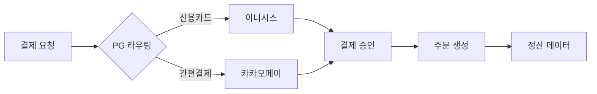
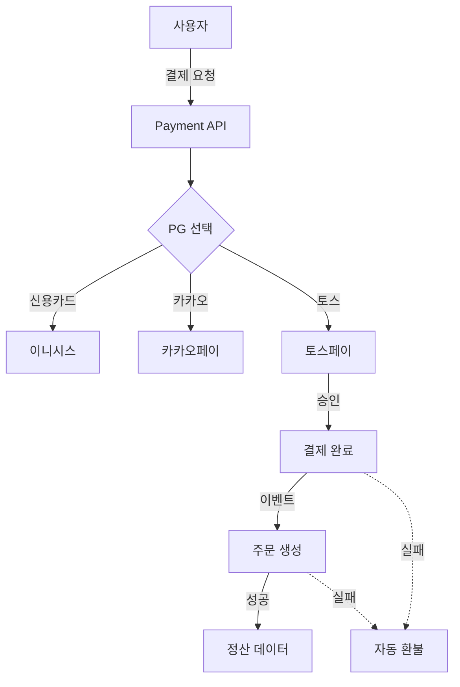

## 목차
1. [배경: 데이터 정합성을 고려한 결제 시스템](#배경-데이터-정합성을-고려한-결제-시스템)
2. [문제 분석: 4개 시스템의 동시 개발](#문제-분석-4개-시스템의-동시-개발)
3. [해결 목표: 무엇을 달성하려 했나](#해결-목표-무엇을-달성하려-했나)
4. [아키텍처 설계: 이벤트 기반 보상 트랜잭션 선택 이유](#아키텍처-설계-이벤트-기반-보상-트랜잭션-선택-이유)
5. [핵심 구현 1: 병렬 개발 전략](#핵심-구현-1-병렬-개발-전략)
6. [핵심 구현 2: 이벤트 기반 보상 트랜잭션으로 데이터 정합성 보장](#핵심-구현-2-이벤트-기반-보상-트랜잭션으로-데이터-정합성-보장)
7. [결과: 숫자로 증명하는 개선 효과](#결과-숫자로-증명하는-개선-효과)

---

## 배경: 데이터 정합성을 고려한 결제 시스템

"토스페이 결제를 추가해주세요."

커머스 플랫폼에 신규 결제 수단을 추가하는 작업. 단순해 보이지만, 결제-주문-정산 시스템 간 데이터 정합성을 보장하는 것이 핵심 과제였습니다. 토스 생태계와의 연동으로 신규 고객을 유입하고, 결제 수단 다양화로 결제 성공률을 개선해야 했습니다.

**가장 중요하게 고민한 것은 안전성이었습니다.** 결제는 승인됐는데 주문이 실패하면? 주문은 생성됐는데 정산 데이터가 누락되면? 네트워크 장애로 중복 결제가 발생하면? 이런 모든 시나리오를 사전에 설계하고 대응 방안을 마련하는 데 집중했습니다.

결과적으로 이 프로젝트는 **전체 거래액의 30%(111억 원)**를 토스페이가 차지하는 성공으로 이어졌습니다.

---

## 문제 분석: 4개 시스템의 동시 개발

결제 시스템은 단순히 "결제 버튼 클릭 → 승인" 으로 끝나지 않습니다. 실제로는 4개의 독립적인 시스템이 유기적으로 동작해야 합니다.

### 영향을 받는 시스템

**1. 결제 시스템**
- 토스페이 API 연동 (인증, 승인, 취소, 환불)
- 기존 PG(이니시스, 카카오페이)와 라우팅 로직 통합
- Webhook 수신 및 처리

**2. 주문 시스템**
- 결제 완료 → 주문 생성 플로우
- 결제 실패 시 주문 롤백
- 주문 상태 관리 (결제 대기 → 결제 완료 → 배송 준비)

**3. 정산 시스템**
- 토스페이 수수료 정책 반영
- 일별/월별 정산 데이터 집계
- 정산 내역 조회 및 엑셀 다운로드

**4. 어드민 시스템**
- 결제 내역 조회 및 필터링
- 수동 환불 처리
- 정산 대시보드 및 통계

### 왜 어려웠을까?

**4개 시스템 동시 개발:**
- 4개 시스템을 동시 개발하면 의존성 지옥 발생 가능
- API 명세 불일치로 인한 통합 실패 리스크

**데이터 정합성 보장:**
- 결제는 승인됐는데 주문은 실패하면?
- 주문은 생성됐는데 정산 데이터가 누락되면?
- 네트워크 장애로 중복 요청이 들어오면?
- 이런 모든 예외 케이스를 사전에 설계하고 대응 방안 마련 필요

**안전성과 확장성:**
- 장애 발생 시 자동 복구 메커니즘
- 향후 다른 PG 추가 시에도 확장 가능한 구조
- 멱등성 보장으로 중복 처리 방지

---

## 해결 목표: 무엇을 달성하려 했나

우리는 명확한 목표를 설정했습니다.

### 정량적 목표
- **결제 성공률**: 95% 이상 유지
- **데이터 정합성**: 불일치 케이스 0건
- **시스템 안정성**: 자동 복구율 100%

### 정성적 목표
- 4개 시스템을 병렬로 개발하되 블로킹 없이 진행
- 결제-주문-정산 전 과정의 데이터 일관성 보장
- 장애 발생 시 자동 보상 트랜잭션으로 복구
- 멱등성 보장으로 중복 처리 방지
- 확장 가능한 아키텍처 (향후 다른 PG 추가 용이)

---

## 아키텍처 설계: 이벤트 기반 보상 트랜잭션 선택 이유

### 기존 PG 구조



### 토스페이 추가 후 아키텍처



### 이벤트 기반 보상 트랜잭션을 선택한 이유

**문제 상황:**
- 결제 승인은 성공했지만 주문 생성이 실패하는 경우
- 네트워크 장애로 정산 데이터 적재가 누락되는 경우
- 중복 요청으로 같은 주문에 대해 결제가 2번 승인되는 경우

**해결책: 이벤트 기반 보상 트랜잭션**
- 분산 트랜잭션을 여러 단계로 나누고, 각 단계마다 이벤트 발행
- 실패 시 보상 트랜잭션(Compensating Transaction) 자동 실행
- 각 단계가 독립적으로 동작하되, 전체 플로우의 데이터 일관성 보장
- 멱등성 키를 활용해 중복 처리 방지

**설계 시 고려한 사항:**

1. **자동 복구 메커니즘**
   - 주문 생성 실패 → 자동 환불 이벤트 발행
   - 정산 데이터 누락 → 재시도 큐에 적재
   - 네트워크 타임아웃 → 멱등성 키로 중복 방지

2. **데이터 일관성 보장**
   - `payment_order_mapping` 테이블로 결제-주문 1:1 매핑
   - 유니크 제약 조건으로 중복 결제 원천 차단
   - 이벤트 로그 테이블로 전체 플로우 추적 가능

3. **확장성 고려**
   - 새로운 PG 추가 시 이벤트 리스너만 추가하면 됨
   - 정산/어드민 시스템이 독립적으로 이벤트 구독
   - 시스템 간 강결합 없이 느슨한 결합 유지

**장점:**
| 기준 | 기존 방식 | 이벤트 기반 보상 트랜잭션 |
|------|----------|----------|
| 트랜잭션 범위 | 단일 DB 트랜잭션 | 분산 트랜잭션 |
| 실패 처리 | 수동 롤백 | 자동 보상 트랜잭션 |
| 중복 처리 방지 | 애플리케이션 로직 | 멱등성 키 + DB 제약 |
| 확장성 | 제한적 | 높음 |
| 복잡도 | 낮음 | 중간 |

---

## 핵심 구현 1: 병렬 개발 전략

### 도전: 4개 시스템을 어떻게 동시 개발할까?

**문제:**
- 결제 API가 완성되어야 주문 시스템 개발 가능?
- 아니면 모두가 완성될 때까지 기다려야 할까?

**해결: API 인터페이스 선정의**

1단계에서 API 명세를 먼저 확정했습니다.

**결제 API 명세 (예시):**
```typescript
// 결제 승인 요청
POST /payments/approve
{
  "paymentKey": "tosspay_xxx",
  "orderId": "order_123",
  "amount": 50000
}

// 응답
{
  "success": true,
  "paymentId": "pay_456",
  "status": "APPROVED",
  "approvedAt": "2024-09-01T10:00:00Z"
}
```

**이벤트 스키마:**
```typescript
// 결제 완료 이벤트
{
  "eventType": "PAYMENT_APPROVED",
  "paymentId": "pay_456",
  "orderId": "order_123",
  "amount": 50000,
  "pg": "TOSS"
}
```

### 병렬 개발 타임라인

| 주차 | 결제팀 (본인) | 주문팀 (동료A) | 정산팀 (동료B) | 어드민팀 (동료C) |
|------|--------------|---------------|---------------|----------------|
| 1-2주 | 토스페이 API 연동 | 이벤트 리스너 구현 | 정산 로직 설계 | UI 설계 |
| 3-4주 | Webhook 처리 | 주문 생성 로직 | 정산 데이터 적재 | CRUD 구현 |
| 5주 | 통합 테스트 | 통합 테스트 | 통합 테스트 | 통합 테스트 |
| 6주 | 프로덕션 배포 | 프로덕션 배포 | 프로덕션 배포 | 프로덕션 배포 |

**핵심:**
- API 명세가 확정되면 각 팀이 독립적으로 개발 가능
- Mock 서버로 개발 진행 → 실제 통합은 5주차에 진행
- 생산성 2배 향상 (4개 시스템을 순차 개발하면 12주 소요)

---

## 핵심 구현 2: 이벤트 기반 보상 트랜잭션으로 데이터 정합성 보장

### 트랜잭션 플로우

**정상 플로우:**
```
1. 결제 승인 요청
2. 토스페이 API 호출
3. 결제 승인 성공
4. 주문 생성 이벤트 발행
5. 주문 생성 성공
6. 정산 데이터 적재
```

**실패 시 보상 트랜잭션:**
```
1. 결제 승인 성공
2. 주문 생성 이벤트 발행
3. 주문 생성 실패 ❌
4. 자동 환불 이벤트 발행 🔄
5. 토스페이 환불 API 호출
6. 주문 상태 롤백
```

### 구현 코드 (예시)

**결제 승인 후 이벤트 발행:**
```typescript
async approvePayment(dto: ApprovePaymentDto) {
  // 1. 토스페이 승인
  const approval = await this.tossPayService.approve(dto);

  // 2. DB에 결제 정보 저장
  const payment = await this.paymentRepository.save({
    paymentKey: approval.paymentKey,
    orderId: dto.orderId,
    amount: dto.amount,
    status: 'APPROVED',
    pg: 'TOSS'
  });

  // 3. 주문 생성 이벤트 발행
  await this.eventBus.publish(new PaymentApprovedEvent({
    paymentId: payment.id,
    orderId: dto.orderId,
    amount: dto.amount
  }));

  return payment;
}
```

**주문 생성 실패 시 자동 환불:**
```typescript
@EventHandler(OrderCreationFailedEvent)
async handleOrderCreationFailed(event: OrderCreationFailedEvent) {
  const payment = await this.paymentRepository.findOne(event.paymentId);

  // 자동 환불 처리
  await this.tossPayService.refund({
    paymentKey: payment.paymentKey,
    reason: '주문 생성 실패'
  });

  // 결제 상태 업데이트
  await this.paymentRepository.update(payment.id, {
    status: 'REFUNDED',
    refundReason: '주문 생성 실패'
  });
}
```

### 멱등성 보장

**문제:**
- 네트워크 장애로 중복 요청이 들어오면?
- 같은 주문에 대해 결제가 2번 승인되면?

**해결: payment_order_mapping 테이블**
```sql
CREATE TABLE payment_order_mapping (
  id BIGINT PRIMARY KEY AUTO_INCREMENT,
  order_id VARCHAR(255) UNIQUE,  -- 주문 ID (유니크 제약)
  payment_id BIGINT,
  created_at DATETIME DEFAULT CURRENT_TIMESTAMP
);
```

```typescript
// 주문 생성 전 중복 체크
const existing = await this.mappingRepository.findOne({
  orderId: dto.orderId
});

if (existing) {
  throw new ConflictException('이미 결제가 진행된 주문입니다');
}
```

**토스페이 Webhook 멱등성:**
```typescript
@Post('/webhook')
async handleWebhook(@Body() body: TossWebhookDto) {
  // 멱등성 키 검증
  const existing = await this.webhookLogRepository.findOne({
    paymentKey: body.paymentKey,
    eventType: body.eventType
  });

  if (existing) {
    return { success: true }; // 이미 처리됨
  }

  // Webhook 처리
  await this.processWebhook(body);

  // 로그 저장
  await this.webhookLogRepository.save({
    paymentKey: body.paymentKey,
    eventType: body.eventType
  });
}
```

---

## 결과: 숫자로 증명하는 개선 효과

### 비즈니스 성과

| 지표 | 결과 |
|------|------|
| **거래액 비중** | 전체의 30% (111억 원) |
| **결제 성공률** | 96.5% |
| **데이터 정합성** | 불일치 케이스 0건 |
| **자동 복구율** | 100% (보상 트랜잭션) |

### 기술적 성과

**병렬 개발:**
- 4개 시스템 동시 개발로 생산성 2배 향상
- API 명세 선정의로 블로킹 없이 진행

**이벤트 기반 보상 트랜잭션:**
- 결제-주문-정산 데이터 정합성 100% 보장
- 자동 보상 트랜잭션으로 수동 롤백 작업 0건
- 멱등성 보장으로 중복 처리 방지

### Before vs After

| 항목 | Before | After |
|------|--------|-------|
| 결제 수단 | 2개 (이니시스, 카카오페이) | 3개 (토스페이 추가) |
| 토스페이 거래액 | 0원 | 111억 원 (30%) |
| 개발 방식 | 순차 개발 | 병렬 개발 (API 명세 선정의) |
| 데이터 정합성 | 수동 체크 | 자동 보장 (보상 트랜잭션) |
| 장애 복구 | 수동 처리 | 자동 복구 (이벤트 기반) |

---

## 배운 점

**1. 병렬 개발의 핵심은 API 명세**
- 인터페이스만 확정되면 각 팀이 독립적으로 개발 가능
- Mock 서버로 개발 → 실제 통합은 마지막에
- 개발 속도 2배 향상

**2. 안전성 고려가 설계의 시작점**
- "결제는 승인됐는데 주문은 실패하면?"부터 시작
- 모든 예외 케이스를 사전에 도출하고 대응 방안 설계
- 이벤트 기반 보상 트랜잭션으로 자동 복구 메커니즘 구축

**3. 이벤트 기반 아키텍처의 장점**
- 결제 시스템은 여러 독립적인 시스템으로 구성
- 각 시스템이 이벤트로 느슨하게 결합
- 실패 시 보상 트랜잭션으로 데이터 정합성 자동 보장
- 새로운 시스템 추가 시 이벤트 리스너만 구현하면 됨

**4. 멱등성은 선택이 아닌 필수**
- 네트워크 장애는 언제든 발생 가능
- 중복 요청을 막지 못하면 결제 2중 처리 발생
- `payment_order_mapping` 테이블의 유니크 제약으로 DB 레벨에서 보장
- 토스페이 Webhook도 `paymentKey`로 멱등성 검증
