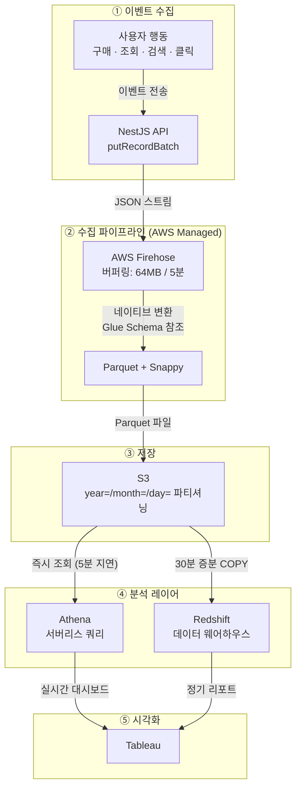

## 목차
1. [배경: 1~2일 걸리는 데이터 분석](#배경-1-2일-걸리는-데이터-분석)
2. [문제 분석: 수동 데이터 수집의 한계](#문제-분석-수동-데이터-수집의-한계)
3. [해결 목표: 30분~1시간 이내 데이터 제공](#해결-목표-30분-1시간-이내-데이터-제공)
4. [아키텍처 설계: AWS 관리형 서비스 선택 이유](#아키텍처-설계-aws-관리형-서비스-선택-이유)
5. [핵심 구현 1: Firehose로 실시간 수집](#핵심-구현-1-firehose로-실시간-수집)
6. [핵심 구현 2: Parquet 변환으로 비용 70% 절감](#핵심-구현-2-parquet-변환으로-비용-70-절감)
7. [핵심 구현 3: Athena와 Redshift로 분석 자동화](#핵심-구현-3-athena와-redshift로-분석-자동화)
8. [결과: 데이터 리드타임 1~2일→30분](#결과-데이터-리드타임-1-2일-30분)

---

## 배경: 1~2일 걸리는 데이터 분석

"지난 주 프로모션 배너의 클릭률을 분석하고 싶어요."

마케팅팀의 요청입니다. 하지만 데이터를 전달받기까지 평균 1~2일이 걸렸습니다. 그 사이 캠페인은 이미 끝나있고, 다음 기획은 과거 데이터 없이 진행될 수밖에 없었습니다.

**기존 프로세스:**
```
1. 데이터 담당자가 어드민에서 직접 다운로드 또는 개발팀에 데이터 요청
2. 개발팀이 DB 직접 조회 후 전달
3. 데이터 담당자가 전처리 (중복 제거, 포맷 변환)
4. 데이터 웨어하우스에 수동 적재
5. 1~2일 후 분석 가능
```

개발자는 반복적인 데이터 추출 작업에 시간을 빼앗기고, 데이터 담당자는 적시에 데이터를 확보하지 못하는 상황이었습니다.

---

## 문제 분석: 수동 데이터 수집의 한계

### 수동 프로세스의 문제점

**1. 데이터 리드타임 (1~2일)**
```
- 요청 접수: 수 시간 (업무 시간대 차이)
- DB 조회: 1시간 (쿼리 작성 + 실행)
- 데이터 전처리: 1시간 (중복 제거, 포맷 변환)
- 적재: 1시간
- 합계: 최소 반나절 → 보통 1~2일
```

**2. 개발자 리소스 낭비**
- 주당 5~10건의 데이터 추출 요청
- 개발자 1명이 주 10시간 소비
- 월 40시간 = 1주일치 생산성 손실

**3. 데이터 정합성 이슈**
```python
# 수동 전처리 과정에서 실수 가능
df = df.drop_duplicates()  # 어떤 컬럼 기준?
df['date'] = pd.to_datetime(df['date'])  # 포맷 일관성?
df.to_csv('output.csv', encoding='utf-8')  # 인코딩 이슈?
```

**4. 히스토리 추적 불가**
- 어제의 데이터와 오늘의 데이터가 다르면 원인 파악이 어렵습니다.
- 누가, 언제, 어떤 로직으로 전처리했는지 기록이 남지 않습니다.

---

## 해결 목표: 당일 데이터 제공

### 정량적 목표
- **데이터 리드타임**: 1~2일 → 당일 데이터 리드 가능
- **처리 용량**: 월 평균 3,000만 건, 피크 5,000만 건

### 정성적 목표
- 개발자 개입 없이 자동화
- Tableau 대시보드 자동 업데이트
- 데이터 유실률 0%

---

## 아키텍처 설계: AWS 관리형 서비스 선택 이유

### 직접 구축 vs AWS 관리형

| 기준 | Kafka + Spark | AWS Firehose |
|------|--------------|--------------|
| 초기 구축 시간 | 2주 | 1일 |
| 운영 부담 | 높음 (클러스터 관리) | 없음 (완전 관리형) |
| 비용 | 높음 (EC2 상시 운영) | 종량제 |
| 확장성 | 수동 스케일링 | 자동 무한 확장 |
| 학습 곡선 | 높음 | 낮음 |

**AWS 관리형 선택 이유:**
- 트래픽이 적을 때는 비용 거의 0원
- 서버 관리 불필요
- 5,000만 건/월 피크에도 문제없이 처리

### 전체 아키텍처



### 수집 이벤트 예시

```typescript
// 구매
POST /events/purchase
{ eventId, userId, productId, amount, timestamp }

// 상품상세 조회
POST /events/view
{ eventId, userId, productId, timestamp }

// 장바구니 담기
POST /events/cart
{ eventId, userId, productId, timestamp }

// 검색
POST /events/search
{ eventId, userId, keyword, timestamp }

// 배너 클릭/노출
POST /events/banner
{ eventId, userId, bannerId, type: 'click' | 'view', timestamp }

// 페이지 이동
POST /events/pageview
{ eventId, userId, page, referrer, timestamp }

// 회원가입
POST /events/signup
{ eventId, userId, channel, timestamp }

// 로그인
POST /events/login
{ eventId, userId, timestamp }
```

---

## 핵심 구현 1: Firehose로 실시간 수집

### Firehose 설정

**CloudFormation 템플릿:**
```yaml
EventsFirehose:
  Type: AWS::KinesisFirehose::DeliveryStream
  Properties:
    DeliveryStreamName: user-events-stream
    ExtendedS3DestinationConfiguration:
      BucketARN: !GetAtt EventsBucket.Arn
      Prefix: events/year=!{timestamp:yyyy}/month=!{timestamp:MM}/day=!{timestamp:dd}/
      ErrorOutputPrefix: errors/
      BufferingHints:
        SizeInMBs: 64          # Parquet 네이티브 변환 시 최소 64MB 권장
        IntervalInSeconds: 300  # 5분마다 저장
      # Parquet 네이티브 변환은 "핵심 구현 2"에서 상세 설명
      DataFormatConversionConfiguration:
        Enabled: true
```

**버퍼링 설정 선택 이유:**
- 64MB 또는 5분 중 먼저 도달하는 조건으로 동작합니다.
- Parquet 네이티브 변환 시 AWS 권장 최소 버퍼 크기가 64MB
- 버퍼가 클수록 하나의 Parquet 파일에 더 많은 레코드가 담겨 Athena 쿼리 효율 향상
- 트래픽이 적으면 5분 대기 (비용 절감)

### API 통합

**NestJS 이벤트 전송:**
```typescript
@Injectable()
export class EventService {
  constructor(
    private readonly firehose: AWS.Firehose
  ) {}

  async trackEvent(event: UserEvent) {
    // Firehose에 전송
    await this.firehose.putRecord({
      DeliveryStreamName: 'user-events-stream',
      Record: {
        Data: JSON.stringify({
          event_id: event.eventId,   // dedup 기준 키
          ...event,
          timestamp: Date.now(),
          server_timestamp: new Date().toISOString()
        }) + '\n'  // 줄바꿈 필수 (Athena 파싱)
      }
    }).promise();
  }
}
```

**배치 전송 최적화:**
```typescript
// 개별 전송 (느림)
for (const event of events) {
  await firehose.putRecord({ ... });  // 10ms × 100건 = 1초
}

// 배치 전송 (빠름)
await firehose.putRecordBatch({
  DeliveryStreamName: 'user-events-stream',
  Records: events.map(e => ({
    Data: JSON.stringify(e) + '\n'
  }))
});  // 100ms × 1번 = 100ms
```

---

## 핵심 구현 2: Parquet 변환으로 비용 70% 절감

### JSON vs Parquet

| 포맷 | 크기 (100만 건) | Athena 스캔 비용 | 쿼리 속도 |
|------|----------------|-----------------|----------|
| JSON (GZIP) | 1GB | $5/TB × 1GB = $0.005 | 10초 |
| Parquet | 300MB | $5/TB × 0.3GB = $0.0015 | 2초 |
| **절감** | **70%** | **70%** | **5배** |

### Firehose 네이티브 Parquet 변환

Parquet의 장점은 컬럼 스토리지로 **대량의 레코드를 하나의 파일에 담았을 때** 나타납니다. Lambda Transform에서 레코드를 개별 Parquet 파일로 변환하면 오히려 JSON보다 파일이 커지고, Athena에서 Small File Problem이 발생합니다.

이를 해결하기 위해 **Firehose의 네이티브 Record Format Conversion** 기능을 활용했습니다. Firehose가 버퍼링한 배치 데이터를 Glue Data Catalog의 스키마 정의를 참조하여 Parquet으로 자동 변환합니다. Lambda Transform 없이도 Firehose 레벨에서 효율적인 Parquet 파일이 생성됩니다.

**Glue Data Catalog 테이블 정의:**
```sql
-- Glue Data Catalog에 스키마 등록
CREATE EXTERNAL TABLE events_schema (
  event_id STRING,
  user_id BIGINT,
  event_type STRING,
  product_id BIGINT,
  amount DOUBLE,
  `timestamp` TIMESTAMP,
  server_timestamp TIMESTAMP
)
STORED AS PARQUET
LOCATION 's3://my-events-bucket/events/'
TBLPROPERTIES ('parquet.compression'='SNAPPY');
```

**CloudFormation — Firehose Record Format Conversion 설정:**
```yaml
EventsFirehose:
  Type: AWS::KinesisFirehose::DeliveryStream
  Properties:
    DeliveryStreamName: user-events-stream
    ExtendedS3DestinationConfiguration:
      BucketARN: !GetAtt EventsBucket.Arn
      Prefix: events/year=!{timestamp:yyyy}/month=!{timestamp:MM}/day=!{timestamp:dd}/
      ErrorOutputPrefix: errors/
      BufferingHints:
        SizeInMBs: 64        # Parquet 변환 시 최소 64MB 권장
        IntervalInSeconds: 300
      # Parquet 네이티브 변환 설정
      DataFormatConversionConfiguration:
        Enabled: true
        InputFormatConfiguration:
          Deserializer:
            OpenXJsonSerDe: {}    # JSON 입력 파싱
        OutputFormatConfiguration:
          Serializer:
            ParquetSerDe:
              Compression: SNAPPY  # 빠른 압축 + 적절한 압축률
        SchemaConfiguration:
          DatabaseName: !Ref GlueDatabase
          TableName: !Ref GlueTable
          RoleARN: !GetAtt FirehoseRole.Arn
```

**네이티브 변환의 장점:**
- Firehose가 버퍼링한 데이터를 **한 파일로 묶어** Parquet 변환 → Small File Problem 방지
- Lambda Transform 비용 제거 (Lambda 실행 비용, 메모리 비용 불필요)
- Glue Data Catalog 기반 스키마 관리로 스키마 변경이 중앙화

**압축 알고리즘 비교:**
```
- None: 500MB (빠름, 비쌈)
- GZIP: 300MB (느림, 저렴)
- Snappy: 350MB (빠름, 중간) ✅ 선택
```

### 스키마 진화(Schema Evolution) 전략

이벤트 타입이 추가되거나 필드가 변경되는 것은 데이터 파이프라인에서 가장 빈번하게 발생하는 변경 사항입니다.

**하위 호환성 원칙:**
- 새 필드는 **nullable로만 추가** (기존 레코드에 영향 없음)
- 필드 삭제/타입 변경은 금지 → 새 필드를 추가하고 기존 필드는 deprecated 처리
- 이벤트 타입(`event_type`)은 문자열이므로 새 타입 추가 시 스키마 변경 불필요

**변경 프로세스:**
1. Glue Data Catalog 스키마에 새 컬럼 추가
2. Athena 테이블에 `ALTER TABLE ADD COLUMNS` 실행
3. Redshift 테이블에 `ALTER TABLE ADD COLUMN` 실행
4. Firehose는 스키마 변경을 자동으로 반영 (재시작 불필요)

Parquet의 self-describing 특성 덕분에, 새 필드가 추가된 파일과 기존 파일이 공존해도 Athena가 정상적으로 쿼리할 수 있습니다. 기존 파일에서 새 필드는 NULL로 반환됩니다.

---

## 핵심 구현 3: Athena와 Redshift로 분석 자동화

### Athena 테이블 생성

**Athena 쿼리 (즉시 조회):**
```sql
-- 일별 구매 금액
SELECT
  DATE(from_unixtime(timestamp / 1000)) as date,
  COUNT(*) as purchase_count,
  SUM(amount) as total_amount
FROM events
WHERE event_type = 'purchase'
  AND year = '2024' AND month = '05'
GROUP BY DATE(from_unixtime(timestamp / 1000))
ORDER BY date DESC;
```

**실행 시간:**
```
Before (JSON):
- 스캔 데이터: 10GB
- 실행 시간: 50초
- 비용: $0.05

After (Parquet):
- 스캔 데이터: 2GB
- 실행 시간: 10초 (5배 향상)
- 비용: $0.01 (80% 절감)
```

### Redshift 적재 (배치)

**30분 간격 배치:**
```sql
-- COPY 명령어로 S3 → Redshift
COPY analytics.events
FROM 's3://my-events-bucket/events/year=2026/month=01/day=08/'
IAM_ROLE 'arn:aws:iam::123456789:role/RedshiftS3Role'
FORMAT AS PARQUET;
```

**테이블 구조:**
```sql
CREATE TABLE analytics.events (
  event_id VARCHAR(64),
  user_id BIGINT,
  event_type VARCHAR(50),
  product_id BIGINT,
  amount DECIMAL(10,2),
  timestamp TIMESTAMP,
  server_timestamp TIMESTAMP
)
DISTKEY(user_id)
SORTKEY(timestamp);
```

S3의 Hive 스타일 파티셔닝(`year=/month=/day=`)은 Athena에서 자동으로 파티션으로 인식되며, Redshift에는 30분 간격 증분 COPY를 실행합니다. 증분 범위는 `server_timestamp` 워터마크를 기준으로 관리합니다.

### Tableau 연동 및 최신 데이터 적재

**Redshift 커넥터:**
- 증분 적재 방식 사용 (비용 절감)

---

## 결과: 데이터 리드타임 1~2일→30분

### 리드타임 단축

| 단계 | Before            | After |
|------|-------------------|-------|
| 데이터 수집 | 어드민 다운로드 / 개발팀 요청 | 자동 (Firehose) |
| 전처리 | 수동 (1시간)          | 자동 (Firehose 네이티브 변환) |
| 적재 | 수동 (1시간)          | 자동 (S3) |
| **리드타임** | **1~2일**          | **30분** |

기존에는 데이터 담당자가 어드민에서 직접 다운로드하거나 개발팀에 데이터를 요청한 뒤, 전처리를 거쳐 수동으로 적재해야 했습니다. 파이프라인 구축 후 이 과정이 완전히 자동화되었습니다.

### 데이터 품질 검증

```
- 데이터 유실: 측정 기간 6개월간 0건
- 검증 방법: API 전송 건수(CloudWatch PutRecord 메트릭) vs S3 적재 건수(Athena COUNT) 일일 비교
- 에러 핸들링: Firehose가 변환 실패 레코드를 errors/ 프리픽스에 자동 분리 저장
- 중복 처리: Firehose at-least-once 특성상 소수 중복 가능 → `event_id` 기준 dedup 뷰/집계로 정산 반영
```

Firehose의 자동 재시도 메커니즘과 ErrorOutputPrefix 설정으로, 변환에 실패한 레코드도 별도 경로에 보관되어 원인 분석과 재처리가 가능합니다.

### 비즈니스 임팩트

| 항목 | 변화 |
|------|------|
| **마케팅팀 데이터 요청** | 주 5~10건 → 직접 Tableau 조회 (요청 자체가 불필요) |
| **캠페인 의사결정 속도** | 캠페인 종료 후 1~2일 → 당일 오후 성과 확인 가능 |
| **개발자 시간 절약** | 월 40시간 (데이터 추출 작업 제거) |
| **데이터 활용 범위** | 월간 리포트 → 일일 대시보드 + 실시간 모니터링 |

특히 마케팅팀이 **캠페인 진행 중에 실시간으로 성과를 확인**하고 타겟팅을 조정할 수 있게 되면서, 데이터 기반 의사결정의 속도가 근본적으로 달라졌습니다.

### 비용

| 항목 | 내용 |
|------|------|
| **추가 인프라 비용** | 월 약 10만원 |
| **스토리지 절감** | Parquet 적용으로 70% 절감 |

### 처리 성능

```
- 월 평균 처리량: 3,000만 건
- 월 피크 처리량: 5,000만 건
- 일 평균: 100만 건
```

---

## 배운 점

**1. AWS 관리형 서비스의 위력**
- Firehose + Lambda + S3로 완전 자동화를 달성했습니다.
- 서버 관리 불필요, 종량제 과금으로 비용을 최소화했습니다.
- 비용 검증 필수

**2. Parquet는 필수**
- 스토리지 비용 70% 절감
- Athena 쿼리 속도 5배 향상
- 압축은 Snappy (빠르고 적절한 압축률, Recommend)

**3. 분석 레이어 이원화**
- Athena: 실시간 조회
- Redshift: 배치 적재 (30분 지연)
- 용도에 따라 적절한 도구를 선택하는 것이 중요합니다.

**4. 데이터 파티셔닝**
```
s3://bucket/events/year=2024/month=05/day=08/
```
- 날짜별 파티션으로 쿼리 성능을 향상시켰습니다.
- 불필요한 데이터 스캔을 방지하여 비용도 절감됩니다.

**5. 히스토리 추적**
- S3 버전 관리로 데이터 복구가 가능합니다.

---

## 기술 스택

| 분류 | 기술 |
|------|------|
| **이벤트 수집** | AWS Data Firehose (서버리스) |
| **데이터 변환** | Firehose 네이티브 변환 (Glue Data Catalog) |
| **스토리지** | S3 (Parquet + Snappy) |
| **쿼리 엔진** | Athena (서버리스) |
| **데이터 웨어하우스** | Redshift (서버리스) |
| **시각화** | Tableau |
