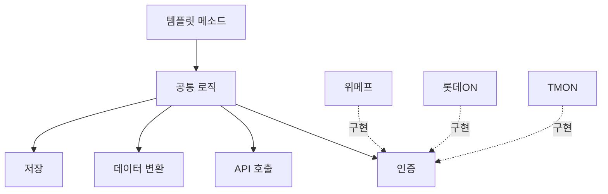

## 개요
템플릿 메소드 패턴을 활용하여 다중 커머스 주문 수집 배치 시스템을 구축하고 성능을 10배 개선했습니다.

## 문제 상황
**다중 커머스 연동:**
- 위메프, 롯데ON, TMON 등
- 각 커머스별 API 형식 상이
- 응답 형식, 인증 방식, 데이터 구조 모두 다름

**기존 시스템:**
- 주문 10,000건 수집: 30분 소요
- 커머스별 코드 중복
- 유지보수 어려움

## 주요 성과
- 처리 시간: 30분 → 3분 (10배 향상)
- 코드 중복: 70% 감소
- 신규 커머스 추가: 2주 → 2일

## 아키텍처

## 주요 기능
**템플릿 메소드 패턴:**
- 공통 로직 분리
- 커머스별 특화 로직 인터페이스화
- 신규 커머스 추가 용이

**Jenkins 기반 재처리:**
- LocalDateTime 매개변수
- 실패 작업 재실행
- 재시도 + 알림

## 기술 스택
- Java 11, Spring Boot 2, Jenkins

## 배운 점
- 디자인 패턴 실전 적용
- 배치 성능 최적화
- 유지보수성 개선
