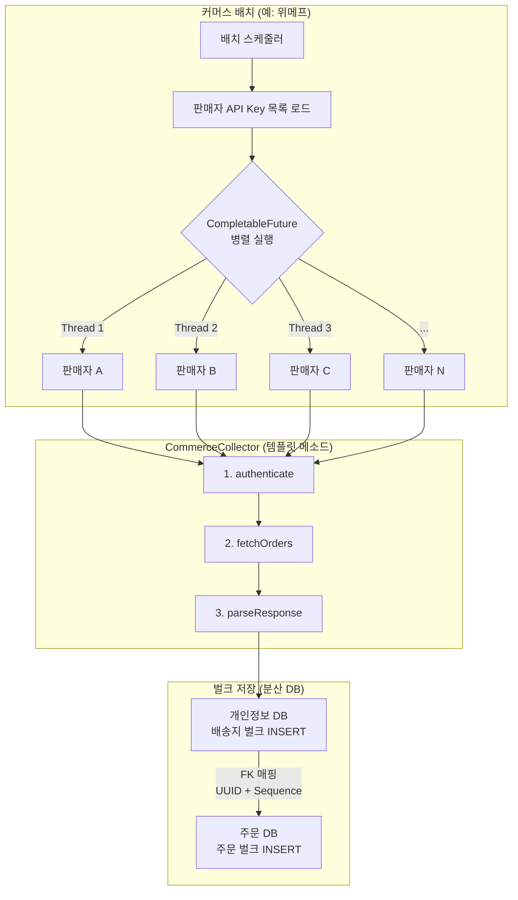

## 목차
1. [배경: 여러 커머스의 주문을 한 곳에](#배경-여러-커머스의-주문을-한-곳에)
2. [문제 분석: 순차 처리의 한계](#문제-분석-순차-처리의-한계)
3. [해결 목표: 처리 시간 10배 단축](#해결-목표-처리-시간-10배-단축)
4. [아키텍처 설계: 템플릿 메소드 패턴 선택 이유](#아키텍처-설계-템플릿-메소드-패턴-선택-이유)
5. [핵심 구현 1: 템플릿 메소드 패턴으로 코드 중복 제거](#핵심-구현-1-템플릿-메소드-패턴으로-코드-중복-제거)
6. [핵심 구현 2: CompletableFuture로 판매자별 병렬 처리](#핵심-구현-2-completablefuture로-판매자별-병렬-처리)
7. [핵심 구현 3: 벌크 처리로 DB 라운드트립 최적화](#핵심-구현-3-벌크-처리로-db-라운드트립-최적화)
8. [핵심 구현 4: Jenkins 기반 재수집 시스템](#핵심-구현-4-jenkins-기반-재수집-시스템)
9. [결과: 처리 시간 30분→3분, 신규 커머스 추가 2주→2일](#결과-처리-시간-30분-3분-신규-커머스-추가-2주-2일)

---

## 배경: 여러 커머스의 주문을 한 곳에

우리 플랫폼은 여러 외부 커머스의 주문을 통합 관리합니다. 위메프, 롯데ON, TMON 등 5개 커머스에서 발생한 주문을 매시간 수집하여 우리 DB에 저장하고, 통합 대시보드로 제공합니다.

각 커머스 배치는 **여러 판매자의 API Key**를 통해 주문 데이터를 수집합니다. 하나의 커머스에 수십 개의 판매자가 등록되어 있으며, 판매자마다 개별 API Key로 인증하여 주문을 조회합니다.

**비즈니스 요구사항:**
- 각 커머스의 주문 데이터를 1시간마다 수집
- 통합 대시보드에서 실시간 현황 파악
- 정산 데이터 집계 (커머스별 수수료 계산)

하지만 판매자별로 순차 처리하다 보니 배치 하나에 30분이 걸렸고, 신규 커머스를 추가하려면 2주 이상 소요되었습니다.

---

## 문제 분석: 순차 처리의 한계

### 기존 시스템의 문제

**1. 판매자별 순차 처리로 인한 지연**

하나의 커머스 배치 내에서 판매자(API Key)별로 순차 처리하는 구조였습니다.

```
[위메프 배치]
판매자 A 수집 (3분) → 판매자 B 수집 (2분) → 판매자 C 수집 (4분) → ...
→ 전체 판매자 순차 처리 합계: 30분
```

외부 API 응답 속도가 느린 데다 판매자 수가 많아, 순차 처리 시 시간이 크게 누적되었습니다.

**2. 코드 중복 (70% 수준)**

각 커머스별로 거의 동일한 로직을 중복 구현했습니다. **각 커머스 수집 클래스가 1,000줄 이상**의 코드를 포함하고 있었습니다.

```java
// 위메프 배치
public void collectWemepOrders() {
  for (String apiKey : wemepApiKeys) {
    // 1. 인증
    String token = authenticateWemep(apiKey);
    // 2. API 호출
    String response = callWemepAPI(token);
    // 3. 파싱
    List<Order> orders = parseWemepResponse(response);
    // 4. 저장
    saveOrders(orders);
  }
}

// 롯데ON 배치 (거의 동일한 구조)
public void collectLotteOrders() {
  for (String apiKey : lotteApiKeys) {
    String token = authenticateLotte(apiKey);
    String response = callLotteAPI(token);
    List<Order> orders = parseLotteResponse(response);
    saveOrders(orders);
  }
}

// TMON, 쿠팡, 11번가... 계속 반복
```

**3. 신규 커머스 추가 시간 (2주)**

기존 배치 구조가 통일되어 있지 않아, 새로운 커머스를 추가하려면 처음부터 전체 로직을 구현해야 했습니다.

1. API 문서 분석 (2일)
2. 인증 로직 구현 (1일)
3. 파싱 로직 구현 (3일)
4. 테스트 및 버그 수정 (5일)
5. 배포 (1일)

**합계: 2주**

**4. 비효율적인 DB I/O**

주문 데이터는 **분산 DB 구조**로 저장됩니다. 개인정보 DB에 배송지 데이터를, 주문 DB에 주문 정보를 각각 저장하며, 두 테이블 간 FK 매핑이 필요합니다.

```
주문 10,000건 처리 시:
1. 개인정보 DB - 배송지 저장: 10,000번
2. 주문 DB - 주문 정보 저장: 10,000번
→ 총 20,000번의 DB I/O
```

이로 인해 DB 커넥션 풀이 고갈되고 전체 배치 처리 시간이 크게 증가했습니다.

**5. 에러 전파**

한 판매자에서 에러가 발생하면 해당 커머스 배치 전체가 중단되었습니다.
```
판매자 A 성공 → 판매자 B 실패
→ 판매자 C, D, E 수집 안 됨
```

---

## 해결 목표: 처리 시간 10배 단축

### 정량적 목표
- **처리 시간**: 30분 → 3분 (10배 단축)
- **코드 중복**: 70% → 10% 이하
- **신규 커머스 추가**: 2주 → 2일 (7배 단축)
- **DB 저장 단계**: 주문당 2회 개별 저장 → 3단계 벌크 처리

### 정성적 목표
- 판매자별 병렬 처리로 처리 시간 최소화
- 템플릿 메소드 패턴으로 코드 재사용성 극대화
- 판매자별 독립적 에러 처리 (장애 격리)
- Jenkins 기반 재수집 시스템 (특정 기간 재처리)

---

## 아키텍처 설계: 템플릿 메소드 패턴 선택 이유

### 디자인 패턴 비교

| 패턴 | 장점 | 단점 | 적합성 |
|------|-----|------|--------|
| **Strategy** | 런타임 교체 가능 | 보일러플레이트 많음 | 낮음 |
| **Factory** | 객체 생성 유연 | 플로우 재사용 안 됨 | 낮음 |
| **Template Method** | 플로우 재사용 | 상속 필요 | **높음** |

**템플릿 메소드 선택 이유:**
- 모든 커머스가 동일한 플로우 (인증 → 조회 → 파싱 → 저장)
- 각 단계별 구현만 다름 (인증 방식, 파싱 로직)
- 상위 클래스에서 플로우 정의 → 하위 클래스는 구현만 담당

### 전체 아키텍처



---

## 핵심 구현 1: 템플릿 메소드 패턴으로 코드 중복 제거

### 추상 클래스 정의

배치의 단계를 명확히 나누고, 커머스별로 상이한 부분만 추상화하여 개별 구현하도록 했습니다.

**CommerceCollector (추상 클래스):**
```java
public abstract class CommerceCollector {

  // 템플릿 메소드 (플로우 정의)
  public final void collect() {
    // 1. 판매자 목록 로드
    List<String> apiKeys = getApiKeys();

    // 2. 판매자별 병렬 수집
    List<Order> allOrders = collectFromSellers(apiKeys);

    // 3. 벌크 저장 (공통 로직)
    saveOrdersBulk(allOrders);

    log.info("{} collected {} orders from {} sellers",
      getName(), allOrders.size(), apiKeys.size());
  }

  // 하위 클래스에서 구현해야 하는 추상 메서드
  protected abstract String authenticate(String apiKey);
  protected abstract String fetchOrders(String token);
  protected abstract List<Order> parseResponse(String response);

  // 공통 로직 (하위 클래스에서 재사용)
  protected abstract List<String> getApiKeys();
  public abstract String getName();
}
```

### 구체적 구현 (위메프)

**WemepCollector:**
```java
@Component
public class WemepCollector extends CommerceCollector {

  @Override
  protected String authenticate(String apiKey) {
    // OAuth 인증
    return restTemplate.postForObject(
      "https://api.wemep.com/oauth/token",
      new OAuth2Request(apiKey, clientSecret),
      TokenResponse.class
    ).getAccessToken();
  }

  @Override
  protected String fetchOrders(String token) {
    HttpHeaders headers = new HttpHeaders();
    headers.setBearerAuth(token);

    return restTemplate.exchange(
      "https://api.wemep.com/orders",
      HttpMethod.GET,
      new HttpEntity<>(headers),
      String.class
    ).getBody();
  }

  @Override
  protected List<Order> parseResponse(String response) {
    // JSON 파싱
    WemepOrderResponse res = objectMapper.readValue(
      response, WemepOrderResponse.class);

    return res.getOrders().stream()
      .map(this::transformToEntity)
      .collect(Collectors.toList());
  }

  @Override
  protected List<String> getApiKeys() {
    return sellerRepository.findApiKeysByCommerce("WEMEP");
  }

  @Override
  public String getName() {
    return "WEMEP";
  }
}
```

### 다른 커머스 구현 (롯데ON)

**LotteCollector:**
```java
@Component
public class LotteCollector extends CommerceCollector {

  @Override
  protected String authenticate(String apiKey) {
    // API Key 인증 (OAuth와 다름)
    return apiKey;
  }

  @Override
  protected String fetchOrders(String apiKey) {
    // XML 응답 (JSON과 다름)
    HttpHeaders headers = new HttpHeaders();
    headers.set("X-API-KEY", apiKey);

    return restTemplate.exchange(
      "https://api.lotteon.com/orders.xml",
      HttpMethod.GET,
      new HttpEntity<>(headers),
      String.class
    ).getBody();
  }

  @Override
  protected List<Order> parseResponse(String response) {
    // XML 파싱 (JSON과 다름)
    Document doc = DocumentBuilderFactory.newInstance()
      .newDocumentBuilder()
      .parse(new InputSource(new StringReader(response)));

    NodeList orderNodes = doc.getElementsByTagName("order");
    List<Order> orders = new ArrayList<>();

    for (int i = 0; i < orderNodes.getLength(); i++) {
      Element orderEl = (Element) orderNodes.item(i);
      orders.add(transformToEntity(orderEl));
    }

    return orders;
  }

  @Override
  protected List<String> getApiKeys() {
    return sellerRepository.findApiKeysByCommerce("LOTTE");
  }

  @Override
  public String getName() {
    return "LOTTE";
  }
}
```

### 코드 재사용 효과

```
Before:
- WemepCollector: 200줄
- LotteCollector: 180줄
- TmonCollector: 190줄
- 합계: 570줄

After:
- CommerceCollector (추상): 50줄
- WemepCollector: 60줄
- LotteCollector: 50줄
- TmonCollector: 55줄
- 합계: 215줄 (62% 감소)
```

---

## 핵심 구현 2: CompletableFuture로 판매자별 병렬 처리

### 순차 처리 vs 병렬 처리

기존에는 각 판매자(API Key)별로 순차적으로 데이터를 가져와서 적재하는 방식이었습니다.

**Before (판매자별 순차):**
```java
public List<Order> collectFromSellers(List<String> apiKeys) {
  List<Order> allOrders = new ArrayList<>();

  for (String apiKey : apiKeys) {
    String token = authenticate(apiKey);      // 인증
    String response = fetchOrders(token);     // API 호출 (느림)
    List<Order> orders = parseResponse(response);
    allOrders.addAll(orders);
  }
  // 판매자 20개 × 평균 1.5분 = 30분

  return allOrders;
}
```

**After (판매자별 병렬):**

스레드 풀은 Spring의 `TaskExecutor` 빈으로 관리합니다. 매 실행마다 스레드 풀을 생성/소멸하는 대신 Spring 컨테이너가 라이프사이클을 관리하도록 했습니다.

```java
@Configuration
public class BatchConfig {
  @Bean("commerceTaskExecutor")
  public TaskExecutor commerceTaskExecutor() {
    ThreadPoolTaskExecutor executor = new ThreadPoolTaskExecutor();
    executor.setCorePoolSize(10);
    executor.setMaxPoolSize(10);
    executor.setThreadNamePrefix("commerce-");
    executor.initialize();
    return executor;
  }
}
```

```java
@Autowired
@Qualifier("commerceTaskExecutor")
private TaskExecutor taskExecutor;

public List<Order> collectFromSellers(List<String> apiKeys) {
  List<CompletableFuture<List<Order>>> futures = apiKeys.stream()
    .map(apiKey -> CompletableFuture.supplyAsync(
      () -> {
        try {
          String token = authenticate(apiKey);
          String response = fetchOrders(token);
          return parseResponse(response);
        } catch (Exception e) {
          log.error("Failed: {} - {}", getName(), apiKey, e);
          return Collections.<Order>emptyList();
        }
      },
      taskExecutor
    ))
    .collect(Collectors.toList());

  // 모든 판매자 수집 완료 대기
  List<Order> allOrders = futures.stream()
    .map(CompletableFuture::join)
    .flatMap(Collection::stream)
    .collect(Collectors.toList());

  // 판매자 20개 병렬 → 가장 느린 판매자 기준 약 2분
  return allOrders;
}
```

### ThreadPool 크기 선택

| 스레드 수 | 장점 | 단점 | 선택 |
|----------|-----|------|------|
| 5개 | CPU 효율 | 판매자 수 대비 적음 | - |
| **10개** | **판매자 수 대비 적절** | **적당한 오버헤드** | **선택** |
| 20개 | 최대 병렬성 | 메모리/컨텍스트 스위칭 | - |

**10개 선택 이유:**
- 커머스당 판매자 수가 10~20개 수준
- 외부 API I/O 대기가 대부분이므로 CPU 바운드 아님
- 향후 판매자 증가에도 충분한 여유

### 에러 복구 전략

판매자별 병렬 처리에서 실패 시 `emptyList()`를 반환하여 다른 판매자에 영향을 주지 않지만, 실패한 판매자의 주문이 유실될 수 있습니다. 이를 방지하기 위해 **실패 기록 → 재시도 → 최종 알림** 전략을 적용했습니다.

```java
public List<Order> collectFromSellers(List<String> apiKeys) {
  List<CompletableFuture<CollectResult>> futures = apiKeys.stream()
    .map(apiKey -> CompletableFuture.supplyAsync(
      () -> {
        try {
          String token = authenticate(apiKey);
          String response = fetchOrders(token);
          return CollectResult.success(apiKey, parseResponse(response));
        } catch (Exception e) {
          log.error("Failed: {} - {}", getName(), apiKey, e);
          return CollectResult.failure(apiKey, e);
        }
      },
      taskExecutor
    ))
    .collect(Collectors.toList());

  List<CollectResult> results = futures.stream()
    .map(CompletableFuture::join)
    .collect(Collectors.toList());

  // 실패한 판매자를 재시도 테이블에 기록
  List<CollectResult> failures = results.stream()
    .filter(CollectResult::isFailed)
    .collect(Collectors.toList());

  if (!failures.isEmpty()) {
    retryRepository.saveAll(failures.stream()
      .map(f -> new RetryRecord(getName(), f.getApiKey(), LocalDateTime.now()))
      .collect(Collectors.toList()));
  }

  return results.stream()
    .filter(CollectResult::isSuccess)
    .flatMap(r -> r.getOrders().stream())
    .collect(Collectors.toList());
}
```

배치는 5분 주기로 실행되며, 다음 배치에서 재시도 테이블을 확인하여 실패한 판매자의 주문을 우선 수집합니다. UPSERT 멱등성 덕분에 재시도 시에도 데이터 중복이 발생하지 않습니다. 3회 연속 실패 시 Slack 알림을 발송하여 운영팀이 개입할 수 있도록 했습니다.

---

## 핵심 구현 3: 벌크 처리로 DB 라운드트립 최적화

### 분산 DB 구조

주문 데이터는 개인정보 보호를 위해 분산 DB 구조로 저장됩니다.

```
개인정보 DB: 배송지 데이터 (주소, 수령인 등)
주문 DB: 주문 정보 (상품, 금액, 상태 등)
```

주문을 저장하려면 먼저 개인정보 DB에 배송지를 저장하고, 채번된 배송지 ID(FK)를 주문 DB의 주문 데이터에 매핑해야 합니다.

### 문제: 주문 10,000건 = DB 라운드트립 20,000번

기존 방식은 주문 하나를 처리할 때마다 2번의 DB I/O가 발생했습니다.

```java
// 기존 방식 (주문 하나씩 처리)
for (Order order : orders) {
  // 1. 개인정보 DB - 배송지 저장
  Address address = personalInfoDb.save(order.getAddress());

  // 2. 주문 DB - 주문 정보 저장 (배송지 FK 매핑)
  order.setAddressId(address.getId());
  orderDb.save(order);
}

// 주문 10,000건 → DB 라운드트립 20,000번
```

### 해결: 3단계 벌크 저장으로 DB 호출 구간 최소화

```java
public void saveOrdersBulk(List<Order> orders) {
  String batchUuid = UUID.randomUUID().toString();

  // 1. 개인정보 DB - 배송지 벌크 저장 (1번의 DB I/O)
  List<Address> addresses = orders.stream()
    .map(Order::getAddress)
    .collect(Collectors.toList());

  for (int i = 0; i < addresses.size(); i++) {
    addresses.get(i).setBatchUuid(batchUuid);
    addresses.get(i).setSequence(i);
  }
  personalInfoDb.saveAll(addresses);

  // 2. 개인정보 DB - 저장된 배송지 조회 (1번의 DB I/O)
  List<Address> savedAddresses = personalInfoDb
    .findByBatchUuidOrderBySequence(batchUuid);

  // 3. 주문 DB - FK 매핑 후 벌크 저장 (1번의 DB I/O)
  for (int i = 0; i < orders.size(); i++) {
    orders.get(i).setAddressId(savedAddresses.get(i).getId());
  }
  orderDb.saveAll(orders);
}

// 주문 10,000건 처리도 "저장 로직 기준 3단계"로 단순화
```

> 참고: ORM/JDBC 배치 설정(batch size)에 따라 실제 SQL 실행 횟수는 달라질 수 있으므로, 본 문서의 "3"은 물리 패킷 수가 아니라 **저장 로직 단계 수**를 의미합니다.

### 동시성 문제와 해결

**문제 발생:**

여러 커머스 배치가 동시에 실행되므로, 개인정보 DB에 동시에 배송지를 삽입합니다. 기존에는 마지막으로 삽입된 ID 기준으로 데이터를 1씩 증가시켜 매핑했지만, 동시성 이슈가 발생했습니다.

```java
// 문제가 있는 코드
// 1. 배송지 20개 벌크 저장
personalInfoDb.saveAll(addresses);

// 2. 마지막 ID 조회
Long lastId = personalInfoDb.findMaxId(); // 520

// 3. ID 범위 계산 (동시성 문제!)
// 500번부터 520번까지가 이번 배치라고 가정
List<Long> ids = IntStream.rangeClosed(lastId - 20, lastId)
  .boxed()
  .collect(Collectors.toList());
```

**문제 상황:**
```
위메프 배치: 배송지 20개 저장 → 마지막 ID: 520
롯데ON 배치: 동시에 배송지 15개 저장 → 마지막 ID: 535
위메프 배치: 마지막 ID 조회 → 535를 가져옴
위메프 배치: 515~535를 자신의 배송지로 착각 (잘못된 매핑)
```

**해결: UUID + Sequence**

```java
// 배치 작업별 UUID 생성
String batchUuid = UUID.randomUUID().toString();

// 1. UUID와 Sequence를 함께 저장
for (int i = 0; i < addresses.size(); i++) {
  addresses.get(i).setBatchUuid(batchUuid);
  addresses.get(i).setSequence(i); // 순서 보장
}
personalInfoDb.saveAll(addresses);

// 2. UUID로 조회 (동시성 안전)
List<Address> savedAddresses = personalInfoDb
  .findByBatchUuidOrderBySequence(batchUuid);
```

**Sequence가 필요한 이유:**

벌크 INSERT 시 삽입 순서와 조회 순서가 일치한다는 보장이 없습니다.

```sql
INSERT INTO addresses VALUES (...), (...), (...);
-- 저장 순서: 1, 2, 3 (예상)
-- 실제 순서: 2, 1, 3 (가능)
```

Sequence를 함께 저장하면 정확한 순서로 조회할 수 있습니다.

```sql
SELECT * FROM addresses
WHERE batch_uuid = '...'
ORDER BY sequence ASC;
```

---

## 핵심 구현 4: Jenkins 기반 재수집 시스템

### Jenkins 파라미터화 배치

특정 기간, 특정 커머스의 주문을 재수집할 수 있는 시스템을 구축했습니다.

**Jenkinsfile:**
```groovy
pipeline {
  agent any

  parameters {
    string(
      name: 'START_DATE',
      defaultValue: '2024-05-01',
      description: '수집 시작 날짜 (yyyy-MM-dd)'
    )
    string(
      name: 'END_DATE',
      defaultValue: '2024-05-08',
      description: '수집 종료 날짜 (yyyy-MM-dd)'
    )
    choice(
      name: 'COMMERCE',
      choices: ['ALL', 'WEMEP', 'LOTTE', 'TMON', 'COUPANG', '11ST'],
      description: '재수집할 커머스 선택'
    )
  }

  stages {
    stage('Re-collect Orders') {
      steps {
        sh """
          java -jar batch.jar \
            --job=reCollectOrders \
            --startDate=${params.START_DATE} \
            --endDate=${params.END_DATE} \
            --commerce=${params.COMMERCE}
        """
      }
    }
  }

  post {
    failure {
      slackSend(
        channel: '#batch-alerts',
        color: 'danger',
        message: "재수집 실패: ${params.COMMERCE} (${params.START_DATE} ~ ${params.END_DATE})"
      )
    }
  }
}
```

### 재수집 로직 (중복 방지)

**UPSERT 쿼리:**
```sql
INSERT INTO orders (
  order_id, commerce, amount, status, created_at, updated_at
)
VALUES (?, ?, ?, ?, ?, NOW())
ON DUPLICATE KEY UPDATE
  amount = VALUES(amount),
  status = VALUES(status),
  updated_at = NOW();
```

- Primary Key: `(order_id, commerce)`
- 같은 주문이 들어오면 UPDATE, 새로운 주문이면 INSERT
- 재수집 시에도 데이터 중복이 발생하지 않습니다.

### Slack 알림 연동

```java
@Component
public class SlackNotifier {

  public void notifyBatchFailure(String commerce, Exception e) {
    String message = String.format(
      ":x: *배치 실패*\n" +
      "커머스: %s\n" +
      "에러: %s\n" +
      "시간: %s\n" +
      "<https://jenkins.example.com|재실행>",
      commerce,
      e.getMessage(),
      LocalDateTime.now()
    );

    slackClient.postMessage("#batch-alerts", message);
  }
}
```

---

## 결과: 처리 시간 30분→3분, 신규 커머스 추가 2주→2일

### 성능 개선

| 지표 | Before | After | 개선률 |
|------|--------|-------|--------|
| **처리 시간** | 30분 | 3분 | **10배 단축** |
| **코드 중복** | 70% | 10% | **7배 감소** |
| **신규 커머스 추가** | 2주 | 2일 | **7배 단축** |
| **DB 저장 방식** | 주문당 개별 저장(2회) | 3단계 벌크 처리 | **호출 구간 대폭 단순화** |

### 개선 경로

처리 시간 단축은 두 단계에 걸쳐 이루어졌습니다.

```
1단계 - 판매자별 병렬 처리 (CompletableFuture):
  30분 → 가장 느린 판매자 기준으로 단축

2단계 - 벌크 DB 처리:
  개별 DB I/O 중심 저장 → 3단계 벌크 저장으로 전환
  DB 커넥션 대기 시간 대폭 단축

최종: 30분 → 3분 (10배)
```

### 확장성

**신규 커머스 추가 시간:**
```
Before: 2주
1. API 문서 분석 (2일)
2. 전체 로직 구현 (5일)
3. 테스트 (5일)
4. 배포 (1일)

After: 2일
1. API 문서 분석 (1일)
2. 3개 메서드만 구현 (4시간)
   - authenticate()
   - parseResponse()
   - transformToEntity()
3. 테스트 (4시간)
```

### 장애 격리

**Before:**
```
판매자 B 실패 → 해당 커머스 배치 전체 중단
나머지 판매자 수집 안 됨
```

**After:**
```
판매자 B 실패 → 해당 판매자만 건너뜀
나머지 판매자는 정상 수집
```

---

## 배운 점

**1. 디자인 패턴은 실용적으로**
- 템플릿 메소드 패턴이 완벽히 맞는 상황이었습니다.
- 배치 플로우의 통일감과 유지보수성을 동시에 달성했습니다.
- 신규 개발자도 추상 메서드만 구현하면 되어 학습 비용이 낮습니다.

**2. CompletableFuture는 I/O 바운드 병렬 처리에 최적**
- 외부 API 호출이 대부분인 작업은 병렬화 효과가 큽니다.
- 판매자별 독립 실행으로 장애 격리도 자연스럽게 달성됩니다.

**3. 분산 DB 간 FK 매핑은 UUID로**
- Auto Increment ID 기반 매핑은 동시성 환경에서 위험합니다.
- UUID + Sequence 조합으로 정확한 매핑과 순서 보장을 달성했습니다.

**4. Jenkins + Slack 조합**
- 실패 시 즉시 알림이 오고, Jenkins에서 클릭 한 번으로 재실행할 수 있습니다.
- UPSERT로 멱등성을 보장하여 재수집 시에도 데이터 정합성이 유지됩니다.

**5. 벌크 처리는 배치의 핵심**
- 개별 INSERT 대비 DB 트랜잭션 횟수를 대폭 감소시킵니다.
- 분산 DB 환경에서는 FK 매핑 전략이 특히 중요합니다.

---

## 기술 스택

| 분류 | 기술 |
|------|------|
| **언어** | Java |
| **프레임워크** | Spring Boot |
| **비동기 처리** | CompletableFuture |
| **디자인 패턴** | Template Method Pattern |
| **데이터베이스** | MySQL (분산 DB: 개인정보 DB + 주문 DB) |
| **CI/CD** | Jenkins (파라미터화 배치) |
| **알림** | Slack Webhook |
