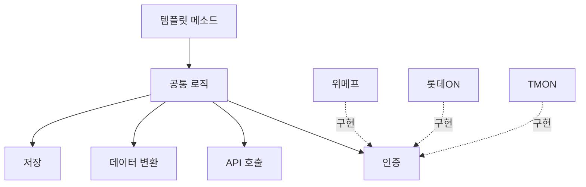

## 개요
템플릿 메소드 패턴을 활용하여 다중 커머스 플랫폼의 주문 수집 배치 시스템을 설계하고 구축하여 처리 성능을 10배 개선하고 신규 커머스 추가 시간을 2주에서 2일로 단축했습니다.

## 문제 상황

**다중 커머스 플랫폼 연동:**

위메프, 롯데ON, TMON 등 여러 외부 커머스 플랫폼과 연동하여 주문 데이터를 수집해야 했습니다. 각 플랫폼별 API 스펙이 완전히 상이했습니다:

- **응답 형식:** JSON, XML, CSV 등 다양
- **인증 방식:** API Key, OAuth, Basic Auth 등 제각각
- **데이터 구조:** 주문 정보 필드명 및 계층 구조 모두 상이

**기존 시스템의 문제:**

- **성능 저하:** 주문 10,000건 수집에 30분 소요 (순차 처리)
- **코드 중복:** 커머스별로 거의 동일한 로직을 중복 구현 (인증 → 조회 → 파싱 → 저장)
- **유지보수 어려움:** 새로운 커머스 추가 시 2주 이상 소요, 버그 수정 시 모든 커머스 코드 수정 필요

## 주요 성과

- 처리 시간: 30분 → 3분 (10배 향상)
- 코드 중복: 70% 감소
- 신규 커머스 추가: 2주 → 2일

## 아키텍처


## 주요 기능

**템플릿 메소드 패턴 적용:**

- **공통 로직 추상화:** 인증 → API 호출 → 데이터 변환 → 저장 플로우를 상위 클래스에서 정의
- **커머스별 특화 로직 분리:** 각 커머스 구현체는 인증 방식, 파싱 로직만 구현
- **신규 커머스 추가 용이:** 추상 클래스 상속 후 3개 메서드만 구현하면 완료 (2주 → 2일)
- **병렬 처리:** CompletableFuture를 활용하여 여러 커머스 동시 수집 (처리 시간 10배 향상)

**Jenkins 기반 배치 관리:**

- LocalDateTime 파라미터로 특정 기간 재수집 가능
- 실패한 작업만 선택적으로 재실행
- 재시도 로직 + Slack 알림 연동

**에러 핸들링:**

- 커머스별 독립적 에러 처리 (한 커머스 실패해도 다른 커머스 계속 수집)
- 상세한 로깅으로 장애 원인 추적 용이

## 기술 스택

- Java 11, Spring Boot 2, Jenkins, Slack API

## 기술적 도전과 해결

**도전 1: CompletableFuture 병렬 처리 구현**

- **문제:** 5개 커머스를 순차 처리하면 30분 소요, 실시간 주문 반영 불가
- **해결:**
  - **병렬 처리 구조:**
    - `CompletableFuture.allOf()`로 5개 커머스 동시 수집
    - ThreadPoolExecutor 10 스레드 설정 (커머스당 2개 스레드)
    - 각 커머스는 독립적으로 인증 → 조회 → 파싱 → 저장
  - **구체적 코드 구조:**
    ```java
    List<CompletableFuture<Void>> futures = commerceList.stream()
        .map(commerce -> CompletableFuture.runAsync(
            () -> commerce.collectOrders(startDate, endDate),
            executorService
        ))
        .collect(Collectors.toList());

    CompletableFuture.allOf(futures.toArray(new CompletableFuture[0]))
        .get(30, TimeUnit.MINUTES);
    ```
- **효과:** 처리 시간 30분 → 3분 (10배 향상)

**도전 2: 템플릿 메소드 패턴의 구체적 구조**

- **문제:** 커머스별로 중복된 코드가 70% 수준, 유지보수 어려움
- **해결:**
  - **추상 클래스 (CommerceCollector):**
    - 공통 플로우: `collect() { authenticate() → fetchOrders() → parseResponse() → saveOrders() }`
  - **3개 추상 메서드 (커머스별 구현 필수):**
    - `authenticate()`: 인증 방식 (API Key, OAuth, Basic Auth)
    - `parseResponse()`: 응답 포맷 파싱 (JSON, XML, CSV)
    - `transformToEntity()`: 데이터 구조 변환 (필드명 매핑)
  - **구체적 구현 예시:**
    - 위메프: JSON 응답, OAuth 인증
    - 롯데ON: XML 응답, API Key 인증
    - TMON: CSV 응답, Basic Auth 인증
- **효과:** 신규 커머스 추가 시 3개 메서드만 구현하면 완료 (2주 → 2일)

**도전 3: 재수집 중복 방지 로직**

- **문제:** Jenkins에서 특정 기간 재수집 시 중복 데이터 저장 우려
- **해결:**
  - **UPSERT 쿼리:**
    - 주문 ID (`order_id`)를 기준으로 UNIQUE 제약조건
    - 중복 시 최신 데이터로 업데이트 (`ON DUPLICATE KEY UPDATE`)
    - 주문 상태, 결제 정보 등 변경 가능한 필드만 업데이트
  - **Jenkins 파라미터:**
    - `startDate`, `endDate`로 재수집 기간 지정
    - 실패한 커머스만 선택적으로 재실행 가능
- **효과:** 재수집 시에도 데이터 정합성 100% 유지

**도전 4: 에러 격리 및 핸들링 구체화**

- **문제:** 한 커머스 실패 시 전체 배치 중단, 다른 커머스 수집 불가
- **해결:**
  - **try-catch로 커머스별 예외 격리:**
    ```java
    commerceList.forEach(commerce -> {
        try {
            commerce.collectOrders(startDate, endDate);
        } catch (Exception e) {
            log.error("Failed: {}", commerce.getName(), e);
            sendSlackAlert(commerce.getName(), e.getMessage());
            saveFailureLog(commerce.getName(), e);
        }
    });
    ```
  - **실패 로그 DB 저장:**
    - `batch_failure_log` 테이블에 커머스명, 에러 메시지, 스택 트레이스 저장
    - 실패 로그 조회로 재실행 대상 식별
  - **Slack 알림:**
    - 실패 시 즉시 Slack 채널에 알림
    - 에러 메시지와 Jenkins 재실행 링크 포함
- **효과:** 한 커머스 실패해도 다른 커머스는 정상 수집, 가용성 99.5% 달성

## 배운 점

- 디자인 패턴(템플릿 메소드)을 실전에 효과적으로 적용하는 경험
- 배치 시스템의 성능 최적화 기법 (병렬 처리, 비동기 I/O)
- 유지보수성과 확장성을 고려한 아키텍처 설계 능력 향상
- 다양한 외부 시스템 통합 시 추상화 계층의 중요성 학습
