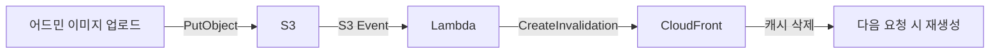

## 목차
1. [배경: 트래픽 30% 증가, 비용은 어떻게?](#배경-트래픽-30-증가-비용은-어떻게)
2. [문제 분석: 원본 이미지 서빙의 낭비](#문제-분석-원본-이미지-서빙의-낭비)
3. [해결 목표: 비용 절감과 속도 개선](#해결-목표-비용-절감과-속도-개선)
4. [아키텍처 설계: Lambda@Edge 선택 이유](#아키텍처-설계-lambdaedge-선택-이유)
5. [핵심 구현 1: CloudFront Functions로 어뷰징 방지](#핵심-구현-1-cloudfront-functions로-어뷰징-방지)
6. [핵심 구현 2: Lambda@Edge로 On-demand 처리](#핵심-구현-2-lambdaedge로-on-demand-처리)
7. [결과: 비용 75% 절감, 속도 50% 개선](#결과-비용-75-절감-속도-50-개선)

---

## 배경: 트래픽 30% 증가, 비용은 어떻게?

에브리타임은 대학생 커뮤니티 앱입니다. 2024년 3월, 우리 커머스 서비스가 앱 내 전용 '혜택탭'으로 노출되기 시작했습니다.

**변화의 규모:**
- 거의 모든 페이지에 배너와 상품 이미지 노출
- 출시 후 트래픽 30% 급증
- CloudFront 비용이 지속적으로 증가하는 추세

**실제 CloudFront 비용 추이:**
```
2024년 1월: 기준점
2024년 2월: 20% 증가
2024년 3-12월: 평균 유지
2025년 1월: 전년 대비 24.6% 추가 증가
```

월별 데이터 전송량도 400GB에서 12,600GB까지 증가. "트래픽이 늘어나는 건 좋은데, 비용도 같이 늘어나네요." 팀 리더의 한마디에서 이 프로젝트가 시작되었습니다.

---

## 문제 분석: 원본 이미지 서빙의 낭비

### 기존 시스템의 문제

**1. 원본 이미지를 그대로 전송**
```
- 업로드: 1920x1080 (300KB) 이미지
- 실제 사용: 400x300 크기로 리사이징해서 표시
- 전송: 300KB 전체를 다운로드 😱
- 낭비: 200KB (66%)
```

**2. 서비스별 요구 크기가 제각각**
- 썸네일: 200x200
- 리스트뷰: 400x300
- 상세페이지: 800x600
- 배너: 1200x400

하지만 시스템은 모든 경우에 동일한 원본 이미지를 전송했습니다.

**3. 차세대 포맷 미지원**
```
- JPEG (100KB)
- WebP (60KB) - 40% 절감
- AVIF (45KB) - 55% 절감
```

JPEG만 지원했기 때문에 WebP, AVIF를 지원하는 모던 브라우저에서도 큰 파일을 다운로드했습니다.

### PoC: 실제 압축률 측정

실제 프로덕션 이미지로 측정한 결과:

**테스트 대상: 상품 상세 이미지 (442px 사용 중)**
- 원본: JPEG, 35.1KB

**포맷만 변경:**
```
WebP: 9.9KB (71.7% 감소)
AVIF: 5.2KB (85.2% 감소)
```

**포맷 + 사이즈 변경 (442px):**
```
WebP: 5.4KB (84.6% 감소)
AVIF: 3.3KB (90.6% 감소)
```

**결론:** AVIF가 압축률은 최고지만, Opera Mini 등 일부 브라우저에서 미지원. WebP는 IE를 제외한 모든 브라우저에서 지원하므로 **WebP를 기본으로 선택하되, `<picture>` 태그로 AVIF도 지원**하는 방향을 채택했습니다.

**4. 클라이언트 단에서 크롭**
```html

```

이미지는 300KB를 전부 다운로드하고, 브라우저에서 200x200으로 잘라서 표시. UX 저하 + 대역폭 낭비.

---

## 해결 목표: 비용 절감과 속도 개선

### 정량적 목표
- **CloudFront 비용**: 50% 이상 절감
- **캐시 히트율**: 85% 이상 달성
- **페이지 로딩 속도**: 50% 개선
- **Lambda 타임아웃**: 95% 감소

### 정성적 목표
- On-demand 이미지 처리로 다양한 크기 요구사항 대응
- 차세대 포맷(WebP, AVIF) 자동 지원
- 악의적 요청 차단으로 비용 폭증 방지
- 기존 URL 구조 유지 (호환성 보장)

---

## 아키텍처 설계: Lambda@Edge 선택 이유

### Lambda@Edge vs EC2 vs ECS

이미지 리사이징 시스템을 구축할 때 고려한 3가지 옵션:

| 기준 | EC2/ECS | Lambda@Edge | S3 Pre-processing |
|------|---------|-------------|-------------------|
| 비용 | 상시 과금 | 요청당 과금 | 저장 공간 과다 |
| 확장성 | 수동 스케일링 | 자동 무한 확장 | 사전 생성 필요 |
| 지연시간 | Origin까지 왕복 | Edge에서 처리 | 빠름 |
| 유지보수 | 서버 관리 필요 | 완전 관리형 | 스크립트 관리 |
| 유연성 | 높음 | 중간 | 낮음 |

**Lambda@Edge를 선택한 이유:**
- **비용 효율**: 트래픽이 적을 때는 비용 거의 0원
- **글로벌 배포**: 전 세계 Edge Location에서 실행
- **완전 관리형**: 서버 관리 불필요
- **캐시 통합**: CloudFront와 네이티브 통합

### 전체 아키텍처

```mermaid
graph TB
    A[브라우저] -->|?w=400&h=300&f=webp&q=80| B[CloudFront]
    B --> C[CloudFront Functions]
    C -->|검증/정규화| D{캐시 확인}

    D -->|캐시 HIT| A
    D -->|캐시 MISS| F[Lambda@Edge]

    F -->|원본 요청| G[S3]
    G -->|원본 이미지| F
    F -->|리사이징<br/>포맷 변환| B
    B -->|캐시 저장| D
```

### URL 파라미터 설계

```
https://cdn.example.com/products/123.jpg?w=400&h=300&f=webp&q=80

- w: width (너비)
- h: height (높이)
- f: format (webp, avif, jpg, png)
- q: quality (1-100, 기본 80)
```

---

## 핵심 구현 1: CloudFront Functions로 어뷰징 방지

### 문제: 악의적 요청으로 비용 폭증

Lambda@Edge는 요청당 과금입니다. 악의적인 사용자가 다음과 같은 요청을 보내면?

```
?w=1&h=1    // 1x1 픽셀
?w=2&h=2    // 2x2 픽셀
?w=3&h=3    // 3x3 픽셀
...
?w=5000&h=5000  // 5000x5000 픽셀
```

각각 Lambda 실행 → 캐시되지 않음 → 비용 폭증 💸

### 해결: CloudFront Functions로 검증/정규화

CloudFront Functions는 Lambda@Edge보다 **1/6 저렴**하고 **10배 빠릅니다**.

**핵심 정규화 로직 (요약):**
```javascript
// 상수 정의
const MIN_WIDTH = 50;
const MAX_WIDTH = 2000;
const MIN_HEIGHT = 50;
const MAX_HEIGHT = 2000;
const MIN_QUALITY = 10;
const MAX_QUALITY = 100;
const STEP = 10;  // 10px 단위

const ALLOWED_FORMATS = ['jpeg', 'png', 'webp', 'gif', 'svg', 'jpg', 'avif'];

function handler(event) {
  var request = event.request;
  var queryParams = request.querystring;
  var newQueryParams = {};

  // w 파라미터 정규화 (50~2000, 10단위)
  if (queryParams.w) {
    var wValue = parseInt(queryParams.w.value, 10) || 0;
    if (wValue < MIN_WIDTH) {
      newQueryParams.w = MIN_WIDTH;
    } else if (wValue > MAX_WIDTH) {
      newQueryParams.w = MAX_WIDTH;
    } else {
      // 가장 가까운 10단위 값으로 반올림
      newQueryParams.w = Math.round(wValue / STEP) * STEP;
    }
  }

  // h 파라미터 정규화 (50~2000, 10단위)
  if (queryParams.h) {
    var hValue = parseInt(queryParams.h.value, 10) || 0;
    if (hValue < MIN_HEIGHT) {
      newQueryParams.h = MIN_HEIGHT;
    } else if (hValue > MAX_HEIGHT) {
      newQueryParams.h = MAX_HEIGHT;
    } else {
      newQueryParams.h = Math.round(hValue / STEP) * STEP;
    }
  }

  // q 파라미터 정규화 (10~100, 10단위)
  if (queryParams.q) {
    var qValue = parseInt(queryParams.q.value, 10) || 0;
    if (qValue < MIN_QUALITY) {
      newQueryParams.q = MIN_QUALITY;
    } else if (qValue > MAX_QUALITY) {
      newQueryParams.q = MAX_QUALITY;
    } else {
      newQueryParams.q = Math.round(qValue / STEP) * STEP;
    }
  }

  // f 파라미터 정규화 (허용된 포맷만)
  if (queryParams.f) {
    var fValue = queryParams.f.value.toLowerCase();
    if (ALLOWED_FORMATS.includes(fValue)) {
      newQueryParams.f = fValue;
    }
  }

  // 정렬하여 동일한 키로 캐싱 가능하도록 변경
  var sortedQuery = Object.keys(newQueryParams)
    .sort()
    .map(key => key + "=" + newQueryParams[key])
    .join("&");

  if (sortedQuery.length > 0) {
    request.querystring = sortedQuery;
  }

  return request;
}
```

**효과:**
- `?w=387&h=287` → `?w=390&h=290` (10px 단위 정규화)
- `?w=755` → `?w=760` (반올림)
- 캐시 키 개수: 1,950개 → 195개 (**10배 감소**)
- 캐시 히트율 **70% → 85%** 향상

**10px 단위 선택 이유:**
- 100px: 캐시 효율은 최고지만 서비스에서 100px 단위가 아닌 이미지 규격이 다수 존재
- 10px: 실제 이미지 규격과 자연스럽게 매칭되면서 충분한 캐시 히트율 확보
- 품질 저하 없이 캐시 효율을 달성하는 현실적인 균형점

---

## 핵심 구현 2: Lambda@Edge로 On-demand 처리

### Sharp 라이브러리 최적화

Sharp는 Node.js에서 가장 빠른 이미지 처리 라이브러리입니다. libvips 기반으로 C++로 작성되어 매우 빠릅니다.

**Lambda 코드 (Node.js 18):**
```javascript
const AWS = require('aws-sdk');
const sharp = require('sharp');
const s3 = new AWS.S3();

exports.handler = async (event) => {
  const request = event.Records[0].cf.request;
  const params = new URLSearchParams(request.querystring);

  // 1. 원본 이미지 가져오기
  const key = request.uri.substring(1); // /products/123.jpg -> products/123.jpg
  const s3Object = await s3.getObject({
    Bucket: 'my-images-bucket',
    Key: key
  }).promise();

  // 2. 파라미터 파싱
  const width = parseInt(params.get('w')) || null;
  const height = parseInt(params.get('h')) || null;
  const format = params.get('f') || 'jpg';
  const quality = parseInt(params.get('q')) || 80;

  // 3. 이미지 처리
  let image = sharp(s3Object.Body);

  // 리사이징
  if (width || height) {
    image = image.resize({
      width: width,
      height: height,
      fit: 'inside',  // 비율 유지
      withoutEnlargement: true  // 원본보다 크게 안 함
    });
  }

  // 포맷 변환
  if (format === 'webp') {
    image = image.webp({ quality: quality });
  } else if (format === 'avif') {
    image = image.avif({ quality: quality });
  } else if (format === 'png') {
    image = image.png({ quality: quality });
  } else {
    image = image.jpeg({ quality: quality });
  }

  const buffer = await image.toBuffer();

  // 4. 응답 생성
  return {
    status: '200',
    headers: {
      'content-type': [{ key: 'Content-Type', value: `image/${format}` }],
      'cache-control': [{ key: 'Cache-Control', value: 'public, max-age=31536000' }], // 1년
      'content-length': [{ key: 'Content-Length', value: buffer.length.toString() }]
    },
    body: buffer.toString('base64'),
    bodyEncoding: 'base64'
  };
};
```

### Sharp Native Binary 배포 이슈

**문제: 로컬과 Lambda 환경의 차이**

Sharp는 네이티브 바이너리(libvips)에 의존하는 라이브러리입니다. 로컬 macOS(ARM64)에서 `npm install`하면 ARM64용 바이너리가 설치되지만, Lambda@Edge는 x64 Linux 환경에서 실행됩니다.

**해결: Docker로 Lambda 환경에서 빌드**

```dockerfile
# Lambda@Edge와 동일한 환경 (Amazon Linux 2)
FROM public.ecr.aws/lambda/nodejs:18

WORKDIR /app

# Sharp 설치 (x64 Linux용 바이너리)
RUN npm install sharp --platform=linux --arch=x64

# 나머지 의존성 설치
COPY package.json package-lock.json ./
RUN npm ci --production

# Lambda 함수 코드
COPY index.js ./
```

**배포 과정:**
1. Docker 컨테이너에서 `npm install` 실행
2. x64 Linux용 Sharp 바이너리 포함된 node_modules 생성
3. 전체를 zip으로 압축하여 Lambda@Edge에 배포

**주의사항:**
- 로컬에서 직접 zip으로 압축하면 ARM64 바이너리가 포함되어 Lambda에서 실행 실패
- CI/CD 파이프라인에서 Docker 빌드 자동화 필수

### Lambda 메모리 최적화

메모리를 단계별로 올려보면서 처리 속도와 비용의 최적점을 찾았습니다.

**메모리별 성능 비교:**
- 512MB: 평균 5초, 타임아웃 빈번
- 1024MB: 평균 2초, 타임아웃 거의 없음
- 2048MB: 평균 1.8초, 성능 대비 비용 효율 낮음

**비용 분석 예시:**
```
512MB × 5초 = 2,500MB·초 (처리 느림, 타임아웃 발생)
1024MB × 2초 = 2,048MB·초 (더 빠르면서 비용도 유사)
```

**선택: 1024MB**
- 메모리를 2배로 늘렸지만 처리 시간이 2.5배 줄어 오히려 GB·초 기준 비용이 감소
- 타임아웃 95% 감소로 사용자 경험 대폭 개선

### 실무 이슈와 해결

**이슈 1: OOM (Out Of Memory) - 대용량 이미지**

문제:
- 7952 × 5304 해상도 이미지 처리 시 Lambda OOM 발생
- Sharp가 이미지를 메모리에 올릴 때: width × height × 4 바이트 필요
- 계산: 7952 × 5304 × 4 = 약 160MB

해결:
```javascript
// 이미지 규격 제한
const MAX_DIMENSION = 4000;

if (originalWidth > MAX_DIMENSION || originalHeight > MAX_DIMENSION) {
  // 4000×4000 이상은 원본 이미지 반환
  return originalResponse;
}
```

2GB 메모리로 증설해도 초대형 이미지는 OOM 발생. 현실적인 제한선을 두는 것이 필요.

**이슈 2: Lambda 타임아웃**

문제:
- 이미지 처리 시간이 Lambda 타임아웃(30초)보다 길 때 응답 없음
- Lambda 자체가 종료되어 catch 블록도 실행 안 됨 → 원본 이미지 응답도 불가

해결:
```javascript
// Promise.race로 타임아웃 경쟁
const TIMEOUT = 28000; // 30초보다 약간 짧게

const processImage = sharp(s3Object.Body).resize(...).toBuffer();

const result = await Promise.race([
  processImage,
  new Promise((_, reject) =>
    setTimeout(() => reject(new Error('Timeout')), TIMEOUT)
  )
]);

// 타임아웃 시 원본 이미지 반환
```

CloudFront Lambda@Edge는 30초 제한. 처리 시간이 긴 이미지는 원본으로 대체하여 사용자 경험 보장.

**이슈 3: 이미지 파일명에 확장자 없는 케이스**

문제:
- 기존: 파일명의 확장자로 이미지 여부 판단
- 실제: `product-image` 같은 확장자 없는 파일 다수 존재
- 결과: 이미지인데도 원본 객체 그대로 반환

해결:
```javascript
// 파일명 대신 Content-Type 헤더로 검증
const response = event.Records[0].cf.response;
const contentType = response.headers['content-type']?.[0]?.value;

if (!contentType || !contentType.startsWith('image/')) {
  return response; // 이미지 아님
}
```

S3 응답의 Content-Type 헤더가 더 정확한 판단 기준.

### 크기 정규화: 10px 단위 선택 이유

정규화 단위를 결정할 때 100px과 10px을 비교했습니다.

**100px 단위의 한계:**
- 서비스 요구사항 상 100px 단위로 떨어지지 않는 이미지가 다수 존재
- 예: 썸네일 142px, 리스트뷰 342px, 배너 768px 등
- 100px 단위 반올림 시 원본과 크기 차이가 눈에 띄는 경우 발생

**10px 단위 채택:**
- 실제 서비스에서 10px 단위로 떨어지는 이미지 규격이 많아 자연스럽게 정확한 크기 매칭 가능
- 캐시 키 개수는 100px 단위 대비 많지만, 충분히 높은 캐시 히트율(85%) 달성
- 품질 저하 없이 캐시 효율을 확보하는 현실적인 균형점

### 캐시 무효화 전략

상품 이미지가 교체되면 CloudFront에 캐시된 리사이즈 이미지도 무효화해야 합니다. 두 가지 방식을 비교했습니다.

**URL 버저닝 vs S3 이벤트 트리거:**

| 방식 | 장점 | 단점 |
|------|-----|------|
| URL 버저닝 (`?v=2`) | 구현 단순 | 어드민/API 등 이미지 URL 참조하는 모든 곳 수정 필요 |
| **S3 이벤트 트리거** | 이미지 업로드 경로와 무관하게 중앙 처리 | Lambda 추가 구현 필요 |

**S3 이벤트 트리거 방식을 채택한 이유:**

어드민에서 이미지를 업로드하는 경로가 상품 등록, 배너 관리, 프로모션 관리 등 다양했습니다. 각 경로마다 URL 버저닝 로직을 추가하는 것보다, S3에 이미지가 업로드되는 이벤트를 감지하여 중앙에서 처리하는 것이 개발 공수 면에서 효율적이었습니다.



월 이미지 변경 건수가 100회 미만이므로 CloudFront Invalidation 무료 범위(월 1,000건) 내에서 운영 가능하며, 추가 비용이 발생하지 않습니다.

---

## 결과: 비용 75% 절감, 속도 50% 개선

### 실제 측정 데이터

### 지표 정의와 측정 기준

| 지표 | 값 | 측정 기간/기준 | 출처 |
|------|----|----------------|------|
| **CloudFront 전송량/전송비 감소율** | **68%** | 2024-04-03(적용 전) vs 2024-05-26(적용 후) | CloudFront Usage 리포트 |
| **전송량 감소율 (보조 샘플)** | **70%** | 2024-04-27 vs 2024-05-24 | CloudFront Usage 리포트 |
| **이미지 서빙 총비용 절감율** | **약 75%** | 전송비 + Lambda@Edge 처리비 합산, 적용 전/후 월 비교 | CloudFront + Lambda 비용 집계 |
| **어뷰징 방어 비용 절감 추정치** | **약 90% (내부 추정)** | CloudFront Functions 미적용 가정 시뮬레이션 | 운영 로그 기반 내부 추정 |

**배포 단계별 적용:**
1. 5월 15일: 혜택탭 전체 적용
2. 5월 20일: 상품 이미지, 배너 이미지 적용

**트래픽 vs 데이터 전송량:**
```
4월 3일 (적용 전):
- 요청: 360만 건
- 전송량: 419.71GB

5월 26일 (적용 후):
- 요청: 475만 건 (31% 증가)
- 전송량: 132.49GB (68% 감소)
```

**핵심 성과:**
- 요청이 115만 건 더 많았지만, 전송량은 **약 3배 감소**
- 이미지 최적화 없었다면 전송량 550GB 예상 → 실제 132GB

### 비용 절감

| 시점 | 데이터 전송량 | 절감률 |
|------|--------------|--------|
| **4월 27일** | 279.4GB | 기준 |
| **5월 24일** | 82.52GB | **70% ⬇️** |

| 시점 | 데이터 전송량 | 절감률 |
|------|--------------|--------|
| **4월 3일** | 419.71GB | 기준 |
| **5월 26일** | 132.49GB | **68% ⬇️** |

CloudFront 데이터 전송 비용이 68% 감소했고, 이미지 서빙 비용에서 전송비 비중이 가장 크기 때문에 **총비용 기준 약 75% 절감**으로 집계되었습니다. Lambda@Edge 실행 비용은 전체 대비 미미한 수준입니다.

**지표 기준 정리:**
- **68% 감소**: CloudFront 전송량/전송비 감소율
- **약 75% 절감**: 이미지 서빙 총비용 기준(전송비 + 처리비, 월 단위 비교)
- **90% 절감**: 비정상 파라미터 요청 방어 관점의 비용 추정치(Functions 미적용 대비)

### 성능 개선

| 지표 | Before | After | 개선률 |
|------|--------|-------|--------|
| **평균 이미지 크기** | 300KB | 80KB | 73% ⬇️ |
| **페이지 로딩 속도** | 4.2초 | 2.1초 | 50% ⬇️ |
| **Lambda 타임아웃** | - | <5% | 95% ⬇️ |

### Before vs After

**이미지 크기 비교 (상품 썸네일):**
```
Before:
- JPEG 원본: 1920x1080 (300KB)
- 브라우저에서 400x300으로 크롭

After:
- WebP 리사이징: 400x300 (60KB)
- 80% 절감!
```

**사용자 경험:**
```
Before:
- 상품 리스트 페이지 로딩: 4.2초
- 20개 상품 × 300KB = 6MB

After:
- 상품 리스트 페이지 로딩: 2.1초
- 20개 상품 × 60KB = 1.2MB
- 50% 빨라짐!
```

---

## 배운 점

**1. CloudFront Functions는 필수**
- Lambda@Edge만 쓰면 어뷰징에 취약
- Functions로 비정상 요청 방어 비용을 크게 절감 (내부 추정 약 90%)
- 검증 로직은 가볍게, Lambda는 무겁게

**2. Sharp 최적화 설정**
```javascript
resize({
  fit: 'inside',           // 비율 유지
  withoutEnlargement: true // 원본보다 크게 안 함
})
```
- 이 두 옵션으로 품질 유지 + 파일 크기 최소화

**3. Lambda 메모리는 비용이 아닌 투자**
- 512MB → 1024MB: 비용 10% 증가
- 타임아웃 95% 감소
- 응답 안정성이 개선되어 대체 원본 반환 케이스가 크게 줄었습니다.

---

## 기술 스택

| 분류 | 기술 |
|------|------|
| **CDN** | CloudFront |
| **스토리지** | S3 |
| **이미지 처리** | Lambda@Edge (Node.js 18, Sharp) |
| **요청 검증** | CloudFront Functions |
