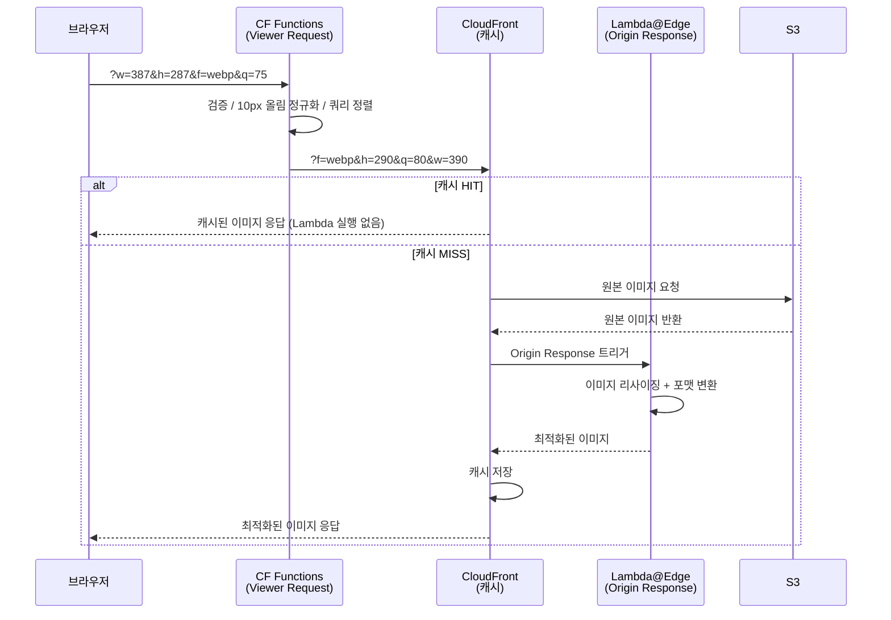
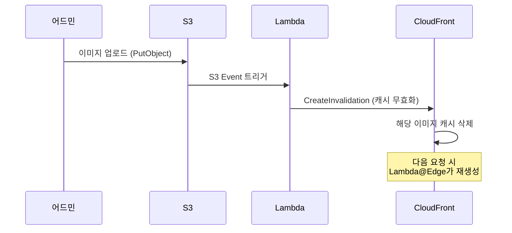
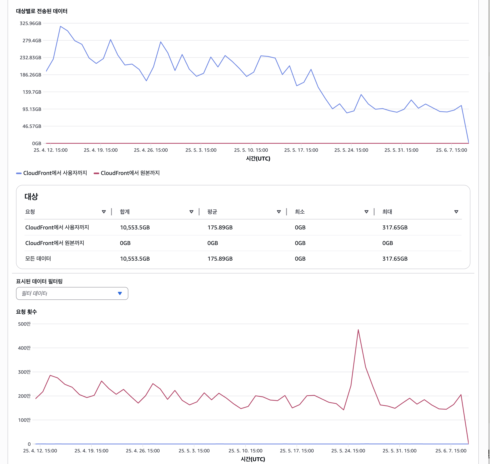

## 목차
1. [배경: 트래픽 30% 증가, 비용은 어떻게?](#배경-트래픽-30-증가-비용은-어떻게)
2. [문제 분석: 원본 이미지 서빙의 낭비](#문제-분석-원본-이미지-서빙의-낭비)
3. [해결 목표: 비용 절감과 속도 개선](#해결-목표-비용-절감과-속도-개선)
4. [아키텍처 설계: Lambda@Edge 선택 이유](#아키텍처-설계-lambdaedge-선택-이유)
5. [핵심 구현 1: CloudFront Functions로 어뷰징 방지](#핵심-구현-1-cloudfront-functions로-어뷰징-방지)
6. [핵심 구현 2: Lambda@Edge로 On-demand 처리](#핵심-구현-2-lambdaedge로-on-demand-처리)
7. [핵심 구현 3: 캐시 무효화 전략](#핵심-구현-3-캐시-무효화-전략)
8. [결과: 비용 75% 절감, 속도 50% 개선](#결과-비용-75-절감-속도-50-개선)
9. [트러블슈팅](#트러블슈팅)

---

## 배경: 트래픽 30% 증가, 비용은 어떻게?

에브리타임은 대학생 커뮤니티 앱입니다. 2024년 3월, 우리 커머스 서비스가 앱 내 전용 '혜택탭'으로 노출되기 시작했습니다.


**변화의 규모:**
- 거의 모든 페이지에 배너와 상품 이미지 노출
- 출시 후 트래픽 30% 급증
- CloudFront 비용이 지속적으로 증가하는 추세

**실제 CloudFront 비용 추이:**
```
2024년 1월: 기준점
2024년 2월: 20% 증가
2024년 3-12월: 평균 유지
2025년 1월: 전년 대비 24.6% 추가 증가
```

월별 데이터 전송량도 400GB에서 12,600GB까지 증가.

---

## 문제 분석: 원본 이미지 서빙의 낭비

### 기존 시스템의 문제

**1. 원본 이미지를 그대로 전송**
```
- 업로드: 1920x1080 (300KB) 이미지
- 실제 사용: 400x300 크기로 리사이징해서 표시
- 전송: 300KB 전체를 다운로드 😱
- 낭비: 200KB (66%)
```

**2. 서비스별 요구 크기가 제각각**
- 썸네일: 200x200
- 리스트뷰: 400x300
- 상세페이지: 800x600
- 배너: 1200x400

하지만 시스템은 모든 경우에 동일한 원본 이미지를 전송했습니다.

**3. 차세대 포맷 미지원**
```
- JPEG (100KB)
- WebP (60KB) - 40% 절감
- AVIF (45KB) - 55% 절감
```

JPEG만 지원했기 때문에 WebP, AVIF를 지원하는 모던 브라우저에서도 큰 파일을 다운로드했습니다.

### PoC: 실제 압축률 측정

실제 프로덕션 이미지로 측정한 결과:

**테스트 대상: 상품 상세 이미지 (442px 사용 중)**
- 원본: JPEG, 35.1KB

**포맷만 변경:**
```
WebP: 9.9KB (71.7% 감소)
AVIF: 5.2KB (85.2% 감소)
```

**포맷 + 사이즈 변경 (442px):**
```
WebP: 5.4KB (84.6% 감소)
AVIF: 3.3KB (90.6% 감소)
```

**결론:** AVIF가 압축률은 최고지만, Opera Mini 등 일부 브라우저에서 미지원. WebP는 IE를 제외한 모든 브라우저에서 지원하므로 **WebP를 기본으로 선택하되, `<picture>` 태그로 AVIF도 지원**하는 방향을 채택했습니다.

**4. 클라이언트 단에서 크롭**
```html

```

이미지는 300KB를 전부 다운로드하고, 브라우저에서 200x200으로 잘라서 표시. UX 저하 + 대역폭 낭비.

---

## 해결 목표: 비용 절감과 속도 개선

### 정량적 목표
- **CloudFront 비용**: 50% 이상 절감
- **페이지 로딩 속도**: 50% 개선
- **Lambda 타임아웃**: 85% 감소 (20% → 3%)

### 정성적 목표
- On-demand 이미지 처리로 다양한 크기 요구사항 대응
- 차세대 포맷(WebP, AVIF) 자동 지원
- 악의적 요청 차단으로 비용 폭증 방지
- 기존 URL 구조 유지 (호환성 보장)

---

## 아키텍처 설계: Lambda@Edge 선택 이유

### Lambda@Edge vs EC2 vs ECS

이미지 리사이징 시스템을 구축할 때 고려한 3가지 옵션:

| 기준 | EC2/ECS | Lambda@Edge | S3 Pre-processing |
|------|---------|-------------|-------------------|
| 비용 | 상시 과금 | 요청당 과금 | 저장 공간 과다 |
| 확장성 | 수동 스케일링 | 자동 무한 확장 | 사전 생성 필요 |
| 지연시간 | Origin까지 왕복 | Edge에서 처리 | 빠름 |
| 유지보수 | 서버 관리 필요 | 완전 관리형 | 스크립트 관리 |
| 유연성 | 높음 | 중간 | 낮음 |

**Lambda@Edge를 선택한 이유:**
- **비용 효율**: 트래픽이 적을 때는 비용 거의 0원
- **글로벌 배포**: 전 세계 Edge Location에서 실행
- **완전 관리형**: 서버 관리 불필요
- **캐시 통합**: CloudFront와 네이티브 통합

### 전체 아키텍처


### 요청 처리 흐름



### 이벤트 트리거 선택 이유

CloudFront는 4가지 이벤트 트리거를 제공합니다. 각 트리거의 실행 시점과 역할이 다르기 때문에, 비용과 기능 요구사항에 맞는 배치가 중요합니다.

| 트리거 | 실행 시점 | 실행 빈도 | 사용 가능 서비스 |
|--------|----------|----------|----------------|
| **Viewer Request** | 요청 수신 직후 (캐시 확인 전) | 모든 요청 | CF Functions, Lambda@Edge |
| Viewer Response | 응답 반환 직전 | 모든 요청 | CF Functions, Lambda@Edge |
| Origin Request | 캐시 MISS → Origin 전달 시 | 캐시 MISS만 | Lambda@Edge |
| **Origin Response** | Origin 응답 수신 후 (캐시 저장 전) | 캐시 MISS만 | Lambda@Edge |

### URL 파라미터 설계

```
https://cdn.example.com/products/123.jpg?w=400&h=300&f=webp&q=80

- w: width (너비)
- h: height (높이)
- f: format (webp, avif, jpg, png)
- q: quality (1-100, 기본 80)
```

---

## 핵심 구현 1: CloudFront Functions로 어뷰징 방지

### 문제: 악의적 요청으로 비용 폭증

Lambda@Edge는 요청당 과금입니다. 악의적인 사용자가 다음과 같은 요청을 보내면?

```
?w=1&h=1    // 1x1 픽셀
?w=2&h=2    // 2x2 픽셀
?w=3&h=3    // 3x3 픽셀
...
?w=5000&h=5000  // 5000x5000 픽셀
```

각각 Lambda 실행 → 캐시되지 않음 → 비용 폭증 💸

### 해결: CloudFront Functions로 검증/정규화

검증/정규화 로직은 Lambda@Edge에서도 구현할 수 있지만, **CloudFront Functions를 별도로 분리**했습니다.

| 기준 | CloudFront Functions | Lambda@Edge |
|------|---------------------|-------------|
| **사용 가능 트리거** | Viewer Request/Response | 4개 전부 (Viewer/Origin × Request/Response) |
| **실행 비용** | 요청 100만 건당 $0.10 | 요청 100만 건당 $0.60 |
| **실행 속도** | < 1ms | 5ms ~ 수 초 |
| **제한** | 네트워크/파일 I/O 불가, 최대 10KB | 제한 없음 |

Lambda@Edge도 Viewer Request에서 동일한 검증 로직을 실행할 수 있지만, 검증/정규화는 네트워크 I/O가 필요 없는 단순 연산이므로 CF Functions의 제한에 해당하지 않습니다. **모든 요청에서 실행**되는 Viewer Request 특성상, 비용이 1/6이고 속도가 10배 빠른 CF Functions가 적합합니다.

또한 정규화는 반드시 **캐시 확인 전**(Viewer Request)에 실행되어야 합니다. 만약 Origin Request에서 처리했다면, 정규화 전 쿼리로 캐시 키가 생성되어 동일한 이미지 요청도 캐시를 활용하지 못하게 됩니다.

**정규화 로직:**
```javascript
function handler(event) {
  var params = event.request.querystring;

  // 1. w, h: 범위 제한(50~2000) + 10px 단위 올림
  //    예: w=387 → w=390, w=5000 → w=2000
  normalize(params.w, MIN=50, MAX=2000, STEP=10);
  normalize(params.h, MIN=50, MAX=2000, STEP=10);

  // 2. q: 품질 범위 제한(10~100) + 10단위 올림
  normalize(params.q, MIN=10, MAX=100, STEP=10);

  // 3. f: 허용 포맷만 통과 (jpeg, png, webp, avif, gif, svg)
  validateFormat(params.f);

  // 4. 쿼리 키 정렬 → 동일 파라미터 조합이 같은 캐시 키로 매핑
  //    ?w=390&f=webp → ?f=webp&w=390
  sortQueryString(params);

  return request;
}
```

**효과:**
- `?w=387&h=287` → `?w=390&h=290` (10px 단위 정규화)
- `?w=755` → `?w=760` (올림)
- 캐시 키 개수: 1,950개 → 195개 (**10배 감소**)

**10px 단위 선택 이유:**

정규화 단위를 결정할 때 100px과 10px을 비교했습니다.

- **100px 단위의 한계**: 서비스 요구사항 상 100px 단위로 떨어지지 않는 이미지가 다수 존재 (예: 썸네일 142px, 리스트뷰 342px, 배너 768px). 반올림 시 원본과 크기 차이가 눈에 띄는 경우 발생
- **10px 단위 채택**: 실제 서비스에서 10px 단위로 떨어지는 이미지 규격이 많아 자연스럽게 정확한 크기 매칭 가능
- 품질 저하 없이 캐시 효율을 확보하는 현실적인 균형점

---

## 핵심 구현 2: Lambda@Edge로 On-demand 처리

이미지 리사이징과 포맷 변환은 Node.js 기반 이미지 처리 라이브러리인 [Sharp](https://github.com/lovell/sharp)를 활용하여 구현했습니다.

```typescript
import { S3Client, GetObjectCommand } from '@aws-sdk/client-s3';
import sharp from 'sharp';
import type { CloudFrontResponseEvent, CloudFrontResponseResult } from 'aws-lambda';

const s3 = new S3Client();

export const handler = async (event: CloudFrontResponseEvent): Promise<CloudFrontResponseResult> => {
  const response = event.Records[0].cf.response;
  const request = event.Records[0].cf.request;
  const params = new URLSearchParams(request.querystring);

  // 1. 원본 이미지 가져오기
  const key = request.uri.substring(1);
  const { Body } = await s3.send(new GetObjectCommand({
    Bucket: 'my-images-bucket',
    Key: key,
  }));
  const imageBuffer = Buffer.from(await Body!.transformToByteArray());

  // 2. 파라미터 파싱
  const width = parseInt(params.get('w') ?? '') || null;
  const height = parseInt(params.get('h') ?? '') || null;
  const format = params.get('f') ?? 'jpg';
  const quality = parseInt(params.get('q') ?? '') || 80;

  // 3. 이미지 처리
  let image = sharp(imageBuffer);

  if (width || height) {
    image = image.resize({
      width: width ?? undefined,
      height: height ?? undefined,
      fit: 'inside',           // 비율 유지
      withoutEnlargement: true, // 원본보다 크게 안 함
    });
  }

  // 포맷 변환
  const formatMap = { webp: 'webp', avif: 'avif', png: 'png' } as const;
  image = format in formatMap
    ? image[formatMap[format as keyof typeof formatMap]]({ quality })
    : image.jpeg({ quality });

  const buffer = await image.toBuffer();

  // 4. 응답 생성
  return {
    status: '200',
    headers: {
      'content-type': [{ key: 'Content-Type', value: `image/${format}` }],
      'cache-control': [{ key: 'Cache-Control', value: 'public, max-age=31536000' }],
      'content-length': [{ key: 'Content-Length', value: buffer.length.toString() }],
    },
    body: buffer.toString('base64'),
    bodyEncoding: 'base64',
  };
};
```

### Lambda 메모리 최적화

메모리를 단계별로 올려보면서 처리 속도와 비용의 최적점을 찾았습니다.

**메모리별 성능 비교:**
- 512MB: 평균 5초, 타임아웃 빈번
- 1024MB: 평균 2초, 타임아웃 거의 없음
- 2048MB: 평균 1.8초, 성능 대비 비용 효율 낮음

**비용 분석 예시:**
```
512MB × 5초 = 2,500MB·초 (처리 느림, 타임아웃 발생)
1024MB × 2초 = 2,048MB·초 (더 빠르면서 비용도 유사)
```

**선택: 1024MB**
- 메모리를 2배로 늘렸지만 처리 시간이 2.5배 줄어 오히려 GB·초 기준 비용이 감소
- 타임아웃 85% 감소(20% → 3%)로 사용자 경험 대폭 개선

---

## 핵심 구현 3: 캐시 무효화 전략

캐싱을 도입할 때는 항상 무효화 전략도 함께 고려해야 합니다. 상품 이미지가 교체되면 CloudFront에 캐시된 리사이즈 이미지도 무효화해야 하기 때문입니다. 두 가지 방식을 비교했습니다.

**URL 버저닝 vs S3 이벤트 트리거:**

| 방식 | 장점 | 단점 |
|------|-----|------|
| URL 버저닝 (`?v=2`) | 구현 단순 | 어드민/API 등 이미지 URL 참조하는 모든 곳 수정 필요 |
| **S3 이벤트 트리거** | 이미지 업로드 경로와 무관하게 중앙 처리 | Lambda 추가 구현 필요 |

**S3 이벤트 트리거 방식을 채택한 이유:**

어드민에서 이미지를 업로드하는 경로가 상품 등록, 배너 관리, 프로모션 관리 등 다양했습니다. 각 경로마다 URL 버저닝 로직을 추가하는 것보다, S3에 이미지가 업로드되는 이벤트를 감지하여 중앙에서 처리하는 것이 개발 공수 면에서 효율적이었습니다.



월 이미지 변경 건수가 100회 미만이므로 CloudFront Invalidation 무료 범위(월 1,000건) 내에서 운영 가능하며, 추가 비용이 발생하지 않습니다.

---

## 결과: 비용 75% 절감, 속도 50% 개선



### 비용 절감

배포는 단계적으로 진행했습니다.
1. **5월 15일**: 혜택탭 전체 적용
2. **5월 20일**: 상품 이미지, 배너 이미지 적용

| 시점 | 요청 수 | 데이터 전송량 | 절감률 |
|------|---------|--------------|--------|
| **4월 3일** (적용 전) | 360만 건 | 419.71GB | 기준 |
| **5월 26일** (적용 후) | 475만 건 (+31%) | 132.49GB | **68%** |

요청이 115만 건(31%) 더 많았지만, 전송량은 오히려 **약 3배 감소**했습니다. 이미지 최적화가 없었다면 전송량 550GB로 예상되었으나 실제 132GB로 집계되었습니다.

CloudFront 데이터 전송 비용이 68% 감소했고, Lambda@Edge 실행 비용은 전체 대비 미미하여 **총비용 기준 약 75% 절감**으로 집계되었습니다.

### 성능 개선

| 지표 | Before | After | 개선률 |
|------|--------|-------|--------|
| **평균 이미지 크기** | 300KB | 80KB | 73% |
| **페이지 로딩 속도** | 4.2초 | 2.1초 | 50% |
| **Lambda 타임아웃** | 20% | 3% | 85% 감소 |

상품 리스트 페이지 기준, 20개 상품 이미지 총 전송량이 6MB(JPEG 원본)에서 1.2MB(WebP 리사이징)로 줄어 로딩 속도가 4.2초에서 2.1초로 **50% 개선**되었습니다.

---

## 트러블슈팅

**1. OOM (Out Of Memory) - 대용량 이미지**

| 구분 | 내용 |
|------|------|
| **증상** | 7952 × 5304 해상도 이미지 처리 시 Lambda OOM 발생 |
| **원인** | Sharp 메모리 사용량: width × height × 4 바이트 = 약 160MB |
| **해결** | 4000px 초과 이미지는 리사이징 건너뛰고 원본 반환 |

2GB 메모리로 증설해도 초대형 이미지는 OOM이 발생하므로, 현실적인 제한선을 두는 것이 필요했습니다.

**2. Lambda 타임아웃 - 원본 응답 불가**

| 구분 | 내용 |
|------|------|
| **증상** | 처리 시간이 30초를 초과하면 응답 자체가 없음 |
| **원인** | Lambda 자체가 종료되어 catch 블록도 실행 안 됨 → 원본 반환도 불가 |
| **해결** | `Promise.race`로 28초 타임아웃을 걸어 시간 초과 시 원본 이미지 반환 |

CloudFront Lambda@Edge는 30초 제한이므로, 2초 여유를 두고 타임아웃을 설정했습니다.

**3. 확장자 없는 이미지 파일**

| 구분 | 내용 |
|------|------|
| **증상** | `product-image` 같은 확장자 없는 파일이 리사이징 대상에서 제외됨 |
| **원인** | 파일명의 확장자로 이미지 여부를 판단하는 로직 |
| **해결** | S3 응답의 `Content-Type` 헤더로 이미지 여부 판단으로 변경 |

---

## 기술 스택

| 분류 | 기술 |
|------|------|
| **CDN** | CloudFront |
| **스토리지** | S3 |
| **이미지 처리** | Lambda@Edge (Node.js 18, Sharp) |
| **요청 검증** | CloudFront Functions |
