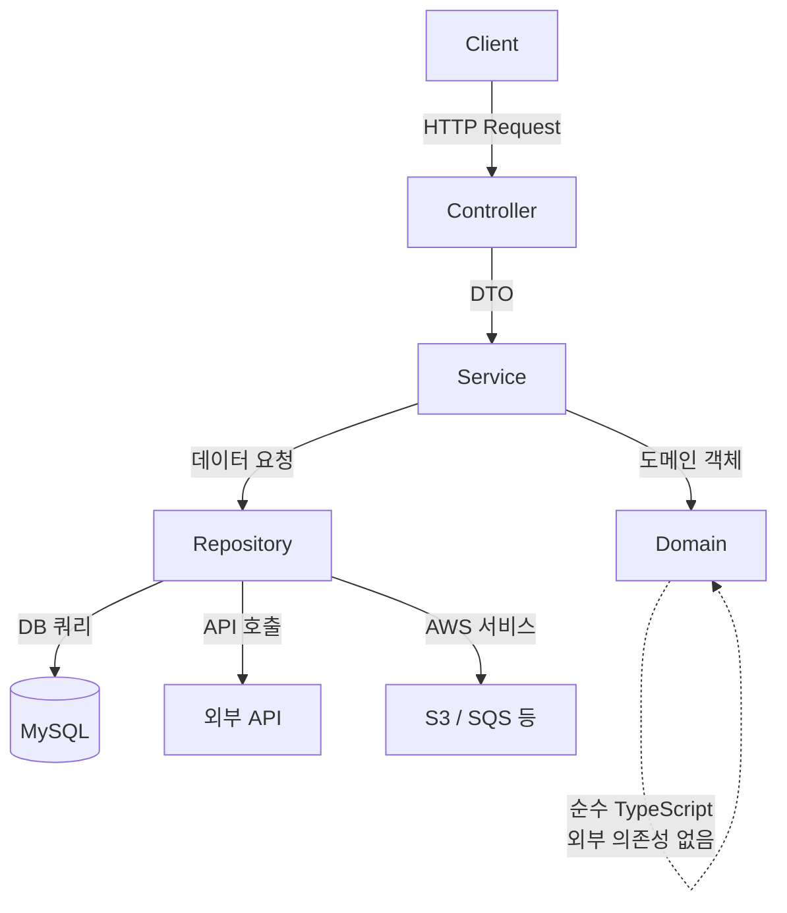

## 목차
1. [배경: Express 모놀리식의 구조적 한계](#배경)
2. [왜 NestJS인가](#왜-nestjs인가)
3. [마이그레이션 전략](#마이그레이션-전략)
4. [설계 및 구현: 4-Layer 아키텍처](#설계-및-구현)
5. [마이그레이션 과정의 챌린지](#마이그레이션-과정의-챌린지)
6. [주요 성과](#주요-성과)
7. [배운 점](#배운-점)

---

## 개요

Express + SST 기반 모놀리식 서버를 NestJS로 마이그레이션하고, ECS 기반 컨테이너 배포 환경을 구축했습니다. 코드 컨벤션과 모듈 구조를 표준화하고, 개발 착수 전 아키텍처 공유 및 리뷰 프로세스를 도입했습니다.

> 이 프로젝트는 **완료형 전환이 아닌 진행형 마이그레이션**입니다. 아래 성과는 모바일 전환 단계에서 운영/관찰로 확보한 수치를 기준으로 작성했습니다.

---

## 배경

기존 시스템은 Express + SST 기반의 모놀리식 구조였습니다. 시간이 지나면서 다음과 같은 구조적 문제들이 누적되었습니다.

### 기존 시스템의 문제

**프로젝트별 구조 파편화와 컨텍스트 스위칭 비용** — 아키텍처 컨벤션이 명확하지 않은 상태에서 Express의 높은 자유도가 작용하여, 프로젝트마다 폴더 구조, 유틸/공통 코드 위치, 라우팅/서비스 레이어 분리 방식이 모두 달랐습니다. 개발자가 프로젝트를 전환할 때마다 해당 프로젝트의 구조를 새로 파악해야 했고, 특히 메인 서비스에서는 수월하게 개발 가능한 기능이 어드민에서는 구조 자체가 달라 별도의 아키텍처를 구상해야 하는 상황이 반복되었습니다.

**라우터에 밀집된 비즈니스 로직** — 도메인별 계층 분리 없이 라우터 파일에 비즈니스 로직이 직접 구현되어 있었습니다. 어떤 API가 어떤 테이블에 데이터를 읽고 쓰는지 추적이 어려웠고, 하나의 수정이 예상치 못한 곳에 사이드이펙트를 일으키는 일이 빈번했습니다. 의존성 주입 없이 코드가 서로 엮이면서, 중복을 줄이기 위한 공통 코드가 자연스럽게 비대해지는 구조였습니다.

**합의 비용의 지속적 증가** — Express에서도 컨벤션으로 통제는 가능하지만, 시스템이 발전할수록 신규 기능이나 예외 케이스가 발생할 때마다 **컨벤션 작성 → 리뷰 → 팀 간 합의 → 문서화 과정을 반복**해야 했습니다. 강제력이 없기 때문에 합의한 구조도 시간이 지나면 흐려지고, 동일한 문제가 반복되는 악순환이었습니다.

### 마이그레이션 타이밍

마침 기존 풀스택 개발 체제에서 프론트엔드/백엔드로 분야를 나누기로 결정한 시점이었습니다. 백엔드 팀이 독립적으로 기술 스택을 재정비할 수 있는 기회였고, 이 타이밍에 구조적 문제를 근본적으로 해결하고자 했습니다.

### 왜 NestJS인가

NestJS는 **커뮤니티가 합의한 모범사례가 프레임워크에 내장**되어 있어, 팀 내부에서 별도로 아키텍처를 재설계하고 합의하는 과정 없이 검증된 구조를 바로 활용할 수 있습니다. 기존에 겪었던 프로젝트별 구조 파편화, 컨텍스트 스위칭 비용, 합의 비용 문제를 프레임워크 레벨에서 해소할 수 있다고 판단했습니다.

또한 NestJS는 기본 HTTP 어댑터로 Express를 사용하기 때문에 기존 미들웨어와 에코시스템을 그대로 활용할 수 있어, 전환 비용도 합리적이었습니다. 학습 곡선에 대한 우려가 있었으나, 팀원들의 적극적인 학습 의지와 동의를 바탕으로 팀 내 공식 기술 스택으로 채택하였습니다.

### NestJS 도입의 장점

**아키텍처의 통일성과 강제된 구조** — NestJS는 Module - Controller - Service라는 명확한 3-tier 계층 구조를 강제합니다. 어떤 프로젝트를 보더라도 동일한 멘탈 모델이 적용되므로, NestJS를 조금만 학습해도 모든 프로젝트에 빠른 적응이 가능합니다. 표준화된 구조 덕분에 AI 코딩 도구(Cursor, GitHub Copilot 등)가 코드베이스를 이해하기 쉬워 더 정확한 코드 제안을 받을 수 있는 점도 이점이었습니다.

**온보딩 및 유지보수 개선** — 기능을 모듈 단위로 나누고 의존성을 명시적으로 등록/주입하는 방식이라 코드의 책임과 경계가 명확합니다. Express의 경우 미들웨어, 유틸, 타입 등 다양한 폴더가 우후죽순으로 생겨나 몇 달만 지나도 코드 추적이 어려워지지만, NestJS는 프로젝트별 형태가 유사하여 팀원 이동이나 신규 입사 시 적응 속도가 빠릅니다.

**DI(Dependency Injection) 기반 설계** — NestJS는 DI를 기본 제공하여 DB 클라이언트, 외부 API, 설정/로깅 등 공통 의존성을 주입 형태로 관리할 수 있습니다. 의존성 결합도가 낮아져 교체가 용이하고, 테스트에서 Mock 대체가 쉬워 단위 테스트 작성 및 자동 검증에 유리합니다. Express에서는 별도 DI 라이브러리(InversifyJS, Awilix 등)를 직접 도입하고 팀별 규칙을 정립해야 하므로 편차가 생기기 쉽습니다.

**모듈 단위 구성** — 도메인/기능 단위로 모듈을 분리하고, `@Module` 데코레이터에 Controller/Provider/Entity를 명세서처럼 등록합니다. 모듈 파일만 보면 구성 요소를 한눈에 파악할 수 있어, 여러 도메인이 동시에 커지는 커머스 서비스에서 확장과 변경 영향 범위 관리에 유리합니다.

**Express 생태계 호환** — NestJS는 기본 HTTP 어댑터로 Express를 사용할 수 있어, 기존 Express 미들웨어와 에코시스템을 그대로 활용 가능합니다. 기존에 공통으로 제공하던 미들웨어/모듈을 NestJS 프로젝트에도 그대로 적용할 수 있었습니다.

**합리적인 성능 특성** — 프레임워크 오버헤드에 대한 우려가 있었으나, 실제 운영 환경에서 주요 병목은 DB 쿼리와 외부 API 연계이며 프레임워크 자체의 오버헤드는 무의미한 수준입니다. 미미한 오버헤드를 위해 구조적 일관성과 장기적 유지보수성을 포기하는 것은 합리적이지 않다고 판단했습니다.

## 마이그레이션 전략

### 왜 점진적 전환이 어려웠나

일반적으로 마이그레이션은 점진적 전환(Strangler Fig 패턴 등)이 안전하지만, 기존 시스템이 **서버사이드 템플릿(SST) 기반**이었기 때문에 API 단위의 점진적 전환이 어려웠습니다. 하나의 페이지 렌더링에 라우팅, 데이터 조회, 템플릿 렌더링이 모두 결합되어 있어, API 레이어만 분리하는 것이 사실상 전체 재작성에 가까웠습니다.

### 모바일 우선 전환으로 리스크 분산

전체 서비스를 한 번에 전환하는 대신, **모바일 서비스를 우선 대상으로 NestJS 기반으로 새로 구축**하는 전략을 선택했습니다.

- **기존 Express 서비스는 유지**: 웹 서비스는 기존 시스템에서 그대로 운영
- **모바일 API만 NestJS로 신규 구축**: 프론트엔드 팀과 함께 모바일 전용 API를 NestJS로 개발
- **충분한 검증 후 확장 전환**: 모바일 서비스에서 아키텍처, 컨벤션, 배포 파이프라인을 검증한 뒤 기존 서비스로 확장

이 방식으로 기존 서비스의 안정성을 유지하면서 새로운 아키텍처를 점진적으로 검증할 수 있었습니다.

### TDD가 안전망 역할

마이그레이션의 전제 조건은 기존 코드를 완벽하게 이해하고, 동일한 동작을 보장하는 것이었습니다. **TDD 방식으로 기존 기능의 동작을 테스트 코드로 먼저 정의**하고, 새로운 NestJS 코드가 이 테스트를 통과하는지 검증하는 프로세스를 따랐습니다. 이를 통해 마이그레이션 과정에서 기능 누락이나 동작 변경을 조기에 발견할 수 있었습니다.

## 설계 및 구현

### 4-Layer 아키텍처 설계

NestJS의 기본 Layered Architecture에 도메인 레이어를 추가한 **Controller → Service → Domain → Repository** 4계층 구조를 설계했습니다. 학생 대상 커머스 특성상 학생인증과 같은 복잡한 비즈니스 로직이 존재하여, Service 레이어와 별도로 Domain 레이어를 두어 핵심 비즈니스 규칙을 분리했습니다.



- **Controller**: 요청/응답 처리, 유효성 검증
- **Service**: 유스케이스 조합, 트랜잭션 관리
- **Domain**: 핵심 비즈니스 로직 (학생인증, 주문 규칙 등) — 순수 TypeScript로만 구성
- **Repository**: 데이터 접근 계층 — DB 쿼리, 외부 API 호출, AWS 서비스 연동 등 외부 의존성을 집중

**모듈 구성 예시:**

```typescript
@Module({
  imports: [TypeOrmModule.forFeature([Order, OrderItem])],
  controllers: [OrderController],
  providers: [OrderService, OrderDomain, OrderRepository],
  exports: [OrderService],
})
export class OrderModule {}
```

모듈 파일만 보면 해당 도메인의 구성 요소를 한눈에 파악할 수 있습니다.

**Domain 레이어 예시 (순수 TypeScript):**

```typescript
export class OrderDomain {
  validateOrder(member: Member, product: Product, quantity: number): void {
    if (!member.isStudentVerified) {
      throw new BusinessException('학생인증이 필요합니다');
    }
    if (product.stock < quantity) {
      throw new BusinessException('재고가 부족합니다');
    }
    if (quantity > product.maxPurchaseLimit) {
      throw new BusinessException('최대 구매 수량을 초과했습니다');
    }
  }

  calculateOrderAmount(product: Product, quantity: number): number {
    const baseAmount = product.price * quantity;
    return product.hasStudentDiscount
      ? baseAmount * (1 - product.studentDiscountRate)
      : baseAmount;
  }
}
```

외부 의존성 없이 순수 TypeScript로만 구성되어 있어, Mock 없이도 안정적인 단위 테스트가 가능합니다.

핵심 설계 원칙은 **Domain 레이어를 순수 TypeScript로 유지**하는 것이었습니다. 외부 의존성이 없기 때문에 안정적인 단위 테스트가 가능하고, 비즈니스 규칙의 변경이 인프라 계층에 영향을 주지 않습니다.

#### 도메인 순수성과 데이터 페칭의 트레이드오프

다만 Domain 레이어를 순수하게 유지하면서 현실적인 어려움이 있었습니다. 도메인이 비즈니스 규칙을 판단하려면 **필요한 데이터가 미리 모두 준비되어야** 합니다. 예를 들어 주문 가능 여부를 판단하려면 회원 정보, 학생인증 상태, 상품 재고 등을 Service 레이어가 사전에 조회해서 Domain에 넘겨줘야 하므로, 일부 오버페칭이 발생할 수밖에 없었습니다.

이를 도메인별 특성에 맞게 실용적으로 접근했습니다. 복잡한 비즈니스 규칙이 있는 도메인(학생인증, 주문 등)은 순수 Domain 레이어를 활용하되, Repository 레이어의 쿼리 최적화로 불필요한 데이터 조회를 최소화했습니다. 도메인 순수성의 원칙이 최대한 깨지지 않는 선에서 안정적인 테스트 환경을 확보하는 것을 우선했습니다.

### 코드 컨벤션과 리뷰 프로세스

처음부터 완벽한 컨벤션을 정의하기보다, **코드 리뷰를 통해 점진적으로 팀 스타일을 맞춰갔습니다.** 순환참조 발생 시 해결 방식, 분리가 애매한 도메인의 경계 설정, 새로운 패턴에 대한 의견 개진 등 실제 코드를 작성하면서 부딪히는 문제들을 리뷰 과정에서 합의하고 컨벤션으로 정립했습니다.

### 테스트 품질 기준

마이그레이션 과정에서 회귀를 줄이기 위해 테스트 기준을 명시했습니다.

- **Domain 레이어 메서드 커버리지 100% 유지**를 팀 룰로 정의
- 핵심 비즈니스 규칙은 Domain 단위 테스트로 우선 검증
- 변경 PR은 관련 Domain 테스트 통과를 머지 조건으로 관리

### ECS 기반 배포 환경

- AWS ECS 컨테이너 배포 환경 구축
- 유휴 리소스 활용으로 QA 서버를 ECS로 분리/증설
- 병렬 배포 구조 도입으로 배포 병목 해소

## 마이그레이션 과정의 챌린지

### 기존 코드의 완전한 이해

마이그레이션의 전제 조건은 기존 코드를 완벽하게 이해하는 것이었습니다. Express의 미들웨어와 비즈니스 로직이 여기저기 흩어져 있다 보니, **기존 기능을 누락하지 않고 전환하는 것 자체가 큰 도전**이었습니다. 하나로 모을 수 있는 로직은 통합하고, 분리해야 할 것은 분리하는 재구조화 작업이 상당했습니다.

### 팀 내 학습 곡선 극복

주 1회 내가 작업한 부분을 팀에 공유하는 시간을 가졌습니다. 단순히 결과만 공유하는 것이 아니라, **왜 이렇게 설계했는지, 다른 방식으로 했을 때 어떤 불편함이 있었는지** 등 의사결정 과정을 함께 나눴습니다. 이외에도 NestJS 관련 아티클 공유와 스터디를 병행하며 팀 전체의 이해도를 높여갔습니다.

## 주요 성과

### 마이그레이션 진행 현황

모바일 서비스를 우선 전환하여 실 운영 환경에 배포 완료했으며, 이후 기존 운영 서비스로 확장 전환을 진행 중입니다. 기존 시스템이 서버사이드 템플릿 기반이었기 때문에 단순한 API 수 비교로 진행률을 측정하기 어렵지만, 모바일 서비스 전환에서 축적한 아키텍처 노하우와 컨벤션이 확장 전환의 속도를 높이고 있습니다.

정량 지표는 아직 수집/고정 중이며, 본 프로젝트는 **완료형 전환이 아닌 진행형 마이그레이션**입니다.

### 현재 확보된 정량 지표 (모바일 전환 단계)

| 지표 | 값 | 측정 기준/근거 |
|------|----|---------------|
| **Domain 레이어 메서드 커버리지** | **100% 유지** | 팀 룰 + CI 머지 조건 (`Domain` 테스트 통과 필수) |
| **온보딩 구조 파악 시간** | **수시간 수준** | 신규 입사자 2명 관찰 기준(레거시 대비 단축) |
| **신규 입사자 관찰 표본** | **2명** | 동일 온보딩 체크리스트로 비교 |

### 구조 표준화의 효과

- **기술 부채 해소**: 라우터에 밀집되어 있던 비즈니스 로직이 도메인별, 기능별로 수직 분리되어 유지보수성이 크게 개선되었습니다
- **코드 리뷰 효율화**: 프레임워크가 강제하는 일관된 구조 덕분에 코드 리뷰에서 "구조" 논의가 아닌 **"비즈니스 로직" 논의**에 집중할 수 있게 되었습니다
- **프로젝트 간 컨텍스트 스위칭 비용 감소**: 모든 프로젝트가 동일한 4-Layer 구조를 따르므로, 다른 프로젝트 코드를 처음 볼 때도 빠르게 파악 가능
- **QA 환경 병렬 배포로 배포 대기시간 제거**
- **온보딩 체감 개선**: 실제 신규 입사자 2명 기준, 레거시 대비 NestJS 구조 파악 완료 시간이 수시간 수준으로 단축되었습니다 (관찰 기반)

### AI 도구와의 시너지

프레임워크 표준화가 가져온 예상치 못한 효과는 **AI 코딩 도구의 활용 효율 향상**이었습니다.

- **CLAUDE.md, 문서 기반 정책 정리** → AI가 코드베이스의 구조와 컨벤션을 정확히 이해 → 더 정확한 코드 생성
- **일관된 모듈 구조** → Claude Code, Cursor 등이 패턴을 학습하여 새 모듈 생성 시 높은 정확도
- **Domain 레이어 순수성** → AI가 비즈니스 로직을 독립적으로 분석하고 테스트 코드 생성 가능

"프레임워크 표준화는 사람뿐 아니라 AI의 생산성도 높인다"는 점은, AI 시대의 개발 환경에서 아키텍처 일관성의 가치가 더욱 커진다는 것을 보여줍니다.

---

## 배운 점

### 1. 프레임워크의 강제력이 곧 생산성이다

Express의 자유도가 높다는 것은 장점이자 단점이었습니다. 프로젝트 초기에는 빠르게 개발할 수 있지만, 시스템이 커지면서 "자유"가 "혼란"이 됩니다. NestJS의 강제된 구조는 초기에는 번거로워 보이지만, 장기적으로 팀 전체의 생산성을 높이는 기반이 되었습니다.

### 2. 도메인 순수성은 타협의 예술이다

Domain 레이어를 순수 TypeScript로 유지하겠다는 원칙은 이상적이지만, 현실에서는 데이터 페칭과의 트레이드오프가 존재합니다. 원칙을 100% 지키는 것보다, **원칙을 이해한 상태에서 실용적으로 타협하는 것**이 더 중요했습니다.

### 3. 마이그레이션은 코드 전환이 아니라 재설계다

기존 코드를 단순히 NestJS 문법으로 옮기는 것이 아니라, 도메인을 다시 분석하고 계층을 재설계하는 과정이었습니다. TDD가 이 과정에서 기존 기능의 안전망 역할을 했고, 코드 리뷰가 팀의 아키텍처 이해도를 높이는 학습 도구가 되었습니다.

### 4. 기술 도입은 팀의 합의가 전제다

NestJS 도입 과정에서 학습 곡선에 대한 우려가 있었지만, 팀원들의 적극적인 학습 의지가 있었기에 가능했습니다. 주 1회 공유 세션과 스터디를 통해 의사결정 과정을 투명하게 나누는 것이 기술 도입의 성패를 좌우했습니다.

---

## 기술 스택

| 분류 | 기술 |
|------|------|
| **백엔드 프레임워크** | NestJS (TypeScript) |
| **기존 프레임워크** | Express + SST |
| **데이터베이스** | MySQL 8.0 |
| **배포 환경** | AWS ECS (Fargate) |
| **테스트** | Jest (TDD) |
