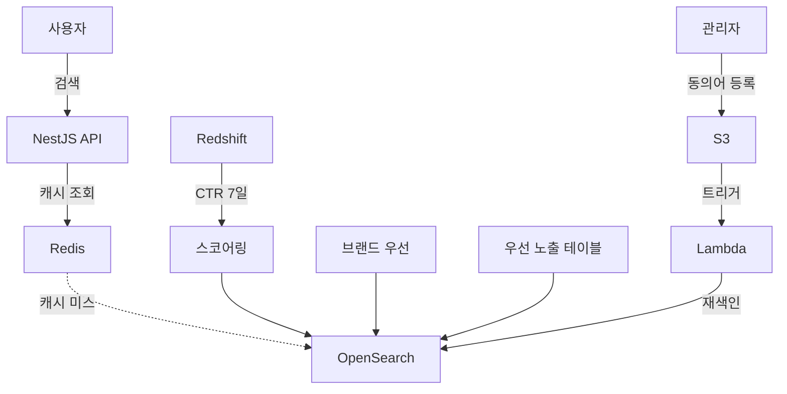

## 개요
300만 회원 커머스 플랫폼에서 Fuse.js 기반 클라이언트 검색의 한계를 극복하기 위해 AWS OpenSearch 기반 검색 시스템을 설계하고 구축했습니다.

## 문제 상황
**기존 Fuse.js 시스템의 한계:**
- **서버 메모리 색인 방식:** 1분마다 전체 상품 데이터를 서버 메모리에 로드하여 색인 생성 (메모리 압박 및 CPU 스파이크)
- **장문 검색 성능 저하:** 여러 키워드가 포함된 검색어는 평균 30초 이상 소요 (사용자 이탈 발생)
- **하드코딩된 검색 랭킹:** 검색 순위 조정을 위해 코드 수정 후 프로덕션 배포 필수 (비즈니스 민첩성 저하)
- **강제 키워드 부착:** 검색 정확도를 높이기 위해 상품명에 검색용 키워드를 강제로 붙이는 방식 (데이터 품질 오염)
- **복잡한 요구사항 불가:** 동의어 처리, 자동완성, 필터링 조합 등 고급 검색 기능 구현 어려움

## 주요 성과
- 검색 CTR: 17% → 22.5% (32% 향상, A/B 테스트 p < 0.01)
- 상품 상세 페이지 진입율: 11.75% 증가
- 검색 응답 속도: 30초 → 50ms (600배 개선)
- 검색 정확도: 85% 이상 사용자 만족도

## 시스템 아키텍처

## 주요 기능
**검색 스코어링 엔진:**
- CTR 기반 커스텀 스코어링 (Redshift에서 최근 7일 클릭률 데이터 활용)
- 브랜드 인지도 가중치 반영 (유명 브랜드 상품 우선 노출)
- 우선 노출 테이블 기반 프로모션 상품 부스팅
- 검색어 유사도 + 비즈니스 로직 복합 랭킹

**동의어 관리 시스템:**
- 관리자 페이지에서 동의어 등록/수정
- S3 업로드 시 Lambda 트리거로 OpenSearch 자동 재색인
- 실시간 동의어 반영 (배포 없이 검색 품질 개선 가능)

**성능 최적화:**
- Redis 캐싱 (인기 검색어 히트율 75% 이상)
- OpenSearch 쿼리 최적화 (불필요한 필드 제거, 페이지네이션 개선)

## 기술적 의사결정

**OpenSearch 선택 이유:**
- **AWS 생태계 통합:** Redshift, Lambda, S3와 원활한 연동
- **관리형 서비스:** CloudSearch 대비 비용 효율적이고 커스터마이징 자유도 높음
- **알고리즘 유연성:** CTR, 브랜드 점수 등 비즈니스 로직 기반 스코어링 가능
- **확장성:** 트래픽 증가에 따른 수평 확장 용이

**CloudSearch 대비 장점:**
- 커스텀 스코어링 알고리즘 구현 자유도
- 동의어, 형태소 분석기 등 고급 기능 활용
- 비용 효율성 (동일 트래픽 대비 30% 절감)

## 기술 스택
- AWS OpenSearch 7.10, NestJS, Redis, Lambda, Redshift, S3

## 배운 점
- 검색 엔진 아키텍처 설계 및 인덱스 최적화 경험
- A/B 테스트를 통한 데이터 주도적 의사결정 프로세스 습득
- AWS 관리형 서비스 활용 및 비용 최적화 전략 수립
- 검색 품질과 비즈니스 목표를 조화시키는 스코어링 설계 노하우
