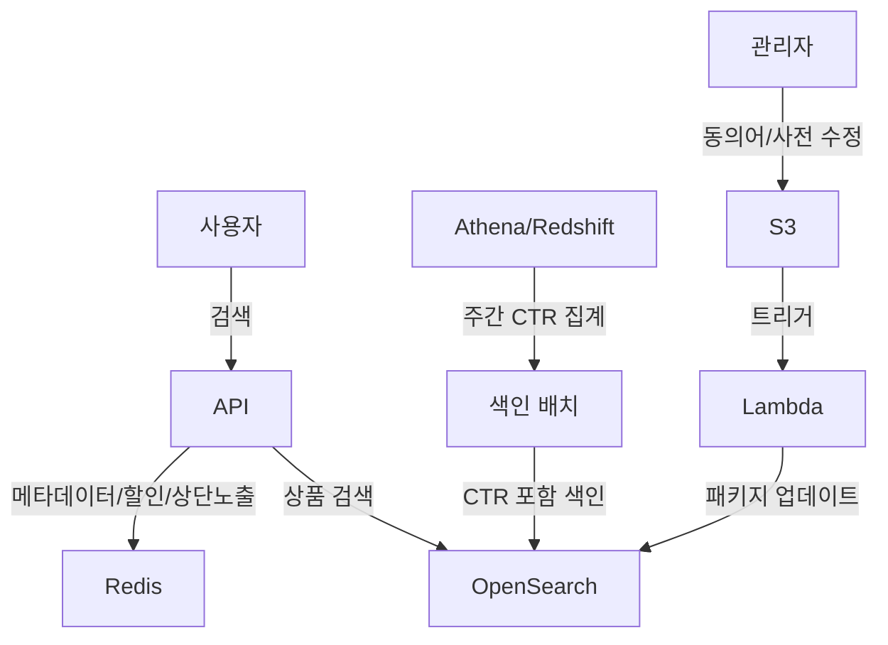

## 목차
1. [배경: 느린 검색, 불안정한 서버](#배경-느린-검색-불안정한-서버)
2. [문제 분석: Fuse.js의 한계](#문제-분석-fusejs의-한계)
3. [해결 목표: 무엇을 달성하려 했나](#해결-목표-무엇을-달성하려-했나)
4. [아키텍처 설계: OpenSearch를 선택한 이유](#아키텍처-설계-opensearch를-선택한-이유)
5. [핵심 구현 1: CTR 기반 동적 랭킹](#핵심-구현-1-ctr-기반-동적-랭킹)
6. [핵심 구현 2: 캐시 전략으로 응답 속도 개선](#핵심-구현-2-캐시-전략으로-응답-속도-개선)
7. [핵심 구현 3: 배포 없이 검색 품질 개선](#핵심-구현-3-배포-없이-검색-품질-개선)
8. [결과: 숫자로 증명하는 개선 효과](#결과-숫자로-증명하는-개선-효과)

---

## 배경: 느린 검색, 불안정한 서버

300만 회원이 사용하는 커머스 플랫폼에서 검색은 핵심 기능입니다. 하지만 "나이키 운동화"를 검색하면 결과가 나오기까지 1~2초가 걸렸고, 키워드가 길어지면 훨씬 더 오래 걸렸습니다. 검색 후 상품을 클릭하는 비율(CTR)은 17%에 불과했습니다.

더 심각한 문제는 서버 안정성이었습니다. 검색을 위해 서버 메모리에 전체 상품 데이터를 올려놓는 구조였기 때문에, 상품 수가 증가할수록 서버 메모리와 CPU에 부담이 가중되었습니다. 검색 순위를 조정하려면 코드를 수정하고 프로덕션에 배포해야 했고, 마케팅팀의 요청 하나에도 30분이 소요되었습니다.

검색 엔진을 전면 개편하기로 결정했습니다.

---

## 문제 분석: Fuse.js의 한계

기존 시스템은 **Fuse.js**라는 JavaScript 기반 퍼지 검색 라이브러리를 사용했습니다. Fuse.js는 역 인덱스(inverted index) 없이 전체 데이터를 순회하며 문자열 유사도를 계산하는 방식으로 동작합니다. 이를 서버 메모리에 전체 상품 데이터를 로드한 후 검색을 수행하는 방식으로 사용하고 있었습니다.

### 왜 문제였을까?

1. **서버 자원 과다 사용**
   - 전체 상품 데이터(수만 건)를 서버 메모리에 상주시켜야 함
   - 검색할 때마다 전체 데이터를 순회하며 유사도 계산 → CPU 스파이크 발생
   - 검색 외 다른 API 응답 속도까지 저하되는 영향

2. **상품 수 증가에 취약한 구조**
   - 역 인덱스가 없어 상품이 늘어날수록 검색 시간이 선형으로 증가
   - "나이키 에어맥스 270 블랙 런닝화" 같은 긴 검색어는 특히 느림
   - 서버 메모리 부족으로 재시작이 빈번

3. **비즈니스 민첩성 부족**
   - 검색 순위 조정 = 코드 수정 + 배포 (30분)
   - A/B 테스트 불가능
   - 동의어 추가도 배포 필요

4. **데이터 품질 오염**
   - 검색 정확도를 높이기 위해 상품명에 검색용 키워드를 강제로 부착
   - 예: "나이키 신발" → "나이키 신발 운동화 스니커즈 런닝화"
   - 사용자에게 보이는 상품명도 지저분해짐

---

## 해결 목표: 무엇을 달성하려 했나

### 정량적 목표
- **응답 속도**: 1~2초 → 100ms 이하
- **CTR**: 17% → 20% 이상 (30% 향상)

### 정성적 목표
- 상품 수가 증가해도 대응 가능한 확장 가능 구조
- 배포 없이 검색 알고리즘을 조정할 수 있는 유연한 방식
- 서버 메모리 부담 감소로 안정성 확보

---

## 아키텍처 설계: OpenSearch를 선택한 이유

### OpenSearch vs CloudSearch

AWS에는 두 가지 관리형 검색 서비스가 있습니다. 저희는 AWS 생태계 내에서 인프라를 운영 중이었기 때문에, 검색 서비스인 Amazon CloudSearch와 Amazon OpenSearch Service 중 하나를 선택해야 했습니다.

| 기준 | CloudSearch | OpenSearch |
|------|-------------|------------|
| **기반 엔진** | Apache Solr | Elasticsearch 포크 (OpenSearch) |
| **커스텀 스코어링** | 제한적 (표현식 기반) | Function Score Query로 자유로운 구현 |
| **한국어 분석** | 기본 토크나이저 | Nori 형태소 분석기 |
| **플러그인 확장** | 미지원 | 커스텀 플러그인 지원 |
| **스케일링** | 자동 | 인스턴스/샤드 직접 제어 |

> **참고**: Amazon CloudSearch는 현재 신규 고객에게 더 이상 제공되지 않으며, AWS는 OpenSearch Service로의 전환을 권장하고 있습니다.

**OpenSearch를 선택한 이유:**
- CTR 기반 커스텀 스코어링(Function Score Query) 구현 가능
- Nori 형태소 분석기로 한국어 검색 품질 확보
- 기존 AWS 인프라(Redshift, Lambda, S3)와 자연스러운 통합
- 동의어/사용자 사전을 플러그인으로 관리 가능

### 전체 아키텍처

검색은 **메타데이터 조회**(상품 수, 필터)와 **상품 검색**, 총 2회의 쿼리로 이루어집니다.



**핵심 컴포넌트:**
1. **NestJS API**: 검색 요청 처리 및 비즈니스 로직
2. **Redis**: 메타데이터(상품 수, 필터), 즉시할인 비용, 상단 노출 리스트 캐싱
3. **OpenSearch**: 전문 검색 및 CTR 기반 랭킹
4. **Athena/Redshift**: 주간 CTR 데이터 집계
5. **Lambda + S3**: 동의어/사용자 사전 자동 업데이트

---

## 핵심 구현 1: CTR 기반 동적 랭킹

### 문제: 검색 결과를 어떻게 정렬할 것인가?

초기에는 OpenSearch의 기본 BM25 스코어만 사용했습니다. 하지만 이는 텍스트 유사도만 고려할 뿐, 실제로 사용자가 선호하는 상품을 반영하지 못했습니다.

예를 들어, "운동화" 검색 시:
- 상품 A: 상품명에 "운동화"가 3번 등장 → 높은 점수
- 상품 B: 상품명에 "운동화"가 1번만 등장 → 낮은 점수

하지만 **상품 B의 CTR이 25%**, **상품 A의 CTR은 5%**라면 어떨까요? 사용자는 명백히 상품 B를 선호하는데, 검색 결과는 상품 A를 상위에 노출하고 있었습니다.

### 해결: 색인 시 CTR 데이터를 함께 저장

**CTR(Click-Through Rate, 클릭률)**을 검색 랭킹에 반영하기 위해, 상품 데이터를 색인할 때 CTR 정보를 함께 저장하는 방식을 채택했습니다.

**1단계: Athena/Redshift에서 주간 CTR 집계**

매일 새벽, Athena 또는 Redshift에서 최근 7일간의 상품별 CTR을 집계합니다.

```sql
SELECT
  product_id,
  SUM(clicks)::FLOAT / SUM(impressions)::FLOAT AS ctr
FROM search_logs
WHERE created_at >= CURRENT_DATE - INTERVAL '7 days'
GROUP BY product_id
HAVING SUM(impressions) >= 100  -- 최소 노출 100회 이상
```

**2단계: CTR을 포함하여 상품 데이터 색인**

집계된 CTR 데이터를 상품 정보와 함께 OpenSearch에 색인합니다. 이렇게 하면 검색 시 별도의 CTR 조회 없이, Function Score Query로 CTR을 랭킹에 바로 반영할 수 있습니다.

**신규 상품의 Cold-start 처리:**

CTR 기반 랭킹의 가장 큰 약점은 신규 상품입니다. 노출 데이터가 없는 상품은 CTR이 0이므로, 검색 결과에서 밀려나 노출 기회를 얻지 못하는 악순환이 발생합니다(Exploration vs Exploitation 문제).

이를 해결하기 위해 **최소 노출 기준(100회) 미달 상품에는 기본 CTR 값을 부여**했습니다. 기본 CTR은 해당 카테고리 상품들의 평균 CTR로 설정하여, 검색 점수에 중립적 영향(증가도 감소도 아닌)을 미치도록 했습니다. 신규 상품이 자연스럽게 노출되어 실제 CTR 데이터가 쌓이면 기본값은 실측값으로 교체됩니다.

```sql
-- 신규 상품에 카테고리 평균 CTR 부여
WITH category_avg AS (
  SELECT category_id, AVG(ctr) AS avg_ctr
  FROM product_ctr_stats
  WHERE impressions >= 100
  GROUP BY category_id
)
SELECT
  p.product_id,
  COALESCE(s.ctr, ca.avg_ctr, 0.05) AS ctr  -- 실측값 → 카테고리 평균 → 기본값 5%
FROM products p
LEFT JOIN product_ctr_stats s ON p.product_id = s.product_id AND s.impressions >= 100
LEFT JOIN category_avg ca ON p.category_id = ca.category_id;
```

**3단계: Function Score Query로 BM25 + CTR 결합**

검색 시 OpenSearch의 Function Score Query를 사용하여 BM25 텍스트 유사도 점수에 CTR을 반영합니다. CTR 값을 log 함수로 변환하여 극단적인 CTR 차이가 랭킹을 지배하지 않도록 완화하고, multiply 모드로 BM25 스코어와 결합합니다.

```json
{
  "query": {
    "function_score": {
      "query": {
        "bool": {
          "must": [
            {
              "multi_match": {
                "query": "나이키 운동화",
                "fields": ["product_name^3", "brand^2", "category"],
                "type": "cross_fields",
                "analyzer": "nori_search"
              }
            }
          ]
        }
      },
      "functions": [
        {
          "field_value_factor": {
            "field": "ctr",
            "modifier": "log1p",
            "factor": 10,
            "missing": 0.05
          }
        }
      ],
      "boost_mode": "multiply",
      "score_mode": "sum"
    }
  }
}
```

- `modifier: "log1p"` — CTR에 log(1 + value)를 적용하여 극단값 완화
- `factor: 10` — CTR 값이 0~1 사이로 작기 때문에 10을 곱해 BM25 스코어와 균형 조정
- `missing: 0.05` — CTR 필드가 없는 경우 기본값 5% 적용
- `boost_mode: "multiply"` — BM25 스코어 × CTR 팩터로 최종 점수 산출

### 검증: A/B 테스트

1주일간 세션 기반 A/B 테스트를 진행했습니다.
- **그룹 A (기존)**: Fuse.js 기반 기존 검색 시스템
- **그룹 B (개선)**: OpenSearch + CTR 기반 랭킹 시스템

**결과:**
- CTR: 17% → 22.5% (**+5.5%p, 상대 32% 향상**)
- 상품 상세 페이지 진입율: (**11.75% 증가**) (A/B Test, p < 0.01)

---

## 핵심 구현 2: 캐시 전략으로 응답 속도 개선

### 문제: 검색 과정에서 부가 조회가 많다

검색 요청 하나를 처리하려면 여러 단계를 거칩니다.

1. **메타데이터 조회**: 전체 상품 수, 필터 옵션 (OpenSearch)
2. **상품 검색**: 실제 검색 결과 (OpenSearch)
3. **즉시할인 계산**: 상품별 할인 비용 적용
4. **상단 노출 리스트**: 프로모션 상품 우선 노출

OpenSearch 전환으로 검색 자체는 300ms로 개선되었지만, 메타데이터 조회와 할인 계산 등 부가 작업까지 합치면 추가 개선 여지가 있었습니다.

### 해결: Redis 캐싱 (1분 TTL)

자주 변하지 않는 부가 데이터를 Redis에 1분 주기로 캐싱했습니다.

**캐싱 대상:**

| 캐싱 항목 | 설명 | TTL |
|-----------|------|-----|
| 메타데이터 | 전체 상품 수, 필터 옵션 | 1분 |
| 즉시할인 비용 | 상품별 실시간 할인 적용 금액 | 1분 |
| 상단 노출 리스트 | 프로모션/우선 노출 상품 목록 | 1분 |

```typescript
async getSearchMetadata(category: string): Promise<SearchMetadata> {
  const cacheKey = `search:meta:${category}`;

  const cached = await this.redis.get(cacheKey);
  if (cached) {
    return JSON.parse(cached);
  }

  const metadata = await this.openSearch.getMetadata(category);
  await this.redis.setex(cacheKey, 60, JSON.stringify(metadata));  // TTL 60초

  return metadata;
}
```

1분 TTL을 선택한 이유는, 상품 수나 필터 옵션, 할인 정보가 초 단위로 변하지 않으면서도 너무 오래된 데이터를 보여주지 않기 위한 균형점이었습니다.

**캐싱 대상의 범위:**

Redis에 캐싱하는 데이터는 **변동이 적은 메타데이터**에 한정했습니다. 검색 필터 옵션, 전체 상품 수, 즉시할인 잔액, 상단 노출 리스트 등이 이에 해당합니다. 반면 **가격, 재고 등 실시간 정합성이 중요한 데이터는 캐싱하지 않고**, OpenSearch 검색 후 DB에서 직접 조회하여 반영합니다.

**캐시 스탬피드(Stampede) 이슈:**

1분 TTL 만료 시 동시에 다수 요청이 캐시 미스를 경험하여 Redis/OpenSearch에 부하가 집중되는 스탬피드 문제가 우려될 수 있습니다. 그러나 TTL 만료 후 **첫 번째 요청이 캐시를 갱신**하면 이후 요청은 즉시 캐시 히트하므로, 실제로 OpenSearch에 동시에 도달하는 요청은 극히 소수입니다. 트래픽 규모에서 이 수준의 순간 부하는 문제가 되지 않아, 별도의 캐시 락이나 사전 갱신 전략은 적용하지 않았습니다.

### 결과: 응답 속도 50ms 달성

- **OpenSearch 전환**: 1~2초 → 300ms
- **Redis 캐싱 적용**: 300ms → 50ms
- **캐시 히트율**: 75%

---

## 핵심 구현 3: 배포 없이 검색 품질 개선

### 문제: 동의어 추가에 30분 걸린다

사용자는 "운동화"를 검색하지만, 상품명에는 "스니커즈"라고 적혀있는 경우가 많습니다. 동의어와 사용자 사전을 관리해야 하는데, 기존 검색 시스템에는 코드에 하드코딩되어 있어 수정할 때마다 배포가 필요했습니다.

```typescript
const synonyms = {
  '운동화': ['스니커즈', '러닝화', '트레이닝화'],
  '가방': ['백팩', '배낭', '핸드백'],
  // ... 코드에 하드코딩
};
```

마케팅팀이 "이번 주부터 '슬리퍼' 검색 시 '쪼리'도 보여주세요"라고 요청하면:
1. 개발자가 코드 수정
2. PR 생성 및 리뷰
3. 프로덕션 배포
4. **총 소요 시간: 30분**

### 해결: 어드민 + S3 + Lambda 자동화

**1단계: 어드민 페이지에서 동의어 및 사용자 사전 수정**

마케팅팀이 어드민 페이지에서 직접 동의어와 사용자 사전을 수정할 수 있도록 했습니다.

**2단계: TXT 파일로 S3 업로드**

수정된 동의어와 사전 데이터를 OpenSearch 형식의 TXT 파일로 변환하여 S3에 업로드합니다.

```typescript
@Post('/admin/synonyms')
async updateSynonyms(@Body() dto: SynonymDto) {
  // 동의어를 OpenSearch 형식의 TXT로 변환
  const synonymText = dto.entries
    .map(e => `${e.word},${e.synonyms.join(',')}`)
    .join('\n');

  await this.s3.upload({
    Bucket: 'search-config',
    Key: 'synonyms.txt',
    Body: synonymText,
  });

  return { message: '동의어가 등록되었습니다. 5분 내 반영됩니다.' };
}
```

**3단계: S3 이벤트 → Lambda → 무중단 동의어 업데이트**

S3에 TXT 파일이 업로드되면 Lambda가 자동으로 트리거되어 동의어를 업데이트합니다.

기존에는 인덱스 close → 설정 변경 → open 방식을 고려했으나, close 동안 검색이 불가능해지는 문제가 있습니다. 이를 해결하기 위해 **동의어를 검색 분석기(search_analyzer)에만 적용하고, `synonym_graph` 타입을 사용**하는 방식을 채택했습니다.

`synonym_graph`는 `synonym` 타입과 달리 다중 토큰 동의어를 정확하게 처리하며, search_analyzer에 적용하면 **인덱스 재생성 없이 동의어를 즉시 반영**할 수 있습니다. 색인 시에는 원본 텍스트 그대로 저장하고, 검색 시에만 동의어를 확장하는 방식이므로 기존 문서의 재색인이 불필요합니다.

```typescript
export const handler = async (event: S3Event) => {
  // 1. S3에서 동의어 TXT 다운로드
  const synonyms = await downloadFromS3(event);

  // 2. 동의어 파일을 OpenSearch 패키지로 업데이트
  await openSearch.updatePackage({
    PackageID: SYNONYM_PACKAGE_ID,
    PackageSource: {
      S3BucketName: event.Records[0].s3.bucket.name,
      S3Key: event.Records[0].s3.object.key,
    },
  });

  // 3. 패키지를 도메인에 연결 (무중단)
  await openSearch.associatePackage({
    PackageID: SYNONYM_PACKAGE_ID,
    DomainName: OPENSEARCH_DOMAIN,
  });

  // search_analyzer에 synonym_graph 필터가 적용되어 있으므로
  // 패키지 업데이트만으로 검색 시 새로운 동의어가 즉시 반영됨
  // 인덱스 close/open이나 재색인이 필요 없음
};
```

**인덱스 설정 (최초 1회):**

```json
{
  "settings": {
    "analysis": {
      "filter": {
        "synonym_filter": {
          "type": "synonym_graph",
          "synonyms_path": "synonyms.txt",
          "updateable": true
        }
      },
      "analyzer": {
        "nori_search": {
          "type": "custom",
          "tokenizer": "nori_tokenizer",
          "filter": ["synonym_filter", "lowercase"]
        }
      }
    }
  },
  "mappings": {
    "properties": {
      "product_name": {
        "type": "text",
        "analyzer": "nori_index",
        "search_analyzer": "nori_search"
      }
    }
  }
}
```

색인 시에는 `nori_index` 분석기(동의어 미포함)를, 검색 시에는 `nori_search` 분석기(동의어 포함)를 사용합니다. 이 분리 덕분에 동의어 업데이트 시 기존 인덱스를 건드리지 않고 검색 품질만 개선할 수 있습니다.

### 결과: 30분 → 5분 (6배 단축)

- 마케팅팀이 어드민 페이지에서 동의어/사전 수정 (1분)
- TXT 파일이 S3에 업로드되고 Lambda가 패키지를 자동 업데이트 (4분)
- **총 소요 시간: 5분**
- **개발자 개입: 0분**

---

## 결과: 숫자로 증명하는 개선 효과

### 정량적 성과

| 지표 | Before | After | 개선율 |
|------|--------|-------|--------|
| **검색 응답 속도** | 1~2초 | 50ms | **약 30배** |
| **CTR** | 17% | 22.5% | **+5.5%p (상대 32% 향상)** |
| **상품 상세 페이지 진입율** | - | - | **11.75% 증가** |
| **동의어 업데이트** | 30분 | 5분 | **6배 단축** |

### 비즈니스 임팩트

- **서버 안정성 확보**: 서버 메모리에 상품 데이터를 적재하지 않아 서버 지표가 안정적으로 개선
- **운영 효율**: 검색 관련 개발 요청 80% 감소 (마케팅/운영팀 셀프 서비스)

### 기술적 성과

- **확장성**: 상품 수 증가에도 검색 성능 유지 (OpenSearch의 분산 아키텍처)
- **안정성**: 서버 메모리 부담 제거로 서버 전체 안정성 향상
- **유지보수성**: 신규 랭킹 요소 추가 시 1일 작업 (기존 1주)

---

## 배운 점

### 1. 검색은 단순히 "찾기"가 아니다

검색 엔진을 개선하면서 깨달은 점은, 검색이 단순히 데이터를 찾는 것이 아니라 **사용자가 원하는 것을 예측하는 것**이라는 점입니다. CTR 기반 랭킹은 사용자의 선택을 존중하는 방식이었고, 결과적으로 더 나은 사용자 경험으로 이어졌습니다.

### 2. 데이터 주도 의사결정의 중요성

A/B 테스트 없이 "이게 더 나을 것 같다"는 직감만으로 개발했다면, CTR **+5.5%p (상대 32% 향상)**라는 성과를 증명할 수 없었을 것입니다. 모든 주요 변경사항은 A/B 테스트로 검증했고, 이는 팀 내부 설득에도 큰 도움이 되었습니다.

### 3. 비용과 성능의 트레이드오프

OpenSearch는 강력하지만 비용이 높습니다. Redis 캐싱으로 75%의 요청을 흡수함으로써 비용을 절감했습니다. 하지만 캐시 일관성, TTL 설정 등 고려할 점이 많았습니다. "모든 문제를 캐싱으로 해결"하는 것이 아니라, **어디에 캐싱을 적용할지** 선택하는 것이 중요했습니다.

### 4. 운영 자동화의 가치

사용자 사전/동의어 사전 업데이트를 자동화함으로써, 개발팀은 더 중요한 문제에 집중할 수 있었습니다. "30분 x 주 5회 = 월 10시간"의 개발 시간을 절약했고, 이는 연간 120시간에 달합니다. 자동화는 단순히 시간 절약이 아니라, **팀의 생산성과 만족도 향상**으로 이어집니다.

---

## 기술 스택

- **검색 엔진**: AWS OpenSearch Service
- **백엔드**: NestJS (TypeScript)
- **캐시**: Redis 6.x
- **데이터 웨어하우스**: Amazon Redshift
- **자동화**: AWS Lambda, S3
- **모니터링**: CloudWatch
