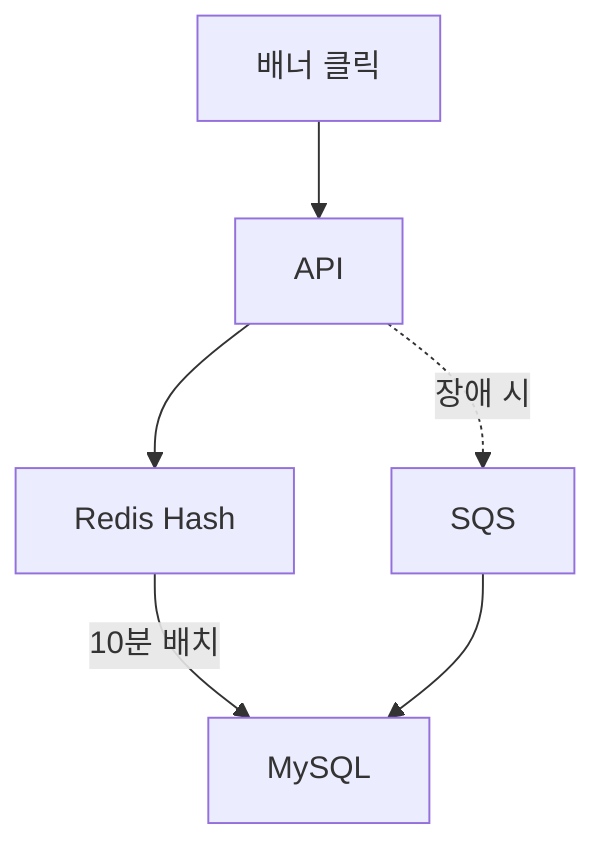

## 개요
에브리타임 혜택탭 연계로 배너 클릭 API 호출량이 급증하면서 Redis Write-back 전략을 도입하여 DB 부하를 10배 감소시켰습니다.

## 문제 상황
**에브리타임 혜택탭 출시:**
- 거의 모든 페이지에 배너 존재
- 자동 스와이핑 시 성과 집계 API 호출
- API 호출량 1위 (가장 많이 호출되는 API)

**기존 시스템:**
- 배너 클릭 시 즉시 DB 업데이트
- DB IOPS 급증
- DB CPU 사용률 증가

## 주요 성과
- DB IOPS: 10배 감소
- DB CPU: 25% 절감
- 서버 CPU: 7% 절감
- API 응답 속도: 500ms → 10ms (50배 개선)

## 시스템 아키텍처


## 아키텍처 개선
**Before:**
- 클릭 → 즉시 DB UPDATE

**After:**
- 클릭 → Redis HINCRBY
- 10분마다 배치 → DB Bulk INSERT
- Redis 장애 시 → SQS → DB

## 기술적 검토
**다양한 방식 POC:**
1. Redis Write-back ✅ 채택
2. SQS Pub-Sub ❌ DB 부하 감소 미미
3. DB Row Insert ❌ 데이터 급증 우려
4. DB Bulk Insert ❌ 정합성 이슈

**Redis 선택 이유:**
- 기존 Redis 유휴 리소스 활용
- 싱글스레드 → 정확한 집계
- 빠른 속도 → 안정성
- 최소 개발 비용

## 주요 기능
**Redis 구조:**
```
HSET banner:{banner_id}:stats
  clicks {count}
  impressions {count}
  last_update {timestamp}
```

**배치 프로세스:**
- 10분마다 실행 (데이터 유실 방지)
- Redis → DB Bulk INSERT
- 트랜잭션 보장

**장애 대응:**
- Redis 장애 시 SQS fallback
- SQS → DB 직접 적재
- 데이터 유실 방지

## 기술 스택
- Redis 6.x, MySQL, NestJS
- AWS SQS, Cron

## 배운 점
- Write-back 패턴 실전 적용
- 다양한 솔루션 비교 분석
- 트래픽 환경 성능 최적화
