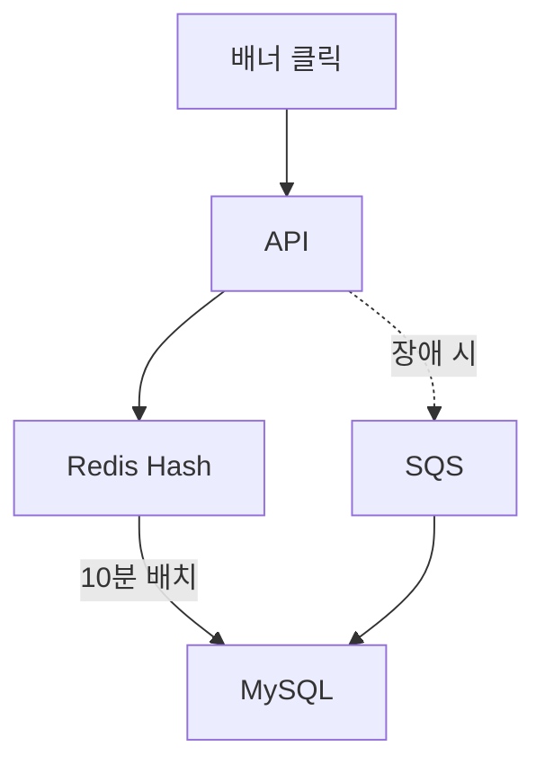

## 개요
에브리타임 혜택탭 연계로 배너 클릭 API 호출량이 급증하면서 Redis Write-back 전략을 도입하여 DB 부하를 10배 감소시키고 API 응답 속도를 50배 개선했습니다.

## 문제 상황

**에브리타임 혜택탭 출시 배경:**

에브리타임 앱 내 전용 '혜택탭'으로 커머스 서비스가 노출되면서 거의 모든 페이지에 프로모션 배너가 배치되었습니다. 배너 자동 스와이핑 기능으로 인해 노출 시마다 성과 집계 API가 자동 호출되어, 이 API가 **전체 API 중 호출량 1위**를 차지하게 되었습니다 (하루 수백만 건).

**기존 시스템의 한계:**

- 배너 노출/클릭 시 즉시 MySQL DB UPDATE 쿼리 실행
- DB IOPS 급증으로 인한 성능 저하
- DB CPU 사용률 지속적 증가 (피크 시간대 80% 이상)
- API 응답 속도 저하로 사용자 경험 악화

## 주요 성과

- DB IOPS: 10배 감소
- DB CPU: 25% 절감
- 서버 CPU: 7% 절감
- API 응답 속도: 500ms → 10ms (50배 개선)

## 시스템 아키텍처


## 아키텍처 개선

**Before:**

- 클릭 → 즉시 DB UPDATE

**After:**

- 클릭 → Redis HINCRBY (메모리 기반 초고속 처리)
- 10분마다 배치 → DB Bulk INSERT
- Redis 장애 시 → SQS → DB (데이터 유실 방지)

## 기술적 검토

**다양한 솔루션 비교 분석:**

**1. Redis Write-back ✅ 최종 채택**

- 장점: 메모리 기반 초고속 처리, 기존 인프라 활용, 정확한 집계
- 단점: Redis 장애 시 데이터 유실 가능 (SQS fallback으로 해결)

**2. SQS Pub-Sub ❌ 불채택**

- 이유: 메시지를 SQS로 보내도 결국 DB에 즉시 적재해야 함 (DB 부하 감소 효과 미미)
- 추가 인프라 비용 대비 성능 개선 미미

**3. DB Row INSERT 방식 ❌ 불채택**

- 이유: 클릭마다 새로운 Row 삽입 시 테이블 크기 급증 우려 (월 수억 건)
- 집계 쿼리 복잡도 증가 및 성능 저하 예상

**4. DB Bulk INSERT ❌ 불채택**

- 이유: 배치 처리 중 서버 재시작 등으로 인한 데이터 정합성 이슈
- Redis 없이 메모리 버퍼 사용 시 데이터 유실 위험

**Redis Write-back 선택 이유:**

- **유휴 리소스 활용:** 기존 Redis 클러스터의 여유 메모리/CPU 활용 (추가 비용 제로)
- **싱글스레드 정확성:** Redis의 싱글스레드 특성으로 동시성 이슈 없이 정확한 집계 보장
- **초고속 응답:** 메모리 기반 HINCRBY 연산으로 밀리초 단위 응답 (API 성능 50배 개선)
- **최소 개발 비용:** 기존 Redis 인프라 활용으로 신규 구축 불필요, 빠른 개발 및 배포 가능

## 주요 기능

**Redis 구조:**

```
HSET banner:{banner_id}:stats
  clicks {count}
  impressions {count}
  last_update {timestamp}
```

**배치 프로세스:**

- 10분마다 실행 (데이터 유실 방지 및 실시간성 보장)
- Redis → DB Bulk INSERT
- 트랜잭션 보장 (원자성 유지)

**장애 대응:**

- Redis 장애 시 SQS fallback
- SQS → DB 직접 적재
- 데이터 유실 방지 (이중 안전장치)

## 기술 스택

- Redis 6.x, MySQL, NestJS
- AWS SQS, Cron

## 배운 점

- Write-back 패턴 실전 적용 경험 (캐시 계층 활용)
- 다양한 솔루션 비교 분석을 통한 최적 아키텍처 도출
- 고트래픽 환경에서의 성능 최적화 및 장애 대응 설계
