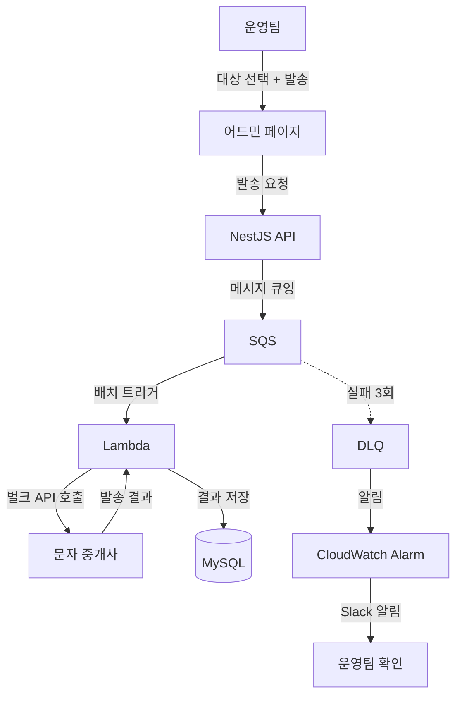
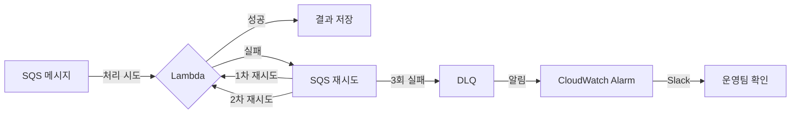

## 목차
1. [배경: 수동 발송의 한계](#배경-수동-발송의-한계)
2. [문제 분석: 왜 자동화가 필요했나](#문제-분석-왜-자동화가-필요했나)
3. [해결 목표: 운영팀 셀프 서비스](#해결-목표-운영팀-셀프-서비스)
4. [아키텍처 설계: SQS + Lambda 선택 이유](#아키텍처-설계-sqs--lambda-선택-이유)
5. [핵심 구현 1: 어드민에서 발송 요청](#핵심-구현-1-어드민에서-발송-요청)
6. [핵심 구현 2: SQS + Lambda 비동기 처리](#핵심-구현-2-sqs--lambda-비동기-처리)
7. [핵심 구현 3: DLQ 기반 실패 재처리](#핵심-구현-3-dlq-기반-실패-재처리)
8. [결과: 월 100만 건 안정 발송](#결과-월-100만-건-안정-발송)

---

## 배경: 수동 발송의 한계

마케팅 캠페인, 주문 알림, 프로모션 안내 등 문자 발송은 커머스 서비스의 핵심 운영 수단입니다. 하지만 기존에는 **문자 발송 시스템 자체가 존재하지 않았습니다.**

**기존 프로세스:**
```
1. 운영팀이 개발팀에 대상 유저 데이터 추출 요청
2. 개발팀이 DB에서 직접 조회하여 유저 목록 전달
3. 운영팀이 엑셀로 정리
4. 문자 중개사 웹사이트에 엑셀 업로드
5. 대량 발송 실행
```

모든 과정이 수동이었고, 발송 한 건에도 개발팀과 운영팀 양쪽의 시간이 소요되었습니다.

---

## 문제 분석: 왜 자동화가 필요했나

### 1. 개발팀 리소스 낭비

문자 발송 요청이 올 때마다 개발자가 DB 쿼리를 작성하고 데이터를 추출해야 했습니다. 단순 반복 작업이지만 발송 조건이 매번 달라 완전한 자동화 없이는 사람이 개입해야 했습니다.

### 2. 발송 리드타임

운영팀 요청 → 개발팀 대응 → 데이터 추출 → 엑셀 정리 → 업로드까지 **최소 반나절**이 걸렸습니다. 긴급 발송이 필요한 상황에서도 이 과정을 거쳐야 했습니다.

### 3. 발송 실패 시 추적 불가

엑셀 기반 대량 발송은 개별 메시지의 성공/실패를 추적하기 어렵습니다. 어떤 유저에게 발송이 실패했는지, 재발송이 필요한지 확인할 방법이 없었습니다.

### 4. 발송 이력 관리 부재

누가, 언제, 어떤 조건으로, 몇 명에게 발송했는지 체계적으로 기록되지 않았습니다.

---

## 해결 목표: 운영팀 셀프 서비스

### 정성적 목표
- 운영팀이 어드민에서 직접 대상 선택 + 발송 실행
- 개발팀 개입 없이 발송 가능
- 발송 실패 자동 재처리
- 발송 이력 및 성공/실패 추적

### 정량적 목표
- 월 100만 건 이상 안정 처리
- API 서버 부하 없이 발송 처리
- 발송 실패율 최소화 (DLQ 기반 재처리)

---

## 아키텍처 설계: SQS + Lambda 선택 이유

### 대안 비교

| 기준 | 별도 발송 서버 (EC2/ECS) | SQS + Lambda |
|------|------------------------|--------------|
| 비용 | 상시 운영 비용 | 요청당 과금 |
| 확장성 | 수동 스케일링 | 자동 무한 확장 |
| 운영 부담 | 서버 관리 필요 | 완전 관리형 |
| 재처리 | 직접 구현 필요 | DLQ 기본 제공 |
| 속도 제어 | 직접 구현 | 동시 실행 수로 제어 |

**SQS + Lambda를 선택한 이유:**
- 문자 발송은 상시 트래픽이 아니라 **캠페인 시 집중되는 패턴**이므로, 서버리스 종량제가 비용 효율적
- SQS의 배치 처리 + Lambda의 동시 실행 수 제어로 문자 중개사의 rate limit에 맞춰 속도 조절 가능
- DLQ 기본 제공으로 실패 재처리 인프라를 별도로 구축할 필요 없음
- 기존 AWS 인프라와 자연스러운 통합

### 전체 아키텍처



---

## 핵심 구현 1: 어드민에서 발송 요청

### 발송 API

운영팀이 어드민에서 대상 유저를 선택하고 메시지를 작성하면, API 서버가 대상 목록을 SQS에 전달합니다.

```typescript
@Injectable()
export class MessagingService {
  constructor(
    private readonly sqsService: SqsService,
    private readonly messagingLogRepository: MessagingLogRepository,
  ) {}

  async sendBulkMessage(dto: BulkMessageDto) {
    const { userIds, content, templateId } = dto;

    // 1. 발송 로그 생성 (이력 관리)
    const log = await this.messagingLogRepository.create({
      totalCount: userIds.length,
      content,
      templateId,
      status: 'QUEUED',
    });

    // 2. SQS에 배치 단위로 전송
    const chunks = this.chunkArray(userIds, 10);
    for (const chunk of chunks) {
      await this.sqsService.sendMessage({
        logId: log.id,
        userIds: chunk,
        content,
        templateId,
      });
    }

    return { logId: log.id, queuedCount: userIds.length };
  }

  private chunkArray<T>(array: T[], size: number): T[][] {
    return Array.from(
      { length: Math.ceil(array.length / size) },
      (_, i) => array.slice(i * size, (i + 1) * size),
    );
  }
}
```

---

## 핵심 구현 2: SQS + Lambda 비동기 처리

### Lambda 핸들러

SQS에서 메시지를 배치로 수신하여 문자 중개사의 벌크 API를 호출합니다.

```typescript
export const handler = async (event: SQSEvent) => {
  for (const record of event.Records) {
    const payload = JSON.parse(record.body);
    const { logId, userIds, content, templateId } = payload;

    try {
      // 1. 유저 연락처 조회
      const users = await getUserPhoneNumbers(userIds);

      // 2. 문자 중개사 벌크 API 호출
      const result = await smsProvider.sendBulk({
        recipients: users.map(u => u.phoneNumber),
        content,
        templateId,
      });

      // 3. 발송 결과 저장
      await saveResults(logId, result);

    } catch (error) {
      console.error(`발송 실패: logId=${logId}`, error);
      throw error; // SQS 재시도 트리거
    }
  }
};
```

### Rate Limit 대응

문자 중개사가 벌크 API와 rate limit을 제공하므로, **SQS 배치 사이즈와 Lambda 동시 실행 수를 rate limit에 맞춰 설정**했습니다.

```yaml
MessagingQueue:
  Type: AWS::SQS::Queue
  Properties:
    QueueName: messaging-queue
    VisibilityTimeout: 120
    RedrivePolicy:
      deadLetterTargetArn: !GetAtt MessagingDLQ.Arn
      maxReceiveCount: 3

LambdaEventSourceMapping:
  Type: AWS::Lambda::EventSourceMapping
  Properties:
    EventSourceArn: !GetAtt MessagingQueue.Arn
    FunctionName: !Ref MessagingLambda
    BatchSize: 10
    MaximumConcurrency: 5  # 중개사 rate limit 내에서 처리
```

- **BatchSize: 10** — SQS에서 Lambda로 한 번에 전달하는 메시지 수
- **MaximumConcurrency: 5** — Lambda 동시 실행 수를 제한하여 중개사 rate limit 초과 방지
- **VisibilityTimeout: 120** — 처리 중인 메시지가 다른 Lambda에 중복 전달되지 않도록 충분한 시간 확보

---

## 핵심 구현 3: DLQ 기반 실패 재처리

### 실패 처리 흐름



3회 재시도 후에도 실패한 메시지는 DLQ에 보관됩니다. CloudWatch Alarm이 DLQ에 메시지가 쌓이면 Slack으로 알림을 전송하여 운영팀이 확인할 수 있도록 했습니다.

```yaml
MessagingDLQ:
  Type: AWS::SQS::Queue
  Properties:
    QueueName: messaging-dlq
    MessageRetentionPeriod: 1209600  # 14일 보관

DLQAlarm:
  Type: AWS::CloudWatch::Alarm
  Properties:
    AlarmName: messaging-dlq-alarm
    MetricName: ApproximateNumberOfMessagesVisible
    Namespace: AWS/SQS
    Dimensions:
      - Name: QueueName
        Value: messaging-dlq
    Statistic: Sum
    Period: 300
    EvaluationPeriods: 1
    Threshold: 1
    ComparisonOperator: GreaterThanOrEqualToThreshold
    AlarmActions:
      - !Ref SlackNotificationTopic
```

---

## 결과: 월 100만 건 안정 발송

### 운영 프로세스 개선

| 단계 | Before | After |
|------|--------|-------|
| 대상 추출 | 개발팀에 요청 (반나절) | 어드민에서 직접 선택 |
| 발송 실행 | 엑셀 업로드 | 어드민에서 클릭 |
| 실패 추적 | 불가능 | DLQ + 알림 자동화 |
| 이력 관리 | 없음 | DB 자동 기록 |
| **개발팀 개입** | **매번 필요** | **불필요** |

### 기술적 성과

- **월 100만 건 이상** 안정적으로 처리
- API 서버 부하 완전 분리 — 발송 처리가 서비스 응답 속도에 영향을 주지 않음
- DLQ 기반 재처리로 발송 누락 방지
- 서버리스 구조로 캠페인 시 자동 확장, 평시에는 비용 거의 0원

---

## 배운 점

### 1. 문제의 본질은 시스템 부재였다

기존 문제는 "동기 처리로 인한 서버 부하"가 아니라, 애초에 **발송 시스템 자체가 없어서 모든 과정이 수동**이었다는 점입니다. 기술적 최적화보다 운영 프로세스 자동화가 더 큰 가치를 만들어냈습니다.

### 2. 서버리스는 불규칙 트래픽에 최적

문자 발송은 마케팅 캠페인 시 집중되고 평시에는 거의 없는 패턴입니다. EC2/ECS로 상시 운영했다면 대부분의 시간에 리소스가 낭비되었을 것입니다. SQS + Lambda의 종량제 모델이 이 패턴에 정확히 맞았습니다.

### 3. Rate Limit은 큐로 제어한다

외부 API의 rate limit을 애플리케이션 코드에서 제어하면 복잡해집니다. SQS의 배치 사이즈와 Lambda의 동시 실행 수를 조절하는 것만으로 인프라 레벨에서 깔끔하게 속도를 제어할 수 있었습니다.

### 4. DLQ는 선택이 아닌 필수

대량 발송에서 일부 실패는 불가피합니다. DLQ가 없었다면 실패한 메시지를 수동으로 추적해야 했을 것입니다. DLQ + CloudWatch Alarm + Slack 알림 조합으로 실패를 자동으로 감지하고 대응할 수 있는 체계를 갖추는 것이 중요했습니다.

---

## 기술 스택

| 분류 | 기술 |
|------|------|
| **백엔드** | NestJS (TypeScript) |
| **메시지 큐** | AWS SQS + DLQ |
| **발송 처리** | AWS Lambda |
| **모니터링** | CloudWatch Alarm → Slack |
| **데이터베이스** | MySQL (발송 이력) |
