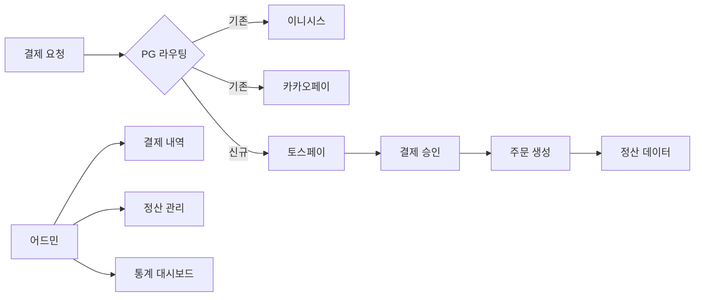

## 개요
기존 이니시스(신용카드), 카카오페이(간편결제) 결제 수단에 토스페이를 추가하여 결제 옵션을 다양화하고 전체 거래액의 30%(111억 원)를 달성했습니다. ISMS-P 보안 인증 심사와 병행하며 통상 3개월 작업을 6주 만에 완료한 프로젝트입니다.

## 프로젝트 배경

**비즈니스 요구사항:**

- 결제 수단 다양화로 사용자 편의성 향상
- 토스 생태계 연동으로 신규 고객 유입
- 결제 성공률 개선 및 시장 점유율 확대

**기술적 도전:**

- **영향 범위 광범위:** 결제, 주문, 정산, 어드민 시스템 전 영역에 걸친 변경 작업
- **ISMS-P 인증 동시 진행:** 보안 인증 심사와 신규 결제 수단 개발을 병행 수행 (정보보호 관리체계 인증)
- **타이트한 일정:** 통상 3개월 소요되는 작업을 비즈니스 요구사항에 따라 6주 내 완료 필요
- **데이터 정합성 보장:** 결제-주문-정산 전 과정의 트랜잭션 일관성 유지

## 주요 성과

- 전체 거래액의 30% (약 111억 원) 달성
- 개발 기간: 통상 3개월 → 6주 완료
- 결제 성공률: 2.5% 향상
- ISMS-P 인증 동시 통과

## 시스템 아키텍처

## 주요 기능

**결제 시스템:**

- 토스페이 API 연동 (승인, 취소, 환불)
- 기존 결제 로직과 통합 (전략 패턴으로 PG사별 분기 처리)
- Webhook 기반 실시간 결제 상태 동기화

**주문 시스템:**

- 결제 수단별 주문 처리 로직 확장
- 트랜잭션 관리 강화 (데이터 정합성)

**정산 시스템:**

- PG사별 정산 데이터 포맷 통합
- 자동 정산 배치 작업 확장

**어드민 시스템:**

- 토스페이 결제 내역 조회
- 결제 수단별 통계 대시보드
- 수동 환불 처리 기능

## 개발 프로세스

**태스크 분석 및 우선순위:**

1. 영향 범위 파악 (결제/주문/정산/어드민)
2. 태스크 분해 및 일정 산정
3. ISMS-P 요구사항 반영

**병렬 개발 전략:**

- 결제 API 연동 (2주)
- 주문/정산 로직 확장 (2주)
- 어드민 기능 개발 (1주)
- QA 및 버그 수정 (1주)

## 기술적 도전과 해결

**도전 1: 짧은 일정 (3개월 → 6주)**

- **문제:** 결제/주문/정산/어드민 4개 영역을 모두 수정해야 하는 대규모 작업
- **해결:**
  - 전체 태스크를 세부 단위로 분해하고 우선순위 매트릭스 작성
  - 핵심 결제 플로우(승인/취소/환불)를 최우선으로 개발
  - 부가 기능(통계, 대시보드)은 2차 배포로 분리
  - 병렬 개발 가능한 영역 식별 및 팀원 간 작업 분담

**도전 2: 데이터 정합성 보장**

- **문제:** 결제 승인 후 주문 생성 실패 시 고객 과금 문제 발생 가능
- **해결:**
  - 분산 트랜잭션 패턴 적용 (Saga 패턴으로 보상 트랜잭션 설계)
  - TossPay Webhook을 통한 결제 상태 실시간 동기화
  - 실패 케이스별 보상 트랜잭션 설계 (자동 환불, 재시도 로직)
  - 결제-주문 매핑 테이블로 중복 결제 방지

**도전 3: ISMS-P 인증과 병행 개발**

- **문제:** 보안 인증 심사 중 신규 결제 수단 추가로 인한 추가 검토 필요
- **해결:**
  - 개발 초기부터 ISMS-P 보안 요구사항 체크리스트 반영
  - 카드번호/계좌번호 등 민감정보 마스킹 처리
  - 결제 관련 모든 API 요청/응답 로깅 및 암호화
  - 개인정보 처리방침 업데이트 및 법무 검토 완료

## 기술 스택

- NestJS, MySQL, Redis
- TossPay API, Webhook
- Docker, GitLab CI/CD

## 배운 점

- 복잡한 시스템 통합 경험 (결제-주문-정산 전 영역 변경)
- 짧은 일정 내 효율적 태스크 관리 및 우선순위 결정
- 보안 인증 요구사항 대응 및 규제 준수 프로세스 이해
