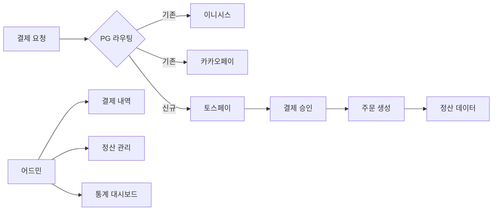

## 개요
기존 이니시스, 카카오페이 결제 수단에 토스페이를 추가하여 결제 옵션을 다양화하고 전체 거래액의 30%(111억)를 달성했습니다.

## 프로젝트 배경
**비즈니스 요구사항:**
- 결제 수단 다양화로 사용자 편의성 향상
- 토스 생태계 연동으로 신규 고객 유입
- 결제 성공률 개선

**기술적 도전:**
- 결제/주문/정산/어드민 전 영역 영향
- ISMS-P 인증 심사와 병행 진행
- 기존 3개월 소요 작업을 6주로 단축

## 주요 성과
- 전체 거래액의 30% (약 111억 원) 달성
- 개발 기간: 통상 3개월 → 6주 완료
- 결제 성공률: 2.5% 향상
- ISMS-P 인증 동시 통과

## 시스템 아키텍처

## 주요 기능
**결제 시스템:**
- 토스페이 API 연동 (승인, 취소, 환불)
- 기존 결제 로직과 통합 (전략 패턴)
- Webhook 기반 실시간 결제 상태 동기화

**주문 시스템:**
- 결제 수단별 주문 처리 로직 확장
- 트랜잭션 관리 강화 (데이터 정합성)

**정산 시스템:**
- PG사별 정산 데이터 포맷 통합
- 자동 정산 배치 작업 확장

**어드민 시스템:**
- 토스페이 결제 내역 조회
- 결제 수단별 통계 대시보드
- 수동 환불 처리 기능

## 개발 프로세스
**태스크 분석 및 우선순위:**
1. 영향 범위 파악 (결제/주문/정산/어드민)
2. 태스크 분해 및 일정 산정
3. ISMS-P 요구사항 반영

**병렬 개발:**
- 결제 API 연동 (2주)
- 주문/정산 로직 확장 (2주)
- 어드민 기능 개발 (1주)
- QA 및 버그 수정 (1주)

## 기술적 도전과 해결
**도전 1: 짧은 일정**
- 해결: 명확한 태스크 분해 및 우선순위 설정
- 핵심 기능 먼저 구현 후 점진적 개선

**도전 2: 데이터 정합성**
- 해결: 트랜잭션 강화 및 Webhook 기반 동기화
- 실패 케이스 철저한 핸들링

**도전 3: ISMS-P 동시 진행**
- 해결: 보안 요구사항 사전 반영
- 개인정보 마스킹, 로깅 강화

## 기술 스택
- NestJS, MySQL, Redis
- TossPay API, Webhook
- Docker, GitLab CI/CD

## 배운 점
- 복잡한 시스템 통합 경험
- 짧은 일정 내 효율적 태스크 관리
- 보안 인증 요구사항 대응
